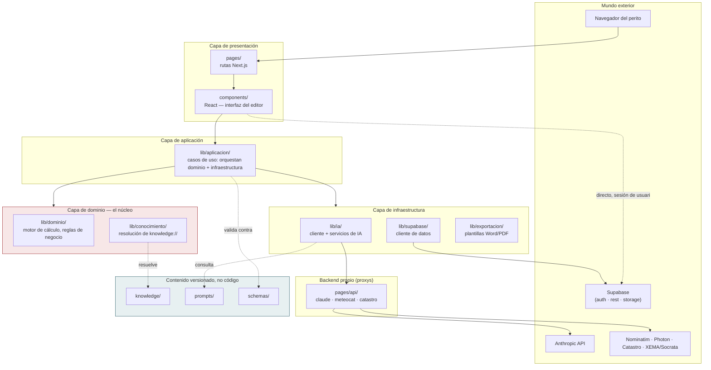

# FOUNDATION_ARCHITECTURE.md — Arquitectura Fundacional de PERIT.IA

> **EPIC 1 — Foundation Architecture.** Documento de referencia oficial para
> la evolución de PERIT.IA "durante los próximos años" (encargo textual de
> Pol). No contiene código, no mueve archivos, no renombra nada. Es el plano;
> la obra es de sprints posteriores, cada uno con su propia aprobación.
>
> **Fecha:** 3 de agosto de 2026 · Sprint 5 — Foundation Architecture
> **Método:** análisis exclusivo del proyecto real, tras el cierre de la Fase
> 0 del Sprint 4 (motor de cálculo extraído a `lib/dominio/calculo.js`, 217
> líneas, 100 % de cobertura de líneas y funciones). Ninguna decisión de este
> documento se apoya en una arquitectura idealizada que ignore lo que ya
> existe: parte de `docs/CURRENT_IMPLEMENTATION.md`, `docs/MODULES.md`,
> `docs/domain/`, `knowledge/architecture/KNOWLEDGE_ARCHITECTURE.md` y
> `docs/migration/MIGRATION_MASTER_PLAN.md`.
> **No abre ninguna fase de implementación.** El `MIGRATION_MASTER_PLAN.md`
> sigue siendo la hoja de ruta de *cuándo* se hace cada cosa; este documento
> añade el nivel de detalle que a aquel le faltaba deliberadamente: *dónde*
> vive cada cosa cuando la migración termine, y *qué regla* impide que vuelva
> a desordenarse.

---

## Cómo leer este documento

Es un plano maestro, no una novela: se puede consultar por sección sin leer
las 16 de corrido. Si es la primera vez, el orden de lectura recomendado es
§1 (visión), §2 (el árbol completo), §12 (reglas de dependencia) y §14
(cómo se llega desde hoy) — el resto es detalle por materia, para consultar
cuando toque cada fase.

**Relación con el resto de la documentación**, para no repetir lo que ya
está escrito en otro sitio:

| Este documento… | No repite, remite a… |
|---|---|
| Define dónde vive cada cosa | `docs/MODULES.md` — qué hay hoy, línea a línea |
| Define las reglas de dependencia del código | `docs/domain/DOMAIN_MODEL.md` — qué significa cada concepto de negocio |
| Ordena la migración por módulo | `docs/migration/MIGRATION_MASTER_PLAN.md` — el cuándo, con riesgos y gates por fase |
| Da por sentado el modelo de conocimiento | `knowledge/architecture/KNOWLEDGE_ARCHITECTURE.md` — qué es una `KU`, cómo se versiona |
| Señala qué decisiones faltan | `docs/OPEN_QUESTIONS.md`, `docs/TECHNICAL_DEBT.md`, `docs/REFACTOR_BACKLOG.md` |

---

## 1. Arquitectura objetivo del proyecto

### 1.1. Qué estilo de arquitectura, y por qué ese y no otro

PERIT.IA adopta una **arquitectura en capas de tipo Clean Architecture,
aplicada de forma pragmática** — no la versión de manual con interfaces,
inyección de dependencias formal y una entidad de dominio por clase. La
razón es honesta, no ideológica: el equipo es una persona no programadora
(Pol) trabajando con asistencia de IA, sobre una aplicación de un único
usuario por sesión (un perito autónomo), sin servidor de aplicación propio
más allá de tres funciones *serverless* que son proxys. Una arquitectura
hexagonal de manual, con puertos y adaptadores formalizados en interfaces de
TypeScript, sería sobre-ingeniería para este tamaño de proyecto — el mismo
error que el propio `CLAUDE.md` y `docs/OPEN_QUESTIONS.md` (P-20) advierten
evitar respecto a construir multiusuario sin saber si hace falta.

Lo que sí se adopta, sin concesiones, son los **principios** de Clean
Architecture y DDD que sí pagan su coste en un proyecto de este tamaño:

| Principio | Qué significa aquí |
|---|---|
| **La regla de dependencia** | El código de negocio (`lib/dominio/`) no depende de React, de Next.js, de Supabase ni de Anthropic. Depende de él quien use React, Next.js, Supabase o Anthropic — nunca al revés |
| **Separación por responsabilidad, no por capricho** | Cada carpeta de `lib/` tiene una única razón para cambiar (cálculo, conocimiento, IA, persistencia) |
| **El dominio es la autoridad** | Ya establecido en `docs/domain/README.md`: el software se adapta al negocio, no al revés |
| **Independencia de infraestructura** | Los adaptadores (Supabase, Anthropic, Nominatim, Catastro) son sustituibles sin tocar el dominio ni los casos de uso |
| **Testabilidad como consecuencia, no como objetivo en sí** | Si el dominio no depende de nada externo, se prueba sin arrancar un navegador ni una base de datos — ya demostrado en la Fase 0 (100 % de cobertura de `lib/dominio/calculo.js` sin `jsdom` ni red) |

Lo que **no** se adopta, explícitamente, para no repetir el error de
construir para una escala que el producto no tiene hoy:

- Entidades de dominio como clases ricas con invariantes autoimpuestas
  (*value objects*, *entities* al estilo DDD táctico completo). Las 30
  entidades de `docs/domain/` siguen siendo documentación conceptual; su
  materialización en código será *funciones puras sobre objetos planos*
  (el mismo estilo que ya tiene `lib/dominio/calculo.js`), no clases.
- Inyección de dependencias con contenedor. Un módulo que necesita otro lo
  importa directamente; el desacoplamiento se logra por **dirección** de la
  dependencia (§12), no por indirección artificial.
- Interfaces de TypeScript para los "puertos". Se decide explícitamente
  mantener JavaScript (§16, decisión ADR-0002) — el desacoplamiento entre
  capas se documenta y se disciplina, no se impone en tiempo de compilación,
  al menos en esta etapa.

### 1.2. Las cuatro capas



**Lectura del diagrama, con la flecha que más importa:** `lib/dominio/`
**no tiene flechas de salida hacia ninguna otra capa de código.** Es la
única casilla del diagrama de la que no sale ninguna dependencia — todo lo
demás depende, directa o indirectamente, de ella o de nada. Esa es la
"regla de dependencia" en una imagen.

**Una honestidad que este documento no oculta:** hoy, el navegador sigue
hablando **directamente** con Supabase para autenticación y datos (flecha
punteada del diagrama), sin pasar por `lib/aplicacion/`. Es una desviación
consciente del modelo de capas puro, heredada de que este es un SPA sin
servidor de aplicación propio (`ssr:false`, ver `docs/MODULES.md` §2.2) — y
se mantiene así en el diseño objetivo, no se corrige, porque introducir un
backend propio solo para intermediar CRUD sin lógica de negocio añadida
sería infraestructura sin beneficio (ver §15, riesgo de sobre-ingeniería).
Donde **sí** hay lógica de negocio de por medio (validación de un caso de
uso, orquestación de IA), la interfaz pasa por `lib/aplicacion/`, nunca
salta directamente a `lib/ia/` o `lib/supabase/`.

---

## 2. Estructura definitiva de carpetas

```
peritia/
├── components/                  ← Presentación (React). Solo interfaz: cero lógica de negocio.
│   ├── ui/                      ← Componentes base sin estado de negocio (Btn, Card, Inp, Sel…)
│   ├── layout/                  ← Armazón de pantalla (NavBottom, Logo, ContextBar…)
│   ├── acceso/                  ← LoginScreen
│   ├── dashboard/                ← Dashboard, listado de expedientes
│   ├── alta/                    ← DropZone, UploadEncargo
│   ├── secciones/               ← Sec1, Sec2, Sec3, Sec4, SecAnexos, SecEncargo
│   ├── informe/                 ← SecInforme (vista previa), ExportModal
│   ├── ReportEditor.jsx         ← Orquestador de las 7 pantallas del editor
│   └── App.jsx                  ← Raíz: sesión, estado global, enrutado interno
│
├── lib/                         ← Todo lo que NO es React ni una ruta de Next.js. El núcleo reutilizable.
│   ├── dominio/                 ← Capa de dominio. Sin dependencias de ninguna otra carpeta de lib/.
│   │   ├── calculo.js           ← YA EXISTE (Fase 0). Motor de cálculo económico.
│   │   ├── reglas.js            ← (futuro) reglas de negocio no económicas: BR-* de docs/domain/BUSINESS_RULES.md
│   │   └── formato.js           ← (futuro) fmt/fmtE/fmtSmart/norm si se extraen más allá de lo ya movido
│   │
│   ├── conocimiento/            ← Puente entre el dominio y knowledge/. Sabe leer, no sabe negocio.
│   │   └── resolver.js          ← (futuro, Fase 3.1) resuelve knowledge://tipo/slug[#version] → objeto
│   │
│   ├── aplicacion/               ← Casos de uso: orquestan dominio + infraestructura. Sin JSX.
│   │   ├── expedientes/         ← crear, guardar, listar, borrar un informe
│   │   ├── valoracion/          ← generar tabla desde baremo, aplicar reglas, calcular indemnización
│   │   └── informe/             ← componer y exportar el informe final
│   │
│   ├── ia/                      ← Adaptador hacia Anthropic. Infraestructura, no dominio.
│   │   ├── cliente.js           ← (futuro, Fase 2.4) callClaude, ya identificado en el plan de migración
│   │   └── servicios/           ← (futuro, Fase 4) una capacidad = un archivo
│   │       ├── extraccionEncargo.js      (IA-1)
│   │       ├── extraccionPoliza.js       (IA-2)
│   │       ├── estimacionRiesgo.js       (IA-3)
│   │       ├── redaccionInstant.js       (IA-4)
│   │       ├── redaccionMeteo.js         (IA-5)
│   │       ├── mejoraCausas.js           (IA-6)
│   │       ├── mejoraDanos.js            (IA-7)
│   │       ├── tablaDesdeBaremo.js       (IA-8)
│   │       └── extraccionFacturas.js     (IA-9)
│   │
│   ├── supabase/                ← Adaptador hacia Supabase. Infraestructura, no dominio.
│   │   └── cliente.js           ← (futuro, Fase 2.4) sbAuth, sbDb, ya identificado en el plan de migración
│   │
│   └── exportacion/             ← (futuro, R-13 — sprint propio, después de Fase 5) motor único de plantilla
│       └── plantilla.js         ← una sola fuente para vista previa, Word y PDF
│
├── pages/                       ← Rutas de Next.js. Convención del framework, no se reorganiza.
│   ├── _app.js
│   ├── index.js
│   └── api/                     ← Backend propio: proxys + (futuro) endpoints con lógica mínima
│       ├── claude.js
│       ├── meteocat.js
│       └── catastro.js
│
├── knowledge/                   ← Contenido, no código. Base de conocimiento del dominio.
│   └── (estructura ya definida en knowledge/architecture/KNOWLEDGE_ARCHITECTURE.md — ver §7)
│
├── prompts/                     ← Contenido, no código. Prompts versionados de los servicios de IA.
│   └── (convención definida en §6)
│
├── schemas/                     ← Contenido, no código. JSON Schema de entrada/salida.
│   └── (uso definido en §11; carga diferida por Pol — R-09)
│
├── supabase/
│   └── migrations/              ← Sin cambios. Infraestructura como código de la base de datos.
│
├── tests/                       ← Sin cambios de convención; crece en espejo de lib/ (§10.4)
│
├── docs/                        ← Sin cambios de convención.
├── .github/workflows/           ← CI. Sin cambios de convención.
├── CLAUDE.md · CONTEXT.md · RESUMEN_PERITIA.md
├── package.json · package-lock.json · next.config.js · vercel.json · .env.example · .gitignore
```

**Qué NO cambia en este árbol respecto al de hoy:** `pages/`,
`supabase/migrations/`, `docs/`, `tests/` (como carpeta, no su contenido),
la raíz del repositorio. **Qué es nuevo respecto a `docs/PROJECT_STRUCTURE.md`
(Sprint 0):** la subdivisión completa de `lib/` y de `components/` — el
Sprint 0 documentó carpetas de contenido (`docs/`, `knowledge/`, `prompts/`,
`schemas/`, `tests/`); este documento añade la organización del **código**
que las consume.

**Regla de nomenclatura, para que no quede implícita:** las carpetas nuevas
de `lib/` se nombran en español (`dominio`, `conocimiento`, `aplicacion`,
`ia`, `supabase`, `exportacion`), coherente con `lib/dominio/calculo.js` ya
creado en la Fase 0 y con el resto de la documentación del proyecto, escrita
en español. Los nombres de componentes de React y de entidades del dominio
que **ya existen** en inglés (`LoginScreen`, `Dashboard`, `SecInforme`,
`Claim`, `Coverage`…) no se traducen — traducir un nombre ya establecido es
un cambio de superficie pública sin beneficio, y contradice la regla de "no
renombrar" de este mismo sprint.

---

## 3. Organización del dominio

### 3.1. Qué es dominio y qué no lo es, en este proyecto concreto

Dominio (`lib/dominio/`) es **todo cálculo o regla que sería igual de
cierta si PERIT.IA no tuviera interfaz, ni base de datos, ni IA** — la
misma prueba que ya superó `calculo.js` en la Fase 0. Ejemplos ya
extraídos: `calcPartida`, `calcReglas`, `calcIndemnizacion`, `matchBaremo`.
Ejemplos que **no** son dominio, aunque parezcan reglas: "guardar el
expediente 5 segundos después del último cambio" (es una política de
aplicación, depende de que exista un backend de persistencia), "avisar si
falta la referencia catastral" (es una regla de interfaz sobre cuándo
mostrar un aviso, no un hecho de negocio).

### 3.2. Por qué el dominio de código no replica todavía los 8 bounded contexts

`docs/domain/DOMAIN_MODEL.md` documenta 8 *bounded contexts* y 30 entidades.
**Este documento no propone una carpeta `lib/dominio/<contexto>/` por cada
uno.** La razón: la mayoría de esas entidades no tienen hoy representación
propia en código ni en base de datos — viven fusionadas dentro de las seis
columnas JSONB de `informes` (ver `DOMAIN_MODEL.md` §6, tabla de
distancia). Crear `lib/dominio/encargo/`, `lib/dominio/poliza/`,
`lib/dominio/riesgo/`… antes de que exista algo real que meter dentro sería
construir estanterías vacías — el mismo antipatrón que este EPIC existe
para evitar ("no quiero seguir creciendo sobre una estructura
provisional", pero tampoco sobre una estructura *prematura*).

**La correspondencia entre bounded contexts y código, tal como está y tal
como estará a medio plazo:**

| Bounded context (`docs/domain/`) | Dónde vive el código hoy | Dónde vivirá cuando tenga código propio |
|---|---|---|
| Valoración Económica | `lib/dominio/calculo.js` (Fase 0, ya hecho) | Mismo sitio — es el único contexto con módulo propio ya extraído |
| Póliza y Cobertura | Campos sueltos de `encargo` (JSONB) | `lib/dominio/poliza.js`, cuando la Fase 6 (§14) dé a `Policy`/`PolicyVersion` una estructura propia dentro del JSON |
| Riesgo y Daño | `s1`, `s3.partidas[]` | Sin módulo propio previsto a corto plazo — se sigue apoyando en `calculo.js` (las partidas son ya su unidad de cálculo) |
| Evidencia Documental | `informes.anexos` (JSONB) | Sin módulo propio previsto — es, sobre todo, gestión de Storage (infraestructura), no cálculo |
| Informe Pericial | Tres plantillas paralelas (DT-07) | `lib/exportacion/plantilla.js` (§9), no `lib/dominio/` — componer un documento es presentación, no una regla de negocio |
| Gestión del Encargo, Organización y Acceso, Operación y Trazabilidad | No existen en código | Sin módulo previsto — bloqueados por P-20 (¿multiusuario?), fuera de alcance mientras no se responda |

**Regla derivada, válida para toda ampliación futura de `lib/dominio/`:**
una carpeta o archivo nuevo bajo `lib/dominio/` se crea **cuando hay una
función pura real que mover o escribir**, nunca antes, para documentar una
intención. Las intenciones viven en `docs/domain/` y en este documento, no
como carpetas vacías en el código.

### 3.3. Qué sí se propone para el corto plazo: `lib/dominio/reglas.js`

`docs/domain/BUSINESS_RULES.md` documenta reglas de negocio (`BR-*`) que no
son de cálculo económico pero sí son deterministas y sin dependencias
externas — por ejemplo, "nunca se sobrescriben datos extraídos por IA sin
confirmación del perito" (BR-28) o "un informe no se exporta si sus
secciones obligatorias no están completas" (parte de la invariante del
agregado `Report`, `DOMAIN_MODEL.md` §3). Hoy esas reglas están implícitas
en el código de interfaz, no como funciones nombradas. Cuando se
materialicen (no antes de que el `MIGRATION_MASTER_PLAN.md` llegue a una
fase que las toque), su destino natural es `lib/dominio/reglas.js`, hermano
de `calculo.js` — mismas propiedades: puro, sin React, con pruebas.

---

## 4. Organización de servicios (IA)

### 4.1. Un servicio por capacidad, no un cliente genérico con 9 llamadas

`docs/AI_INVENTORY.md` documenta 9 capacidades de IA, todas hoy invocadas a
través de un único `callClaude` disperso en la interfaz. El destino objetivo
—ya anticipado por la Fase 4 del plan de migración— es un archivo por
capacidad bajo `lib/ia/servicios/`, cada uno:

1. Con un nombre que dice qué hace, no un número (`extraccionPoliza.js`, no
   `ia2.js`).
2. Que exporta una única función con forma consistente:
   `async (entrada, { onTokens } = {}) => resultado`.
3. Que construye su propio *system prompt* y *user prompt* a partir de
   `prompts/` (§6), nunca con texto incrustado en el propio archivo de
   servicio — es la aplicación directa de la brecha ya señalada en
   `MIGRATION_MASTER_PLAN.md` (Fase 3 antes que Fase 4: primero el
   conocimiento, después quien lo consume).
4. Que delega la llamada HTTP real en `lib/ia/cliente.js` — el mismo
   `callClaude` ya extraído conceptualmente en la Fase 2.4, sin
   reimplementar la conexión en cada servicio.

### 4.2. Contrato común de un servicio de IA

Todo servicio de `lib/ia/servicios/` respeta la misma forma de entrada y
salida, para que quien lo llama desde `lib/aplicacion/` no tenga que conocer
las particularidades de cada uno:

```js
// Contrato — no es código todavía, es la forma que tendrá cuando se escriba
async function nombreDelServicio(entrada, opciones = {}) {
  // entrada: objeto plano específico del servicio (ver su ficha en docs/ai/)
  // opciones.onTokens: (in, out) => void — igual que hoy
  // devuelve: { ok: true, datos } | { ok: false, error }
  //   nunca lanza excepción por un fallo de la IA — mismo principio que
  //   iaError() ya aplica hoy, formalizado como parte del contrato
}
```

**Por qué esta forma y no otra:** es la que ya usa, con más o menos
disciplina, el código actual (`parseJSON` + `iaError`, `docs/MODULES.md`
M5) — este documento **no inventa** un contrato nuevo, **nombra** el que ya
existe implícitamente para que cada servicio nuevo lo siga sin
reinventarlo.

### 4.3. Registro de ejecución, sin adelantar la Fase 6

Cada servicio, al llamar a `lib/ia/cliente.js`, debe poder identificarse
(nombre de capacidad, versión de prompt consumida). Esto habilita el
registro mínimo que la Fase 4 del plan de migración ya prevé (4.2) sin
necesitar todavía la tabla de auditoría completa de la Fase 6. La forma
exacta del registro (dónde se guarda, con qué retención) es una decisión
de esa fase, no de este documento.

---

## 5. Organización de componentes

### 5.1. Este apartado es diseño puro — no reactiva la Fase 5

`MIGRATION_MASTER_PLAN.md` §6, Fase 5, nota de gobernanza: dividir
`Peritia.jsx` es la ficha **R-15**, diferida explícitamente por Pol (sesión
21), y su plan exige "confirmación específica y expresa" (gate **G-5**),
distinta de la aprobación de un plan general. **Este documento diseña la
estructura de destino sin activar ese gate.** Cuando (y si) se confirme,
la Fase 5 se ejecuta contra este diseño en lugar de improvisar uno nuevo —
es exactamente la motivación que ha dado Pol para pedir este EPIC ("quiero
evitar mover archivos dos o tres veces").

### 5.2. Estructura de destino

| Carpeta | Contiene | Corresponde a (`docs/MODULES.md`, M7) |
|---|---|---|
| `components/ui/` | Componentes base sin estado de negocio: `Spin`, `Lbl`, `Inp`, `EuroInput`, `Sel`, `Txt`, `Btn`, `Card`, `SecTitle`, `SectionLabel`, `InfoRow`, `AutoTextarea` | Grupo "Base", líneas 491–613 |
| `components/layout/` | `ZoneLabel`, `ContextBar`, `ResultZone`, `Formula`, `ResultTable`, `AutoBadge`, `Block` y las funciones `*BlockStates`/`semaforoFromStates`, `NavBottom`, `Logo`, `VoiceBox` | Grupos "Zonas", "Acordeón y semáforo", "Voz", "Navegación" |
| `components/acceso/` | `LoginScreen` | Grupo "Acceso" |
| `components/dashboard/` | `Dashboard` | Grupo "Listado" |
| `components/alta/` | `DropZone`, `UploadEncargo`, `SecEncargo` | Grupos "Alta", "Encargo" |
| `components/secciones/` | `Sec1`, `Sec2`, `Sec3` (+`InpCell`), `Sec4`, `SecAnexos` | Grupo "Secciones" |
| `components/informe/` | `SecInforme`, `ExportModal` | Grupos "Vista previa" y parte de "Exportación" |
| `components/ReportEditor.jsx` | Orquestador de las 7 pantallas | Grupo "Editor" |
| `components/App.jsx` | Raíz: sesión, estado global | M9 |

**Orden de extracción, si se activa** (heredado sin cambios de
`MIGRATION_MASTER_PLAN.md` §6, Fase 5): de menor a mayor acoplamiento —
`ui/` primero, `App.jsx` al final. No lo repite este documento en detalle
para no duplicar una tabla que ya existe y que sigue siendo válida.

### 5.3. Qué cambia respecto a hoy, y qué no

Ningún componente cambia de comportamiento, de nombre exportado ni de
`props`. Lo único que cambia es el archivo físico donde vive cada uno y,
en consecuencia, sus `import`. Es, por definición, un refactor de "mover
sin alterar" (mismo principio que Fase 2).

---

## 6. Organización de prompts

### 6.1. Por qué hoy es un problema y qué resuelve la carpeta

`docs/AI_INVENTORY.md` documenta 9 prompts incrustados en `Peritia.jsx`,
ninguno con nombre ni versión — el más grave, el de IA-2, es una sola
línea de ~4.500 caracteres con reglas de negocio en lenguaje natural
(`OPEN_QUESTIONS.md`, P-08). La carpeta `prompts/` existe desde el Sprint 0
pero está vacía. Este documento fija su convención de contenido, que hasta
ahora no existía en ningún sitio.

### 6.2. Convención de archivo

```
prompts/
├── extraccion-encargo/
│   ├── v1.md
│   └── metadata.json
├── extraccion-poliza/
│   ├── v1.md
│   └── metadata.json
├── estimacion-riesgo/
│   └── ...
└── (una carpeta por capacidad, mismo nombre que su servicio en lib/ia/servicios/)
```

- **Una carpeta por capacidad**, con el mismo nombre (en kebab-case) que su
  archivo de servicio correspondiente en `lib/ia/servicios/` — así la
  correspondencia prompt↔servicio es obvia por convención de nombre, sin
  necesitar un mapa aparte.
- **`vN.md`** — el texto del prompt tal cual, en Markdown simple (no
  plantilla con motor propio: los huecos se rellenan por sustitución de
  variables sencilla, igual que hoy con *template literals*). Un archivo
  por versión; nunca se edita uno ya usado en producción — se crea `v2.md`.
- **`metadata.json`** — versión vigente, modelo recomendado, `max_tokens`
  por defecto, fecha de creación, motivo del cambio respecto a la versión
  anterior (si la hay). Ejemplo de forma, no de contenido final:

```json
{
  "vigente": "v1",
  "modelo": "claude-sonnet-4-6",
  "maxTokens": 8000,
  "historial": [
    { "version": "v1", "fecha": "2026-08-03", "motivo": "extracción inicial" }
  ]
}
```

### 6.3. Regla de contenido, heredada de `knowledge/architecture/KNOWLEDGE_ARCHITECTURE.md` §8

**Un prompt consume conocimiento, nunca lo contiene.** El prompt de IA-2 hoy
declara *"la franquicia de daños por agua es tal"* como texto fijo; el
prompt objetivo referencia `knowledge://coverages/DAGUA` y quien construye
el prompt en tiempo de ejecución (el servicio en `lib/ia/servicios/`,
usando `lib/conocimiento/resolver.js`, §7.3) resuelve la referencia. Esto
no se ejecuta antes de la Fase 3 del plan de migración — se documenta aquí
como la forma final, no como un cambio inmediato.

### 6.4. Independencia de aseguradora dentro del propio prompt

Ningún prompt debe mencionar "AXA" (o cualquier otra aseguradora) por
nombre. Las reglas específicas de una compañía viven en
`knowledge/mappings/COMPANIES.md` (ya diseñado) y se inyectan como contexto
resuelto, no como instrucción escrita para esa aseguradora en particular.
Es la traducción directa, a este apartado, del principio ya fijado en
`docs/domain/DOMAIN_MODEL.md` §7.2.

---

## 7. Organización de la Knowledge Library

### 7.1. Este documento no rediseña `knowledge/` — lo conecta al código

`knowledge/architecture/KNOWLEDGE_ARCHITECTURE.md` (Sprint 2) ya define con
detalle qué es una `KU`, cómo se tipa, versiona, valida, referencia y
consume. Repetirlo aquí sería duplicar documentación que ya es la autoridad
en su materia. Lo que este documento añade es el **punto de conexión con el
código**: `lib/conocimiento/resolver.js` (§2), que:

1. Recibe un identificador `knowledge://tipo/slug[#version]`.
2. Localiza el archivo Markdown correspondiente (hoy) o la fuente que lo
   sustituya (mañana — el propio `KNOWLEDGE_ARCHITECTURE.md` §7 ya declara
   el identificador independiente de dónde viva físicamente el contenido).
3. Interpreta su sobre de metadatos (`frontmatter`) y su cuerpo.
4. Aplica `ambito` (ramo, aseguradora, fecha) para resolver la versión
   vigente que corresponde al contexto de la consulta.
5. Devuelve un objeto plano — nunca el Markdown crudo — a quien lo consume
   (un caso de uso de `lib/aplicacion/`, un servicio de `lib/ia/servicios/`
   construyendo su prompt, o eventualmente `lib/dominio/` si una regla
   necesita un valor de referencia).

**Este resolutor no tiene lógica de negocio propia.** Si el mañana exige
resolver `ambito` con una regla compleja (por ejemplo, qué versión aplica
si el ramo y la aseguradora dan resultados distintos), esa regla vive en
`lib/dominio/`, no en el resolutor — el resolutor localiza y valida forma,
el dominio decide.

### 7.2. La pregunta pendiente que este documento no resuelve por su cuenta

`docs/OPEN_QUESTIONS.md`, **P-24**, y `KNOWLEDGE_ARCHITECTURE.md` §11
documentan que existen **dos estructuras de carpetas solapadas** dentro de
`knowledge/`: las 11 del Sprint 0 (`hogar/`, `garantias/`, `causas/`… en
español, sin modelo de `KU`) y las creadas en el Sprint 2 siguiendo el
modelo de `KU` (`coverages/`, `causes/`, `branches/`… en inglés). Ninguna
se ha fusionado ni movido.

Este EPIC **no resuelve P-24** por su cuenta — sería tomar una decisión de
contenido disfrazada de decisión de arquitectura, exactamente lo que
`CLAUDE.md` y todos los sprints anteriores han evitado. Lo que sí hace es
**recomendar explícitamente una opción**, de las tres que
`KNOWLEDGE_ARCHITECTURE.md` §11 ya dejó planteadas, para que quede resuelta
como ADR antes de que la Fase 3 del plan de migración cargue contenido real
(§13, ADR-0004):

**Recomendación: Opción A** — las carpetas del Sprint 0 se retiran cuando
se cargue contenido real, migrando su función a las carpetas del Sprint 2.
Motivo: la Opción B (mantenerlas como alias sincronizados en español)
duplica para siempre el trabajo de mantenimiento de cada `KU` en dos
sitios; la Opción C (reconvertirlas en subcarpetas) mezcla dos taxonomías
con criterios de corte distintos (ramo vs. tipo de `KU`) de forma forzada.
La Opción A es la que menos deuda perpetúa, al coste de que las 11
carpetas del Sprint 0 no lleguen a usarse — un coste ya asumido, porque
ninguna tiene contenido real cargado todavía.

### 7.3. Tabla de correspondencia código ↔ conocimiento

| Antes (código) | Después (conocimiento + resolutor) | Fase |
|---|---|---|
| `BAREMO` (constante, 47 partidas) | `knowledge/repairs/*.md`, resuelto por `lib/conocimiento/resolver.js` | 3.3 |
| `TABLAS_ARQ` (constante) | Fichas de material/objeto asegurado con su módulo €/m² | 3.4 |
| `COMPANIAS` + `normCompania()` | `knowledge/mappings/COMPANIES.md` | 3.5 |
| Reglas de capital en el prompt de IA-2 | `knowledge://mappings/companies/axa/*`, resuelto antes de construir el prompt | 4.3 |

---

## 8. Organización de APIs

### 8.1. `pages/api/` sigue siendo la única puerta de entrada HTTP propia

No se propone introducir un *framework* de API aparte (Express, un backend
separado): sería duplicar lo que Next.js ya da, sin beneficio, contra el
principio de "no añadir dependencias sin necesidad" (`CLAUDE.md`, regla 4).
Los tres endpoints actuales (`claude.js`, `meteocat.js`, `catastro.js`)
siguen siendo proxys puros — su responsabilidad no crece con este EPIC.

### 8.2. Convención para endpoints nuevos, cuando existan

`docs/API_INVENTORY.md` §5 señala ausencias reales (sin versionado, sin
autenticación, sin contratos formales). Este documento fija la convención
que deberá seguir cualquier endpoint nuevo, sin implicar que se cree
ninguno todavía:

1. **Un endpoint por archivo**, bajo `pages/api/`, nombrado por lo que
   hace, no por el servicio externo que envuelve (ya se cumple hoy).
2. **Forma de error consistente**: `{ ok: false, error: { codigo, mensaje }
   }` con el código HTTP correcto (`400`, `401`, `403`, `502`…) — corrige,
   como diseño objetivo, el patrón actual de devolver `200` con `ok:false`
   para errores de negocio (`meteocat.js`, `catastro.js`; DT-14, R-17).
3. **Autenticación explícita cuando el endpoint gasta dinero o expone datos
   de un perito concreto** — aplica hoy mismo a `/api/claude` (DT-04, R-04,
   ya en la Fase 1 del plan de migración, no depende de este EPIC).
4. **Sin versionado de ruta por ahora** (`/api/v1/...`). Se documenta como
   opción disponible, no como decisión tomada — introducir versionado antes
   de tener un segundo consumidor de la API (hoy solo la consume el propio
   frontend) sería anticipar una necesidad que no existe. Si en el futuro
   PERIT.IA expone una API a terceros, esta es la primera decisión a
   revisar.

### 8.3. Contrato de servicio externo, para cuando se documenten formalmente

Cada integración externa (`docs/API_INVENTORY.md` §3) debería tener,
cuando se formalice, una ficha en `docs/api/integraciones/<servicio>.md`
con: endpoint, autenticación, límites conocidos, comportamiento ante fallo,
y el archivo que lo consume. Hoy esa documentación vive dispersa dentro de
`API_INVENTORY.md`; migrarla a fichas independientes no es necesario hasta
que el número de integraciones crezca lo suficiente para que un único
documento deje de ser manejable — no es una acción de este EPIC, es una
opción para cuando haga falta.

---

## 9. Organización de exportadores

### 9.1. El problema que ya está documentado, sin agravarlo aquí

`docs/TECHNICAL_DEBT.md`, DT-07: el informe se genera **tres veces**
(`SecInforme` para la vista previa, `buildWordHTML` para Word, la lógica de
`exportPDF` para PDF), cada una con su propia composición del mismo
contenido. `MIGRATION_MASTER_PLAN.md` ya identifica la corrección
(**R-13**) y la pospone deliberadamente a un sprint propio, posterior a la
Fase 5, para no mezclar "mover" con "unificar" (§13 del plan). **Este EPIC
respeta esa decisión** y no la adelanta.

### 9.2. Destino de diseño, para cuando R-13 se aborde

```
lib/exportacion/
├── plantilla.js      ← una función de composición del informe, fuente única
├── adaptadores/
│   ├── html.js        ← vista previa (SecInforme) y base de Word
│   └── pdf.js          ← especificidades de impresión/paginado
```

**Principio de diseño para cuando llegue ese sprint:** `plantilla.js`
produce una representación intermedia neutral (un árbol de secciones con su
contenido ya resuelto), y cada adaptador la traduce a su formato de salida.
Ningún dato se calcula dos veces en dos adaptadores distintos — hoy sí
ocurre (DT-08, discrepancia de infraseguro entre `SecInforme` y el motor).
Este documento no diseña la representación intermedia en detalle: es
trabajo de ese sprint futuro, con la ficha R-13 como punto de partida.

### 9.3. Qué no cambia mientras tanto

`meteoHTML` (`docs/MODULES.md`, M6) ya demuestra, dentro del código actual,
que compartir una plantilla entre Word y PDF con un parámetro de
diferenciación es viable sin gran esfuerzo — es la excepción positiva a
DT-07. Es la prueba de concepto de que `lib/exportacion/` es alcanzable, no
una aspiración sin precedente en este código.

---

## 10. Organización de infraestructura

### 10.1. Qué se entiende por infraestructura aquí

Todo adaptador hacia un sistema externo: Supabase (`lib/supabase/`),
Anthropic (`lib/ia/cliente.js`), y los tres proxys de geolocalización y
meteorología (`pages/api/meteocat.js`, `pages/api/catastro.js`, que ya son,
en sí mismos, infraestructura del lado servidor). No se agrupan bajo una
carpeta `lib/infraestructura/` común: el plan de migración (`Fase 2.4`) ya
fijó `lib/supabase/cliente.js` y `lib/ia/cliente.js` como destinos planos
bajo `lib/`, y **este documento no los reubica** — moverlos a una carpeta
"infraestructura" añadida ahora sería exactamente el doble movimiento que
Pol ha pedido evitar. Se documentan aquí como capa conceptual, no como
carpeta física adicional.

### 10.2. Vercel, Next.js y CI

Sin cambios respecto a hoy: `vercel.json` (framework `nextjs`),
`next.config.js` (`reactStrictMode: false`, pendiente de respuesta en
`OPEN_QUESTIONS.md` P-19), despliegue automático por rama. El flujo de CI
introducido en la Fase 0 (`.github/workflows/ci.yml`: `npm test` +
`next build` en cada push/PR a `main`/`test`) ya cumple el rol de
verificación continua que le corresponde en esta arquitectura — no necesita
ampliarse como parte de este EPIC.

### 10.3. Entornos: producción y test

Sin cambios respecto al mecanismo ya vigente (`CLAUDE.md`): dos proyectos
Supabase, variables de entorno de Vercel como diferenciador, `TestBadge`
como aviso visual. Este documento no propone un tercer entorno ni cambia el
mecanismo — es infraestructura operativa ya resuelta y estable.

### 10.4. Tests: dónde viven, en espejo de `lib/`

```
tests/
├── dominio/
│   ├── calculo.test.js          ← ya existen 4 archivos (motor-calculo, utilidades,
│   │                                modulos-arquitectura, matchbaremo); se reagrupan
│   │                                aquí cuando el volumen lo justifique, no antes
│   └── reglas.test.js           ← cuando exista lib/dominio/reglas.js
├── conocimiento/
│   └── resolver.test.js         ← cuando exista lib/conocimiento/resolver.js
├── aplicacion/
│   └── ...                      ← un archivo por caso de uso, cuando existan
└── ia/
    └── servicios/...            ← contra dobles de prueba, nunca contra la API real
```

**No se reorganizan los 4 archivos de test ya existentes como parte de
este EPIC** — viven hoy en `tests/` sin subcarpeta y funcionan
correctamente; moverlos ahora sería tocar código de pruebas sin ningún
cambio de comportamiento que lo justifique, until el propio `lib/dominio/`
crezca lo suficiente para que la agrupación aporte claridad de verdad.

---

## 11. Contratos entre módulos

### 11.1. Sin TypeScript, el contrato es documentación disciplinada, no el compilador

Con la decisión de mantener JavaScript (§16, ADR-0002), un contrato entre
módulos no lo hace cumplir el compilador — lo hace cumplir una combinación
de tres mecanismos, en orden de fuerza creciente:

1. **JSDoc en la firma de cada función pública de `lib/`** — documenta
   forma de entrada/salida donde se declara la función, visible en el
   propio editor sin abrir otro archivo. No se aplica retroactivamente a
   `lib/dominio/calculo.js` como parte de este EPIC (sería tocar un archivo
   ya cerrado y probado sin necesidad); se exige para todo módulo nuevo.
2. **`schemas/` (JSON Schema) para los contratos que cruzan un límite de
   confianza** — específicamente, todo lo que entra desde la IA. Es donde
   vive R-09, explícitamente diferida por Pol (sesión 21): este documento
   **no reactiva** su implementación, solo fija que, el día que se
   reactive, `schemas/` es su único destino y `lib/aplicacion/` (nunca
   `lib/ia/servicios/`, nunca un componente) es la capa que valida.
3. **Reglas de import verificadas por herramienta (§12.3)** — el mecanismo
   más fuerte, porque falla el build si se viola.

### 11.2. Contrato de un caso de uso (`lib/aplicacion/`)

```js
// Forma esperada, no código ya escrito
async function nombreDelCaso(entrada, contexto) {
  // entrada: datos específicos del caso de uso
  // contexto: { usuario, token } — nunca acopla a React ni a la request HTTP
  // devuelve: { ok: true, resultado } | { ok: false, error }
  // puede llamar a lib/dominio/, lib/conocimiento/, lib/ia/, lib/supabase/
  // NUNCA importa nada de components/ ni de pages/
}
```

### 11.3. Contrato de una `KU` consumida desde código

Ya definido por completo en `KNOWLEDGE_ARCHITECTURE.md` §1 (el sobre de
metadatos) — este documento no lo repite, solo confirma que
`lib/conocimiento/resolver.js` es quien lo hace cumplir del lado del
código: cualquier `KU` sin el sobre completo, el resolutor la rechaza en
vez de devolver un objeto a medias en silencio (mismo principio ya aplicado
por `parseJSON` con `_parseError`, `docs/MODULES.md` M5).

---

## 12. Reglas de dependencia

### 12.1. La tabla que resume todo lo anterior

| Desde ↓ / Hacia → | `dominio` | `conocimiento` | `aplicacion` | `ia` | `supabase` | `exportacion` | `components` |
|---|---|---|---|---|---|---|---|
| `dominio` | — | ❌ | ❌ | ❌ | ❌ | ❌ | ❌ |
| `conocimiento` | ✅ (si necesita una regla) | — | ❌ | ❌ | ❌ | ❌ | ❌ |
| `aplicacion` | ✅ | ✅ | — | ✅ | ✅ | ✅ | ❌ |
| `ia` | ❌ | ✅ (para construir prompts) | ❌ | — (entre sí) | ❌ | ❌ | ❌ |
| `supabase` | ❌ | ❌ | ❌ | ❌ | — | ❌ | ❌ |
| `exportacion` | ✅ (para recalcular, nunca duplicar) | ❌ | ❌ | ❌ | ❌ | — | ❌ |
| `components` | ❌ directo* | ❌ directo* | ✅ | ❌ directo* | ⚠️ (ver 12.2) | ❌ directo* | — (entre sí) |

`✅` = dependencia permitida y esperada · `❌` = prohibida · `*` = no se
importa directamente porque `components/` debe pasar por `lib/aplicacion/`
para cualquier operación con lógica, aunque técnicamente JavaScript no lo
impida sin herramienta (§12.3).

### 12.2. La excepción documentada: `components/` → Supabase directo

Como ya se explica en §1.2, el acceso a datos y autenticación desde el
navegador sigue siendo directo, sin pasar por `lib/aplicacion/`, porque no
hay lógica de negocio en un CRUD simple protegido por RLS. **Esta es la
única flecha del diagrama que se permite saltarse una capa**, y se permite
porque:

1. Está protegida por una barrera real (RLS de PostgreSQL,
   `docs/DB_MODEL.md` §5), no solo por disciplina de código.
2. Introducir `lib/aplicacion/expedientes/` como intermediario obligatorio
   de cada `PATCH` no añadiría ninguna regla de negocio nueva — sería
   ceremonia sin función.
3. Si en el futuro aparece una regla real que deba ejecutarse al guardar
   (por ejemplo, validar contra `schemas/` antes de persistir), esa regla
   sí se escribe en `lib/aplicacion/expedientes/guardar.js`, y en ese
   momento —y no antes— `components/` deja de llamar a `lib/supabase/`
   directamente para pasar por ahí.

### 12.3. Cómo se hace cumplir, no solo se documenta

Documentar una regla de dependencia sin mecanismo que la haga cumplir es
exactamente el problema que `docs/MODULES.md` §4 ya señala del código
actual ("la separación existe por disciplina, no por estructura"). Este
EPIC identifica el mecanismo, sin instalarlo todavía (es una dependencia de
desarrollo nueva, sujeta a la misma aprobación que Vitest en la Fase 0):
**ESLint con una regla de límites de import** (`eslint-plugin-boundaries` o
equivalente), configurada para que el build falle si `lib/dominio/` importa
de `lib/ia/`, o si `components/` importa directamente de `lib/supabase/`
fuera de la excepción de §12.2. Ver §16 (decisión pendiente de aprobación)
y §13 (ADR-0006).

---

## 13. ADR necesarias

Ninguno de los siguientes ADR se crea como archivo en este EPIC — se listan
como el conjunto de decisiones que este documento **implica** y que deberían
quedar registradas formalmente, con su numeración reservada, cuando cada una
se apruebe (algunas ya están aprobadas de facto por instrucción directa de
Pol en esta conversación, y solo faltaría redactar el ADR; otras siguen
abiertas, ver §16).

| ADR | Título | Decisión que registra | Estado |
|---|---|---|---|
| **0001** | Arquitectura en capas pragmática sobre monolito de archivo único | Adopta el estilo de §1: principios de Clean Architecture/DDD sin sus patrones tácticos completos | Aprobado de facto (este EPIC) |
| **0002** | JavaScript, no TypeScript, para `lib/` en esta etapa | Los contratos entre módulos se documentan (JSDoc, JSON Schema), no se imponen en compilación | **Pendiente** — ver §16 |
| **0003** | `lib/` con destinos ya fijados por el plan de migración se mantienen | Ratifica `lib/supabase/cliente.js` y `lib/ia/cliente.js` (Fase 2.4) como definitivos, sin reubicar bajo una carpeta "infraestructura" | Aprobado de facto (§10.1) |
| **0004** | Reconciliación de las carpetas duplicadas de `knowledge/` (resuelve P-24) | Adopta la Opción A de `KNOWLEDGE_ARCHITECTURE.md` §11 (retirar carpetas del Sprint 0 al cargar contenido real) | **Pendiente** — recomendado en §7.2, no decidido |
| **0005** | Convención de archivo y versionado de `prompts/` | Fija el formato de §6.2 (`vN.md` + `metadata.json`) | Aprobado de facto (este EPIC) |
| **0006** | Aplicación automática de las reglas de dependencia mediante ESLint | Introduce `eslint-plugin-boundaries` (o equivalente) como *devDependency* nueva | **Pendiente** — nueva dependencia, requiere aprobación explícita (regla 4, `CLAUDE.md`) |
| **0007** | Capa de aplicación explícita (`lib/aplicacion/`) frente a llamada directa dominio+infraestructura desde interfaz | Formaliza el patrón de casos de uso de §11.2, con la excepción documentada de §12.2 | Aprobado de facto (este EPIC) |
| **0008** | La componente de interfaz (`components/`) no se divide sin confirmación específica | Ratifica el gate **G-5** ya existente en `MIGRATION_MASTER_PLAN.md`, con el diseño de destino de §5 ya preparado | Aprobado de facto (hereda G-5) |

**Recomendación operativa:** escribir los archivos `docs/adr/0001-...md` a
`0008-...md` en un paso de documentación posterior a la aprobación de este
EPIC, no como parte de su entrega — mantiene la regla de "una decisión, un
ADR" sin mezclar la creación de ocho archivos con la revisión de este
documento único.

---

## 14. Estrategia de migración desde la estructura actual

### 14.1. Este documento no sustituye al plan de fases — lo completa

`MIGRATION_MASTER_PLAN.md` ya define **cuándo** se ejecuta cada extracción
(Fases 0–7, con sus gates y dependencias). Este documento no reordena esas
fases ni cambia sus riesgos — añade, fase a fase, la ubicación definitiva
que faltaba por precisar, para que ninguna fase futura tenga que decidir
"¿y esto dónde va?" en caliente.

### 14.2. Tabla de correspondencia completa

| Fase del plan de migración | Qué mueve | Destino fijado por **este** documento |
|---|---|---|
| **0 — Red de seguridad** | Nada de código (ya completada) | — |
| **0, corrección de alcance** | Motor de cálculo | `lib/dominio/calculo.js` ✅ **ya hecho** |
| **2.1** | Prompts | `prompts/<capacidad>/vN.md` + `metadata.json` — convención fijada en §6 |
| **2.2** | Resto del motor de cálculo, si queda algo fuera de `calculo.js` | `lib/dominio/calculo.js` (mismo módulo, ya existe) |
| **2.3** | Datos maestros, como paso intermedio antes de `knowledge/` | `lib/dominio/calculo.js` ya se llevó `BAREMO`, `TABLAS_ARQ`, `PROVINCIAS`, `PCT_INDIRECTO` en la corrección de alcance de la Fase 0 — **no hace falta un `lib/datos/` intermedio**, el plan original lo preveía antes de que la extracción real ya los absorbiera |
| **2.4** | Cliente de IA y cliente de Supabase | `lib/ia/cliente.js`, `lib/supabase/cliente.js` — ratificado en §10.1, ADR-0003 |
| **3.1** | Mecanismo de resolución de `knowledge://` | `lib/conocimiento/resolver.js` — nuevo, fijado en §7.1 |
| **3.2–3.6** | Contenido de conocimiento | Dentro de `knowledge/`, sin cambio de mecanismo — pendiente de ADR-0004 (§7.2) antes de cargar contenido real |
| **4.1** | Los 9 servicios de IA | `lib/ia/servicios/*.js` — convención fijada en §4 |
| **4.2** | Registro de ejecución | Dentro de cada servicio, llamando a `lib/ia/cliente.js` — forma exacta pendiente de esa fase |
| **4.3** | Reglas de aseguradora fuera del prompt | `knowledge://mappings/companies/...`, resuelto antes de construir el prompt — §6.3 |
| **5.1–5.6** | División de `Peritia.jsx` | `components/ui/`, `components/layout/`, `components/acceso/`, `components/dashboard/`, `components/alta/`, `components/secciones/`, `components/informe/`, `components/ReportEditor.jsx`, `components/App.jsx` — tabla completa en §5.2 |
| **6.2–6.5** | Estructuras de dominio realizadas en el esquema | `supabase/migrations/` (sin cambio de convención) + `lib/dominio/reglas.js` y `lib/dominio/poliza.js` si generan lógica pura nueva — §3.3 |
| **R-13** (fuera de fase numerada, sprint propio) | Unificación de las tres plantillas de informe | `lib/exportacion/plantilla.js` + `adaptadores/` — §9.2 |

### 14.3. Regla que no cambia: Strangler Fig, siempre

Cada fila de la tabla anterior se ejecuta, cuando le toque, con la misma
disciplina ya fijada en `MIGRATION_MASTER_PLAN.md` §3: copiar antes de
borrar, delegar antes de eliminar, verificar en `test` antes de `main`,
retirar el código antiguo en un commit aparte. Este documento no relaja esa
disciplina en ningún punto — la extracción del motor de cálculo (Fase 0,
corrección de alcance) ya demostró que funciona: cada línea del módulo
nuevo se verificó como existente, literal, en el archivo anterior, antes de
borrarla de origen.

---

## 15. Riesgos

### 15.1. Riesgos de este propio documento (arquitectura, no implementación)

| Riesgo | Por qué puede pasar | Mitigación |
|---|---|---|
| **Sobre-diseño para el tamaño real del producto** | Es fácil, escribiendo un documento de arquitectura "para los próximos años", diseñar para una escala que PERIT.IA no tiene y quizá no tenga nunca (equipo de un desarrollador no técnico, un usuario por sesión) | §1.1 ya declara explícitamente qué NO se adopta (clases de dominio ricas, contenedor de DI, TypeScript por ahora) y por qué; §3.2 evita crear carpetas de dominio vacías por adelantado |
| **El plano se queda en plano** | Un documento de 16 secciones puede convertirse en el nuevo `docs/architecture/README.md` vacío: bien escrito, nunca ejecutado | Cada fila de §14.2 remite a una fase ya existente y aprobable de `MIGRATION_MASTER_PLAN.md` — no hay trabajo huérfano sin fase que lo reclame |
| **Contradicción silenciosa con el plan de migración ya aprobado** | Redefinir carpetas sin cruzar cada una contra las ya fijadas en la Fase 2.4 del plan | §14.2 hace ese cruce explícito, fila a fila; ADR-0003 ratifica en vez de reubicar |
| **Bikeshedding de nomenclatura** | Discutir español/inglés, singular/plural, en vez de contenido | §2 fija la regla una vez (español para `lib/` nuevo, sin tocar nombres ya establecidos) y no vuelve sobre ella |

### 15.2. Riesgos de ejecución futura, heredados del plan de migración

No se repiten aquí en detalle — ya están en `MIGRATION_MASTER_PLAN.md` §7,
con mitigación y validación por fase. La novedad de este documento respecto
a ese riesgo general es que, al fijar el destino de antemano, **elimina
específicamente** el riesgo que el propio `CLAUDE.md` registra como ya
materializado una vez: dos sesiones de Claude Code construyendo, en
paralelo y sin saberlo, el mismo fix porque cada una decidía la estructura
sobre la marcha (`CLAUDE.md`, regla 5b, citando `CONTEXT.md` sesión 12).
Con este plano, cualquier sesión futura que ejecute una fase del plan de
migración tiene una única respuesta a "¿dónde va esto", sin tener que
decidirla de nuevo.

### 15.3. Riesgo específico de las decisiones no aprobadas todavía (§16)

Si una fase de implementación empieza a ejecutarse **antes** de que las
decisiones pendientes de §16 se resuelvan, se repite exactamente el
problema que motiva la Fase 0 del plan de migración: avanzar sobre una base
todavía no confirmada. Ninguna fase de implementación de este plano debe
empezar sin que su decisión asociada (si la tiene) esté cerrada.

---

## 16. Decisiones que requieren aprobación

Ninguna se ejecuta por la aprobación general de este documento — cada una
necesita su propia confirmación explícita, con el mismo criterio de
gobernanza ya establecido en `MIGRATION_MASTER_PLAN.md` §11.

| # | Decisión | Por qué no se asume | Recomendación de este documento |
|---|---|---|---|
| **D-1** | ¿JavaScript o TypeScript para `lib/`? (ADR-0002) | Cambia la herramienta de desarrollo de todo el proyecto, no solo de un módulo; tiene coste de aprendizaje para Pol si en algún momento necesita leer o pedir cambios sobre tipos | Mantener JavaScript ahora (§1.1, §11.1); revisar si `lib/` crece más allá de ~10 módulos o si se incorpora alguien más al proyecto |
| **D-2** | ¿Se instala ESLint con reglas de límites de import? (ADR-0006) | Nueva *devDependency*, misma categoría de decisión que Vitest en la Fase 0 — exige la aprobación de la regla 4 de `CLAUDE.md` | Sí, cuando `lib/aplicacion/` empiece a existir con más de un caso de uso — antes de eso, la disciplina documentada (§12) basta |
| **D-3** | Reconciliación de las carpetas de `knowledge/` (ADR-0004, resuelve P-24) | Es, en el fondo, una decisión sobre cómo se organiza el conocimiento del negocio, no solo el código | Opción A recomendada en §7.2 — decidir **antes** de la Fase 3.2 del plan de migración, que ya depende de tenerla resuelta |
| **D-4** | ¿Se formaliza `lib/aplicacion/` ya, o se difiere hasta que la Fase 4 lo necesite? | Introducir una capa nueva sin casos de uso reales que la llenen es la misma sobre-ingeniería que §15.1 advierte | Diseñarla ahora (ya hecho, §11.2), **poblarla** solo cuando la Fase 4 o una necesidad real de guardado con lógica lo exija |
| **D-5** | Activación de la Fase 5 (división de `components/`) | Ya es un gate existente (**G-5**) del plan de migración, no nuevo de este documento | Sin cambio: sigue bloqueada hasta confirmación específica y expresa, distinta de la de este EPIC |
| **D-6** | ¿Se crean ya los 8 archivos ADR listados en §13? | Es trabajo de documentación adicional, no decidido como parte del alcance de este EPIC | Crearlos en un paso posterior, uno a uno, a medida que cada decisión de esta tabla se resuelva — no todos a la vez |

---

## Informe de cierre de este EPIC

**Arquitectura propuesta:** capas pragmáticas tipo Clean Architecture —
`lib/dominio/` (sin dependencias, ya iniciado con `calculo.js`),
`lib/conocimiento/` (puente a `knowledge/`), `lib/aplicacion/` (casos de
uso), `lib/ia/` y `lib/supabase/` (infraestructura, destinos ya fijados por
el plan de migración), `lib/exportacion/` (motor único de informe, para
cuando se aborde R-13), `components/` subdividido por función (diseño
listo, gate G-5 sin activar), y `knowledge/`/`prompts/`/`schemas/` como
contenido versionado, no código.

**Diferencias respecto al proyecto actual:** hoy, `Peritia.jsx` concentra
en un archivo lo que este documento reparte en ocho responsabilidades
distintas; `pages/api/` sigue igual (ya cumplía su papel de proxy);
`knowledge/`, `prompts/`, `schemas/` pasan de vacías con README a tener
convención de contenido definida.

**Beneficios esperados:** ninguna sesión futura decide la estructura sobre
la marcha (mitiga el riesgo ya materializado una vez, `CONTEXT.md` sesión
12); el dominio queda testeable sin infraestructura (ya demostrado, 100 %
de cobertura de `calculo.js`); cada capa tiene una única razón para cambiar;
el plan de migración gana precisión de destino sin cambiar su orden ni sus
riesgos ya evaluados.

**Riesgos:** sobre-diseño para el tamaño real del producto (mitigado
declarando explícitamente qué NO se adopta); que el plano quede sin
ejecutar (mitigado porque cada pieza remite a una fase ya aprobable);
bikeshedding de nomenclatura (mitigado fijando la regla una sola vez).

**Orden recomendado para implementar cada módulo**, retomando el plan de
migración con la precisión de este documento:

1. **`lib/supabase/cliente.js` y `lib/ia/cliente.js`** (Fase 2.4) — menor
   riesgo, mayor claridad inmediata, sin dependencias nuevas de contenido.
2. **`prompts/`** con la convención de §6 (Fase 2.1) — mueve texto, no
   lógica; puede ir en paralelo con el punto 1.
3. **ADR-0004** (reconciliación de `knowledge/`, D-3) — decisión de
   contenido que bloquea la Fase 3; conviene cerrarla temprano, aunque no
   implique código todavía.
4. **`lib/conocimiento/resolver.js`** (Fase 3.1) — una vez resuelto el
   punto 3.
5. **`lib/ia/servicios/`** (Fase 4) — después de 1, 2 y 4, tal como ya
   exige la dependencia entre fases del plan de migración.
6. **`components/`** (Fase 5) — solo tras confirmación específica del gate
   G-5, sin relación de urgencia con los puntos anteriores.
7. **`lib/exportacion/`** (R-13) — sprint propio, después de la Fase 5, sin
   cambios respecto a lo ya decidido.

No se implementa nada de lo anterior sin aprobación explícita, punto por
punto — este documento es el plano, no la autorización de obra.
