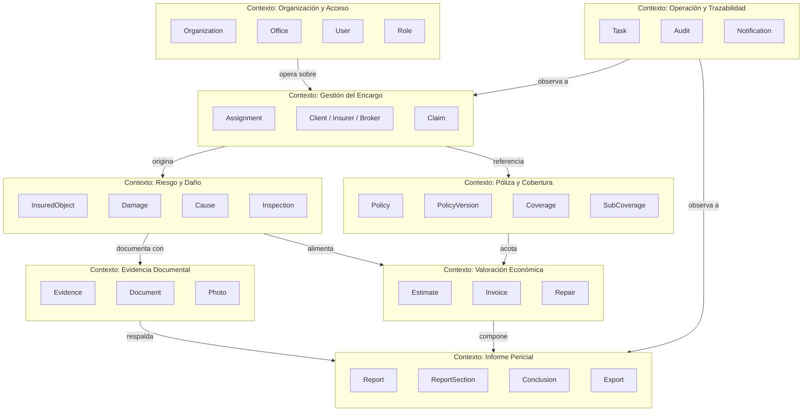
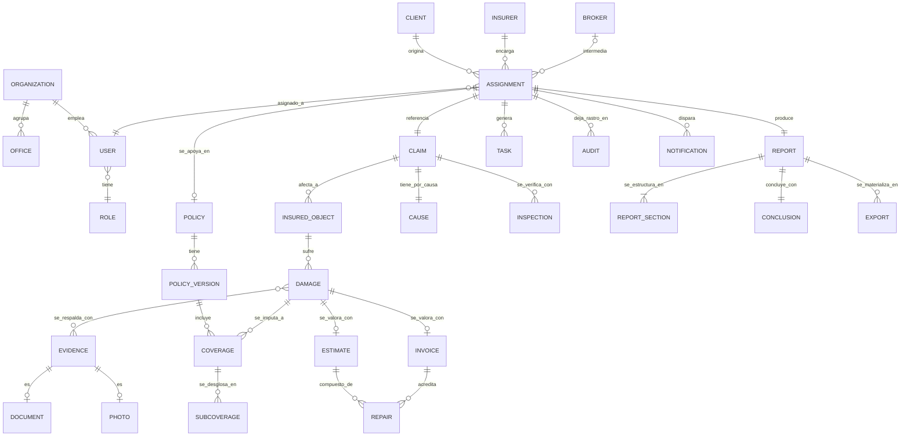

# DOMAIN_MODEL.md — Modelo de dominio de PERIT.IA

> Visión conceptual del negocio. Este documento no habla de código: describe el
> dominio de la peritación de seguros tal y como PERIT.IA lo modela y aspira a
> modelarlo, con independencia de cómo esté implementado hoy.
>
> **Fecha:** 1 de agosto de 2026 · Sprint 1 — Domain Model
> **Depende de:** `GLOSSARY.md` para el vocabulario, `docs/CURRENT_IMPLEMENTATION.md`
> y `docs/DB_MODEL.md` (Sprint 0) para contrastar con el estado real del código.
> **Regla de este sprint:** ninguna decisión de negocio no deducible del código
> ni confirmada por Pol se da por buena en silencio; donde falta, se abre una
> pregunta en `docs/OPEN_QUESTIONS.md` y se marca en el texto.

---

## 1. Qué negocio modela PERIT.IA

PERIT.IA es una plataforma para el oficio de la **peritación de seguros de
daños**: el proceso mediante el cual un profesional independiente —el
perito— examina un siniestro, verifica el riesgo asegurado, determina la
causa, valora el daño y dictamina si procede indemnización y por qué importe.

El negocio tiene tres partes interesadas estructurales, aunque hoy el sistema
solo represente formalmente a una:

| Parte | Papel | Modelada hoy |
|---|---|---|
| **El perito** (o el gabinete que lo emplea) | Ejecuta la peritación y usa PERIT.IA como herramienta de trabajo | Sí — es el único usuario del sistema |
| **La aseguradora** (o la correduría que actúa en su nombre) | Encarga la peritación y recibe el informe | Parcialmente — solo como dato de texto (`compania`), sin relación ni configuración propias |
| **El asegurado** (y, en su caso, el perjudicado) | Sujeto del siniestro, cuyo interés es objeto del dictamen | Solo como dato de texto dentro del expediente |

Esta asimetría es intencionada en la etapa actual del producto (una
herramienta de productividad para un perito autónomo), pero condiciona todo lo
que sigue: el modelo de dominio que se describe aquí es **más amplio que la
implementación actual**, porque el objetivo de este sprint es preparar el
terreno conceptual, no describir solo lo que ya existe. Cada vez que el modelo
se adelanta a la implementación, se indica explícitamente.

---

## 2. Bounded contexts

Un *bounded context* es una frontera dentro de la cual un término del dominio
tiene un significado único y consistente. PERIT.IA, incluso en su forma actual
de aplicación única, ya contiene varios subdominios con vocabulario y reglas
propias que conviene distinguir, porque crecerán a ritmos distintos y
probablemente los mantendrán personas distintas.

### 2.1. Descripción de cada contexto

**Gestión del Encargo** — El mandato que da origen a todo lo demás: quién
encarga, a quién, sobre qué siniestro. Es la puerta de entrada al sistema.

**Póliza y Cobertura** — El contrato de seguro y sus condiciones: qué está
cubierto, con qué capital, con qué franquicia, bajo qué exclusiones. Este
contexto es **de solo lectura** desde la perspectiva del perito: la póliza no
la crea PERIT.IA, la interpreta.

**Riesgo y Daño** — El objeto asegurado, lo que le ha ocurrido y por qué. Es
el contexto donde vive el trabajo de campo del perito.

**Evidencia Documental** — Todo lo que respalda una afirmación del dictamen:
fotografías, documentos, capturas de fuentes oficiales. Este contexto impone
una disciplina transversal (todo debe tener origen) que atraviesa a los demás.

**Valoración Económica** — El cálculo del coste del daño y, en última
instancia, de la indemnización. Es el contexto con reglas de negocio más
densas y el único con casos de verificación conocidos hoy (los dos casos
oráculo de `CONTEXT.md`).

**Informe Pericial** — El producto final: la composición de todo lo anterior
en un documento entregable, con sus distintos formatos de salida.

**Organización y Acceso** — Quién puede hacer qué, y para quién trabaja. Es el
contexto **menos desarrollado hoy**: el sistema actual no distingue
organización, oficina ni rol; solo existe "un perito con su sesión". Se
documenta igualmente porque es indispensable para cualquier futuro
multi-usuario (ver `docs/OPEN_QUESTIONS.md`, P-20).

**Operación y Trazabilidad** — Tareas de trabajo, registro de auditoría y
avisos. Es, junto con el anterior, el contexto que **no existe en el código
actual** y que se documenta en preparación de necesidades futuras (gestión de
carga de trabajo, cumplimiento normativo, comunicación con el interesado).

---

## 3. Agregados

Un *agregado* es un grupo de entidades que se tratan como una unidad
consistente, con una entidad raíz que controla el acceso a las demás. Estos
son los agregados que este sprint identifica:

| Agregado | Raíz | Miembros | Invariante que protege |
|---|---|---|---|
| **Encargo** | `Assignment` | `Claim` | Un encargo siempre referencia exactamente un siniestro |
| **Póliza** | `Policy` | `PolicyVersion`, `Coverage`, `SubCoverage` | Las garantías y sus condiciones siempre pertenecen a una versión concreta y vigente de la póliza |
| **Expediente de riesgo** | `InsuredObject` | `Damage`, `Cause` | Todo daño está asociado a un objeto asegurado y a una causa determinada |
| **Evidencia** | `Evidence` | `Document`, `Photo` | Toda evidencia tiene un origen identificable |
| **Valoración** | `Estimate` | `Repair` (partidas), `Invoice` | El importe de una valoración es siempre la suma consistente de sus partidas |
| **Informe** | `Report` | `ReportSection`, `Conclusion`, `Export` | Un informe no se exporta si sus secciones obligatorias no están completas |
| **Organización** | `Organization` | `Office`, `User`, `Role` | Todo usuario pertenece exactamente a una organización |

Cada agregado tiene documento propio en `docs/domain/entities/`, con su ciclo
de vida, reglas y validaciones detalladas.

---

## 4. Modelo conceptual — vista de entidades y relaciones

La versión narrada de cada relación, con su cardinalidad justificada, está en
`RELATIONSHIPS.md`. Este diagrama es el mapa; ese documento es el porqué de
cada flecha.

---

## 5. El flujo de valor, en una frase por contexto

1. **Un cliente encarga** una peritación sobre un siniestro concreto.
2. **El encargo se apoya en una póliza** que acota qué está cubierto y con qué
   límites.
3. **El perito verifica el riesgo** e identifica los objetos asegurados
   afectados y la causa del siniestro.
4. **Cada daño se documenta con evidencia** y se valora, por baremo, por
   presupuesto o por factura.
5. **Todo se compone en un informe**, que concluye con un dictamen motivado y
   se exporta en el formato que el destinatario necesita.
6. **Alrededor de todo el proceso**, la organización asigna trabajo, dejando
   rastro de lo que ha ocurrido y avisando a quien corresponda.

---

## 6. Distancia respecto a la implementación actual

Tabla de contraste, para que este documento no se lea como si describiera el
código de hoy:

| Concepto del dominio | Existe hoy como | Brecha |
|---|---|---|
| `Assignment` | Fila de `informes` (columna `encargo` jsonb) | El encargo y el siniestro no están separados; el "cliente" que encarga es un campo de texto libre implícito en `compania` |
| `Client` / `Insurer` / `Broker` | `enc.compania` (texto libre) | No hay entidad, ni catálogo, ni distinción entre aseguradora y correduría |
| `Claim` | Implícito dentro de `encargo` | No tiene identidad propia separable del encargo |
| `Policy` / `PolicyVersion` | Campos sueltos de `encargo` | No hay versión de póliza: un cambio de condiciones en el tiempo no se puede representar |
| `Coverage` / `SubCoverage` | `enc.garantia` (texto) + `franquicias{}` por código | La subgarantía no existe como entidad, solo como clave de un mapa |
| `InsuredObject` | No existe | El daño se agrupa directamente por partidas; no hay objeto asegurado individual |
| `Inspection` | `enc.modalidadVisita` (PRESENCIAL/DOCUMENTAL) | Es un campo, no una entidad con su propio ciclo de vida |
| `Evidence` / `Document` / `Photo` | `informes.anexos` (jsonb) | Sin procedencia, sin confianza, sin versión — ver Sprint 0, DT-12 |
| `Estimate` / `Invoice` / `Repair` | `s3.partidas[]`, `s3.facturas[]` | Sin trazabilidad de origen por partida |
| `Report` / `ReportSection` / `Conclusion` | `s1`-`s4` + composición en tres plantillas distintas | Sin modelo único (Sprint 0, DT-07) |
| `Organization` / `Office` / `Role` | No existen | Sistema mono-usuario; ver `docs/OPEN_QUESTIONS.md`, P-20 |
| `Task` / `Audit` / `Notification` | No existen | Sin gestión de carga de trabajo ni registro de auditoría |

Esta tabla es la base de las inconsistencias reportadas en el resumen
ejecutivo de este sprint.

---

## 7. Principios de diseño del dominio

Derivados de `CLAUDE.md` y de la exigencia explícita de este sprint, no
inventados:

1. **El software se adapta al dominio, no al revés.** Cuando este modelo y el
   código actual difieran, el modelo no se recorta para encajar en lo que hay.
2. **La plataforma es independiente de la aseguradora.** `Insurer` es una
   entidad de configuración, no un valor de texto ni una rama de código.
3. **Toda conclusión debe estar respaldada por evidencia.** `Conclusion` y
   `Damage` no existen sin al menos una referencia a `Evidence`.
4. **Todo informe debe ser trazable.** Cada dato del `Report` debe poder
   remontarse a su `Document`, `Evidence` o entrada manual de origen.
5. **Nunca se sobrescriben datos extraídos por IA.** El valor extraído y el
   valor corregido por el perito conviven; el segundo no borra al primero (ver
   `BUSINESS_RULES.md`).

---

## 8. Documentos relacionados

| Documento | Contenido |
|---|---|
| `GLOSSARY.md` | Definiciones del lenguaje ubicuo usado aquí |
| `BUSINESS_RULES.md` | Reglas de negocio derivadas de este modelo |
| `STATE_MACHINES.md` | Estados y transiciones de las entidades con ciclo de vida propio |
| `EVENTS.md` | Eventos de dominio que estas entidades producen y consumen |
| `RELATIONSHIPS.md` | Detalle narrado de cada relación del diagrama de la sección 4 |
| `LIFECYCLES.md` | Ciclo de vida completo, extremo a extremo, de las entidades principales |
| `entities/*.md` | Ficha completa de cada una de las 30 entidades |
| `docs/OPEN_QUESTIONS.md` | Preguntas de negocio que este sprint no ha podido cerrar |
