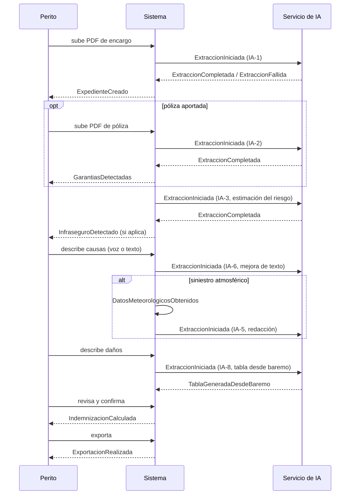

# EVENTS.md — Eventos de dominio de PERIT.IA

> Catálogo de eventos del negocio: hechos consumados, relevantes para el
> dominio, que ocurren a lo largo del ciclo de vida de un expediente. Un evento
> se nombra en pasado y no se puede deshacer — lo que ocurre después es una
> reacción al evento, no su cancelación.
>
> Cada evento se marca **[Implícito]** cuando el hecho ocurre hoy en el código
> pero no existe como evento observable (no hay publicación, ni registro, ni
> nadie puede suscribirse a él), o **[Conceptual]** cuando pertenece al modelo
> de dominio objetivo y hoy no ocurre de ninguna forma.
>
> **Ninguno de estos eventos se registra hoy como tal.** Esta es, en sí misma,
> la principal conclusión de este documento — desarrollada en Sprint 0,
> `TECHNICAL_DEBT.md`, DT-12.
>
> **Fecha:** 1 de agosto de 2026 · Sprint 1 — Domain Model

---

## 1. Ciclo de vida del encargo y el expediente

| Evento | Estado | Dispara hoy en el código | Debería disparar (conceptual) |
|---|---|---|---|
| **EncargoRecibido** | Implícito | Subida del PDF de encargo, antes de extraer nada | Registro de auditoría; posible notificación al gabinete |
| **ExpedienteCreado** | Implícito | `handleDone` — alta local + intento de `INSERT` en Supabase | Evento de auditoría con usuario, fecha y origen |
| **ExpedienteAsignado** | Conceptual | No existe (mono-usuario) | Asignación a un perito concreto dentro de un gabinete |
| **DocumentoSubido** | Implícito | Cualquier `POST` a Storage (anexos, capturas automáticas) | Evento con tipo de documento, tamaño, usuario |
| **ExtraccionIniciada** | Implícito | Llamada a `callClaude` con un PDF | Registro de ejecución de IA (ver Sprint 0, DT-12) |
| **ExtraccionCompletada** | Implícito | Respuesta de IA interpretada con éxito por `parseJSON` | Igual que el anterior, con resultado y confianza |
| **ExtraccionFallida** | Implícito | `_apiError` o `_parseError` detectado por `iaError` | Igual, con motivo del fallo, para permitir reintento dirigido |
| **GarantiasDetectadas** | Implícito | Campo `garantia`/`coberturaInferida` relleno tras extraer el encargo | Evento propio, para poder reaccionar (por ejemplo, activar automáticamente la verificación meteorológica) |
| **RiesgoVerificado** | Conceptual | No existe como hecho discreto; se infiere de que Sección 1 esté completa | Evento al completar la verificación del riesgo |
| **InfraseguroDetectado** | Implícito | `calcReglas` devuelve `infraCont`/`infraContenido` > 0, se muestra en pantalla | Evento explícito, para poder avisar de forma proactiva al perito |

---

## 2. Ciclo de vida de la valoración

| Evento | Estado | Dispara hoy en el código | Debería disparar (conceptual) |
|---|---|---|---|
| **ModoValoracionElegido** | Implícito | El perito selecciona baremo / presupuesto / factura en Sección 3 | Sin cambios necesarios, es ya una decisión explícita del usuario |
| **TablaGeneradaDesdeBaremo** | Implícito | Éxito de IA-8 (`genFromBaremo`) | Registro de qué partidas propuso la IA frente a las que el perito conservó |
| **PartidasExtraidasDeFactura** | Implícito | Éxito de IA-9 (`extractFromFacturas`) | Igual, con la factura de origen de cada partida |
| **PartidaSinPrecioEnBaremo** | Implícito | `matchBaremo` no encuentra coincidencia, se avisa en pantalla | Ya es visible al usuario; falta que quede registrado para analizar qué falta en el baremo |
| **ReglaProporcionalActivada** | Implícito | El perito activa `s3.reglaContinente`/`reglaContenido` | Sin cambios necesarios |
| **IndemnizacionCalculada** | Implícito | Cada vez que se renderiza la Sección 4 o la vista previa (cálculo en vivo, no un hecho discreto) | Evento explícito al confirmar la valoración, con el importe congelado en ese momento |

---

## 3. Ciclo de vida del informe

| Evento | Estado | Dispara hoy en el código | Debería disparar (conceptual) |
|---|---|---|---|
| **InformeGenerado** | Implícito | La vista previa (`SecInforme`) se recalcula en cada render; no es un hecho, es una proyección continua | Evento discreto en el momento en que el perito considera el informe listo |
| **InformeRevisado** | Conceptual | Abrir el panel de "Pendientes" no se registra en ningún sitio | Evento al completar la revisión previa a exportar |
| **ExportacionRealizada** | Implícito | `handlePDF` / `handleWord` en `ExportModal`, y `markExported` marca `estado='exportado'` | Registro con formato, fecha, usuario y versión de los datos exportados |
| **FirmaCompletada** | Conceptual | No existe ningún mecanismo de firma | Evento futuro, si se incorpora firma electrónica del informe |
| **ExpedienteEntregado** | Conceptual | No hay distinción entre "exportado" y "entregado al destinatario" | Evento de entrega efectiva (envío, descarga confirmada) |
| **ExpedienteCerrado** | Conceptual | No existe estado de cierre (ver `STATE_MACHINES.md`, sección 1) | Evento que impediría nuevas ediciones |
| **ExpedienteReabierto** | Conceptual | Editar un expediente exportado no deja rastro de que ha ocurrido | Evento que documentaría el motivo de la reapertura |

---

## 4. Eventos de sesión y seguridad

| Evento | Estado | Dispara hoy en el código | Debería disparar (conceptual) |
|---|---|---|---|
| **UsuarioRegistrado** | Implícito | `sbAuth('signup', …)`, dispara el trigger `handle_new_user` | Ya deja rastro en `perfiles`; falta evento observable a nivel de aplicación |
| **UsuarioAutenticado** | Implícito | `sbAuth('token?grant_type=password', …)` | Registro de auditoría de accesos |
| **SesionCaducada** | Conceptual | Ocurre de hecho al pasar el tiempo de vida del token, pero nadie lo detecta activamente — el primer síntoma es un guardado fallido | Evento explícito que permitiría avisar al perito antes de perder trabajo |
| **ExpedienteBorrado** | Implícito | `deleteCase` — `DELETE` en `informes`, sin borrar los archivos asociados en Storage | Evento con motivo, y que debería disparar el borrado en cascada de los anexos |

---

## 5. Eventos externos consumidos

Eventos que **no genera** PERIT.IA, pero que **recibe** de servicios externos y
a los que reacciona. Se listan porque también forman parte del vocabulario de
eventos del dominio.

| Evento externo | Origen | Reacción actual |
|---|---|---|
| **DatosCatastralesObtenidos** | Sede Electrónica del Catastro, vía `/api/catastro` | Rellena referencia catastral, superficie, año y uso en Sección 1 |
| **DatosMeteorologicosObtenidos** | XEMA, vía `/api/meteocat` | Rellena la tabla meteorológica de Sección 2 y dispara IA-5 (redacción del párrafo) |
| **RespuestaDeIARecibida** | Anthropic, vía `/api/claude` | Se interpreta con `parseJSON`; si falla, dispara `ExtraccionFallida` |

---

## 6. Relación entre eventos y las nueve capacidades de IA

Cada capacidad de IA descrita en Sprint 0 (`AI_INVENTORY.md`) corresponde a un
tramo del ciclo de eventos:

---

## 7. Lo que este documento no puede afirmar

Ningún evento de este catálogo se persiste hoy como registro consultable. Lo
más parecido que existe es la consola de Vercel, efímera y sin correlación
con el expediente (Sprint 0, `AI_INVENTORY.md`, sección 7.1). Diseñar un bus de
eventos o una tabla de auditoría es trabajo de implementación, fuera del
alcance de este sprint documental — queda anotado como propuesta pendiente de
ADR en el resumen ejecutivo, no como tarea abierta a ejecutar.
