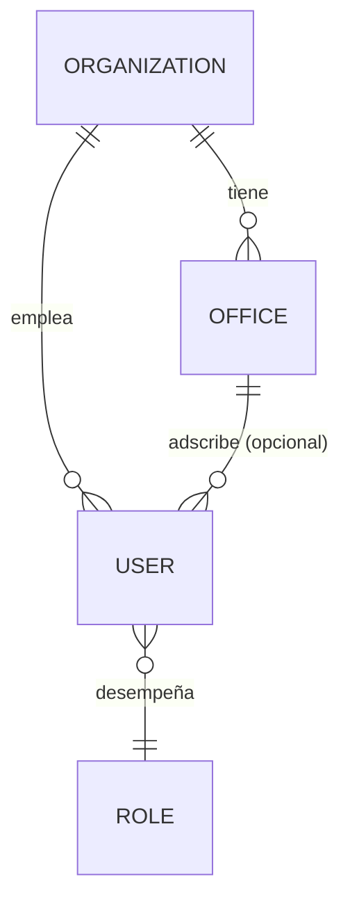
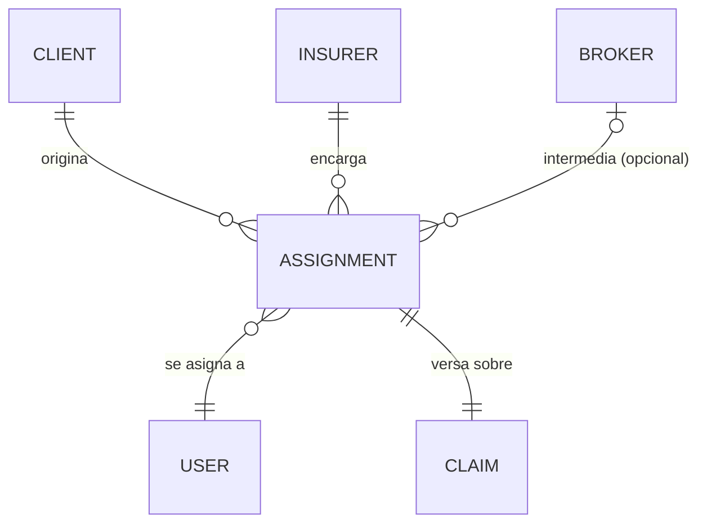
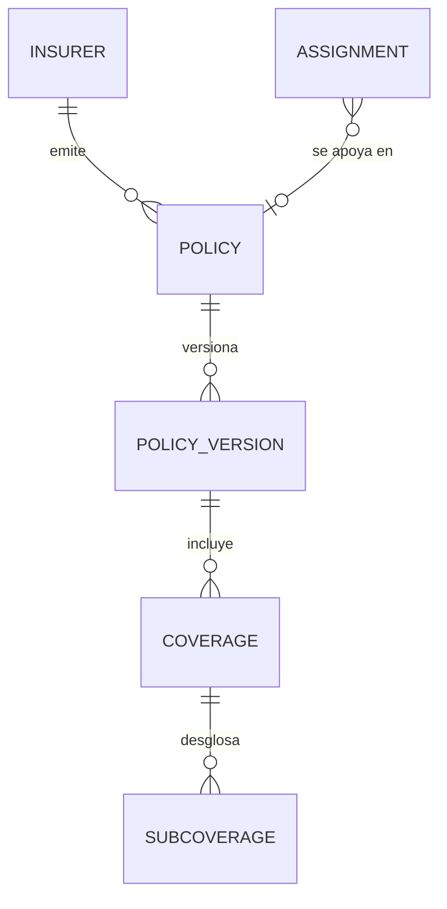
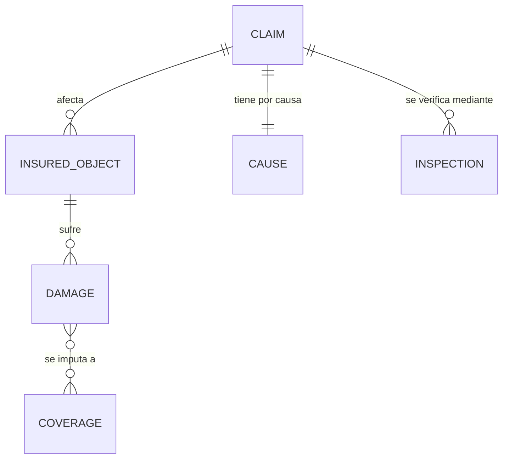
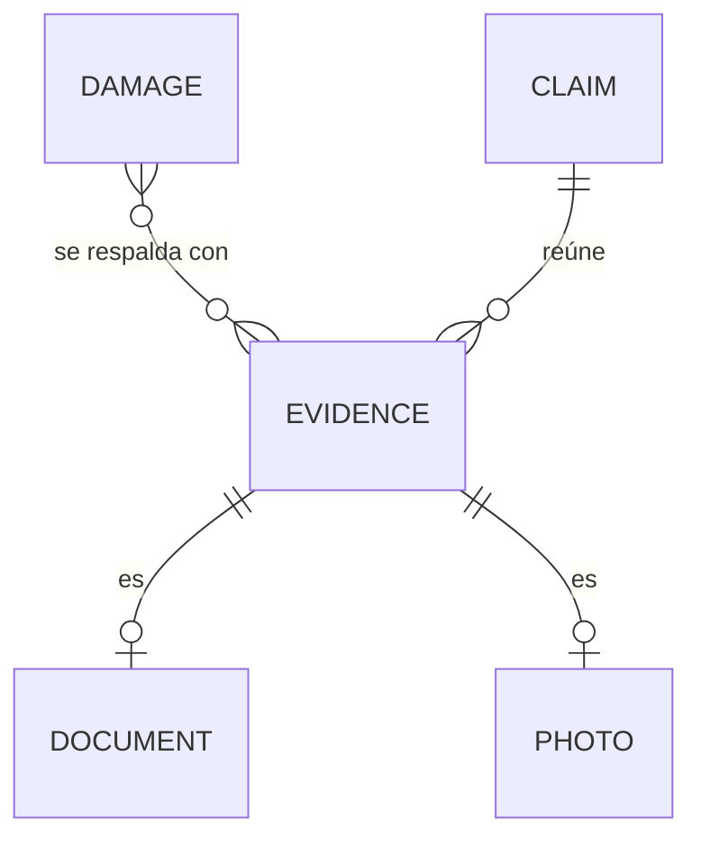
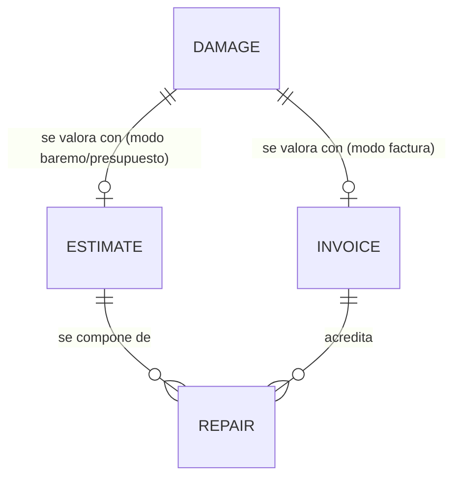
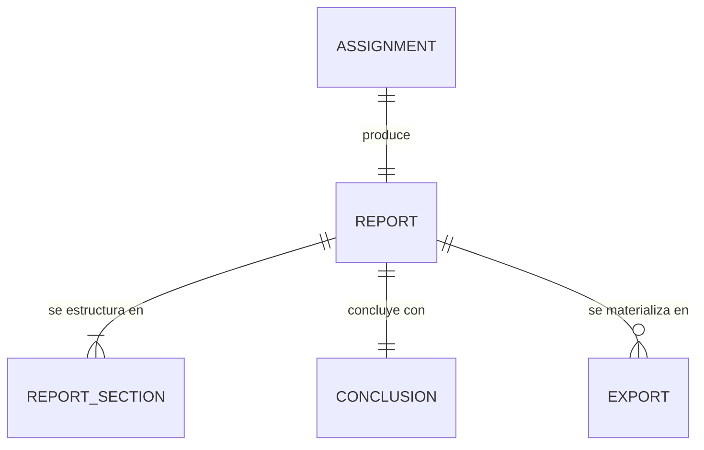
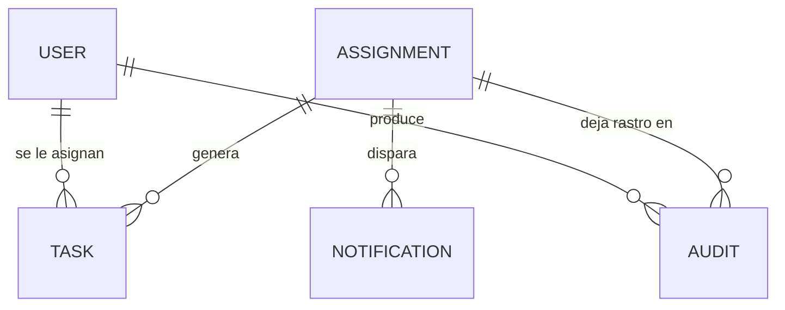

# RELATIONSHIPS.md — Relaciones entre entidades

> Explicación narrada de cada relación del modelo de dominio, con su
> cardinalidad y su justificación de negocio. El diagrama consolidado está en
> `DOMAIN_MODEL.md`, sección 4; este documento es el porqué de cada flecha, no
> su repetición.
>
> **Fecha:** 1 de agosto de 2026 · Sprint 1 — Domain Model

---

## 1. Organización y acceso

- **Organization 1 — N Office.** Una organización (un gabinete pericial) puede
  operar desde una o varias oficinas físicas o administrativas. **Conceptual**:
  no existe hoy ninguna de las dos entidades.
- **Organization 1 — N User.** Todo perito pertenece a una organización. En el
  caso más simple —el actual—, la organización es el propio perito autónomo:
  una organización de un único miembro.
- **Office 0..1 — N User.** Un usuario puede adscribirse a una oficina
  concreta dentro de su organización, o a ninguna si la organización es
  plana.
- **User N — 1 Role.** Cada usuario desempeña un rol que determina sus
  permisos. Hoy solo existe un rol implícito ("perito"), sin representación
  como entidad.

---

## 2. Encargo y sus partes interesadas

- **Client 1 — N Assignment.** Un mismo cliente puede originar múltiples
  encargos a lo largo del tiempo. "Cliente" aquí es deliberadamente genérico:
  puede ser la propia aseguradora actuando como cliente directo del perito, o
  un tercero. Ver la nota de la sección 8 sobre la ambigüedad de este
  concepto en el negocio actual.
- **Insurer 1 — N Assignment.** La aseguradora que asume el riesgo encarga, de
  forma directa o a través de correduría, la peritación de sus siniestros.
- **Broker 0..1 — N Assignment.** Una correduría puede intermediar en el
  encargo, actuando en nombre de la aseguradora o del tomador. La relación es
  opcional: muchos encargos van directos de aseguradora a perito.
- **Assignment N — 1 User.** Cada encargo se asigna a un perito responsable.
  En el sistema actual, como solo hay un usuario por cuenta, esta asignación
  es implícita y trivial (siempre el mismo).
- **Assignment 1 — 1 Claim.** Un encargo versa siempre sobre un único
  siniestro. No existe el encargo múltiple sobre varios siniestros a la vez;
  si un mismo evento (por ejemplo, un temporal) afecta a varios asegurados,
  se generan encargos y siniestros independientes, uno por cada uno.

---

## 3. La póliza y su estructura de cobertura

- **Insurer 1 — N Policy.** Una aseguradora emite múltiples pólizas a lo largo
  del tiempo, para distintos tomadores.
- **Policy 1 — N PolicyVersion.** Una póliza puede tener varias versiones a lo
  largo de su vigencia (renovaciones, suplementos que cambian capitales o
  condiciones). **Conceptual, no implementado**: hoy solo hay un juego de
  valores por expediente, sin relación con ninguna versión concreta de
  póliza — ver `docs/OPEN_QUESTIONS.md`, P-21.
- **PolicyVersion 1 — N Coverage.** Cada versión de la póliza define qué
  garantías están contratadas, con qué capital y qué franquicia en ese
  momento.
- **Coverage 1 — N SubCoverage.** Una garantía puede desglosarse en conceptos
  más finos. **Conceptual**: el código actual no tiene esta entidad; lo más
  cercano son las claves de `franquicias{}`, que dan granularidad por
  garantía, no por subgarantía dentro de la garantía.
- **Assignment N — 0..1 Policy.** Un encargo se apoya, casi siempre, en una
  póliza identificada; pero la relación es opcional porque puede haber
  encargos —Instant Payment, por ejemplo— gestionados sin que la póliza llegue
  a aportarse formalmente o sin que se identifique su número.

---

## 4. El riesgo, sus objetos y sus daños

- **Claim 1 — N InsuredObject.** Un siniestro puede afectar a varios objetos
  asegurados distintos (varias estancias, varios elementos). **Conceptual**:
  el código no distingue objetos individuales; el daño se agrupa
  directamente en partidas de reparación sin pasar por un objeto intermedio.
- **Claim 1 — 1 Cause.** Un siniestro tiene una causa principal. **Matiz**:
  aunque la causa sea una, puede tener consecuencias sobre varias garantías a
  la vez (BR-09); la relación 1–1 es con la causa, no con sus efectos.
- **Claim 1 — N Inspection.** Un siniestro puede requerir más de una
  inspección (por ejemplo, una primera visita y una revisión posterior tras
  una reparación provisional). Hoy solo existe el campo `modalidadVisita`,
  sin entidad de inspección propiamente dicha.
- **InsuredObject 1 — N Damage.** Cada objeto puede sufrir varios daños de
  naturaleza distinta.
- **Damage N — N Coverage.** Un daño se imputa a una garantía concreta
  (relación real 1–1 en el código actual vía el campo `garantia` de cada
  partida), pero conceptualmente un mismo daño físico podría, en teoría,
  solaparse entre garantías (por ejemplo, un daño con causa mixta). Se
  documenta como N–N por generalidad del dominio, con la advertencia de que
  la implementación actual la simplifica a una imputación única.

---

## 5. La evidencia

- **Damage N — N Evidence.** Un daño puede estar respaldado por varias
  evidencias, y una misma evidencia (una fotografía general de una estancia)
  puede respaldar varios daños a la vez (BR-29).
- **Evidence — Document / Photo.** `Evidence` es un concepto paraguas;
  `Document` y `Photo` son sus dos especializaciones más frecuentes en el
  dominio actual. Una pieza de evidencia es una u otra, no ambas
  (especialización excluyente).
- **Claim 1 — N Evidence.** Toda la evidencia reunida pertenece, en última
  instancia, al siniestro que documenta, con independencia de a cuántos daños
  concretos respalde.

---

## 6. La valoración económica

- **Damage 0..1 — Estimate.** Un daño se valora mediante una estimación
  (baremo o presupuesto) o mediante una factura, no ambas a la vez para el
  mismo importe — son modos de valoración mutuamente excluyentes por
  expediente (BR-23), aunque el dominio general permitiría, en teoría,
  combinaciones (parte del daño por baremo, parte por factura ya emitida).
- **Estimate 1 — N Repair.** Una estimación se compone de varias partidas de
  reparación, cada una con su unidad, cantidad y precio.
- **Invoice 1 — N Repair.** Una factura acredita, igualmente, un conjunto de
  partidas ya ejecutadas y cobradas.
- **Repair** es la entidad común a ambos caminos: la unidad mínima de cálculo,
  con independencia de si su precio viene del baremo, de un presupuesto o de
  una factura real.

---

## 7. El informe

- **Assignment 1 — 1 Report.** Cada encargo produce exactamente un informe.
  No hay informes múltiples ni parciales por encargo en el modelo actual;
  las revisiones son versiones del mismo informe, no informes distintos.
- **Report 1 — N ReportSection.** El informe se estructura en secciones fijas
  (hoy: Datos del Encargo, Verificación del Riesgo, Causas y Circunstancias,
  Valoración de Daños, Cobertura-Indemnización, Anexos), cada una con su
  propio contenido y su propio criterio de "completa".
- **Report 1 — 1 Conclusion.** El informe concluye con un único dictamen
  motivado sobre causa, daño y procedencia de indemnización.
- **Report 1 — N Export.** Un mismo informe puede materializarse en varias
  exportaciones a lo largo del tiempo (PDF, Word, sucesivas versiones tras
  correcciones), cada una como un artefacto propio con su fecha.

---

## 8. Operación y trazabilidad

- **Assignment 1 — N Task.** Un encargo puede generar varias tareas de trabajo
  a lo largo de su ciclo de vida. Conceptual, no implementado.
- **Assignment 1 — N Audit.** Cada acción relevante sobre un encargo deja, en
  el modelo objetivo, un registro de auditoría. Conceptual: hoy la única
  huella es `updated_at` a nivel de fila completa.
- **User 1 — N Audit.** Todo registro de auditoría tiene un autor.
- **Assignment 1 — N Notification.** Distintos hitos del encargo pueden
  disparar avisos a las partes interesadas. Conceptual, no implementado.

---

## 9. Advertencia sobre la entidad "Client"

Esta es la relación más ambigua de todo el modelo, y se deja constancia
explícita para no ocultar el problema bajo un diagrama limpio.

En el dominio pericial, **"cliente" no es un concepto unívoco**: puede
referirse a quien paga al perito (con frecuencia la aseguradora), a quien
sufre el siniestro (el asegurado), o a la correduría que gestiona la relación.
El modelo de esta sección trata `Client` como un rol genérico —quien encarga
la peritación—, distinto de `Insurer` —quien asume el riesgo asegurado— y de
`Broker` —quien intermedia—, precisamente porque en muchos encargos las tres
cosas son la misma entidad (la propia aseguradora) y en otros no.

**Esta ambigüedad no se resuelve en este documento.** Ver
`docs/OPEN_QUESTIONS.md`, P-22 (nueva de este sprint): si `Client` debe
existir como entidad separada de `Insurer`, o si en el negocio real de
PERIT.IA el cliente del perito es siempre la aseguradora y la entidad sobra.

---

## 10. Tabla resumen de cardinalidades

| Relación | Cardinalidad | Estado |
|---|---|---|
| Organization – Office | 1–N | Conceptual |
| Organization – User | 1–N | Conceptual (hoy: 1–1 implícito) |
| User – Role | N–1 | Conceptual |
| Client – Assignment | 1–N | Parcial (como texto libre) |
| Insurer – Assignment | 1–N | Parcial (como texto libre) |
| Broker – Assignment | 0..1–N | Conceptual |
| Assignment – User | N–1 | Implícito (siempre el mismo usuario) |
| Assignment – Claim | 1–1 | Implícito, sin entidades separadas |
| Insurer – Policy | 1–N | Parcial |
| Policy – PolicyVersion | 1–N | Conceptual |
| PolicyVersion – Coverage | 1–N | Implementada (sin versión explícita) |
| Coverage – SubCoverage | 1–N | Conceptual |
| Assignment – Policy | N–0..1 | Implícito |
| Claim – InsuredObject | 1–N | Conceptual |
| Claim – Cause | 1–1 | Implementada |
| Claim – Inspection | 1–N | Parcial (un campo, no una entidad) |
| InsuredObject – Damage | 1–N | Conceptual |
| Damage – Coverage | N–N (real: N–1) | Implementada como N–1 |
| Damage – Evidence | N–N | Parcial (sin relación explícita, solo coexistencia en el expediente) |
| Evidence – Document/Photo | especialización | Parcial |
| Claim – Evidence | 1–N | Implementada (`anexos`) |
| Damage – Estimate/Invoice | 0..1–0..1 | Implementada |
| Estimate/Invoice – Repair | 1–N | Implementada (`partidas[]`) |
| Assignment – Report | 1–1 | Implementada |
| Report – ReportSection | 1–N | Implementada |
| Report – Conclusion | 1–1 | Implementada (sin entidad propia) |
| Report – Export | 1–N | Parcial (no se guarda historial de exportaciones) |
| Assignment – Task/Audit/Notification | 1–N | Conceptual, no implementadas |
