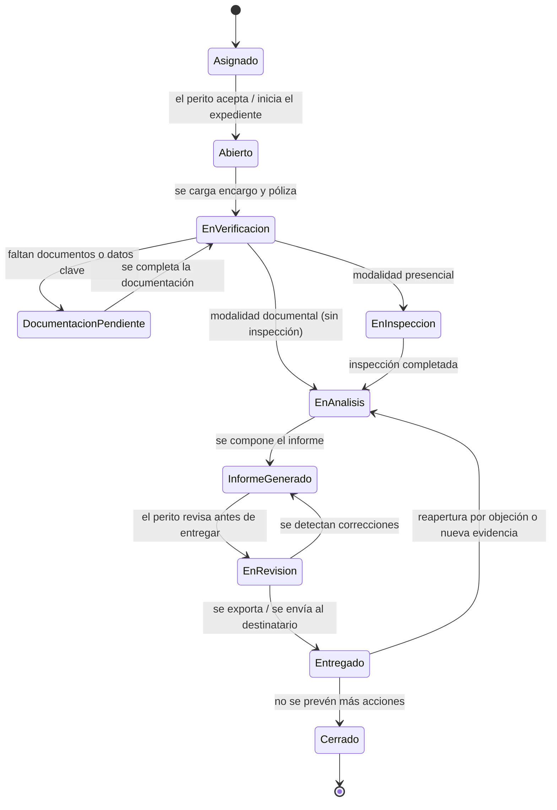
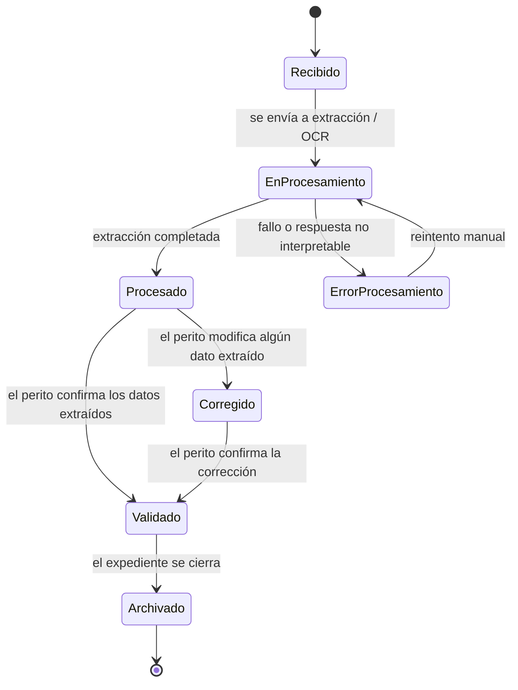
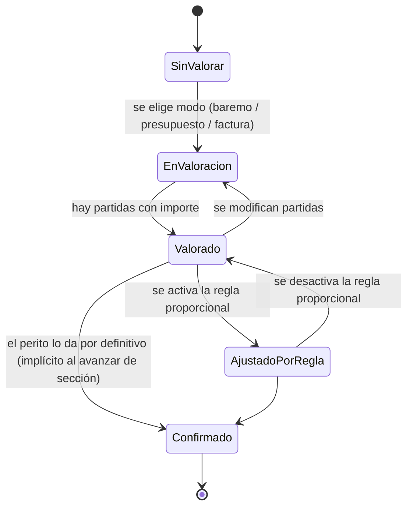
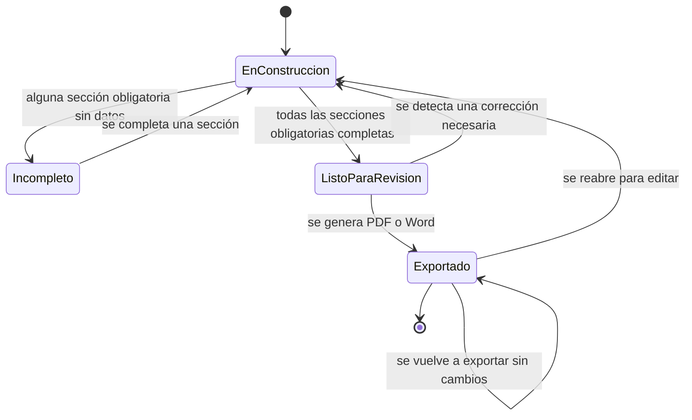
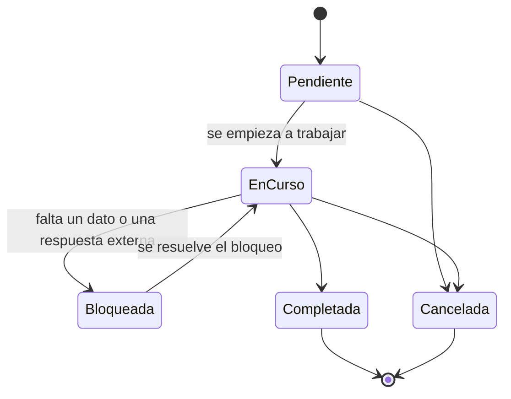
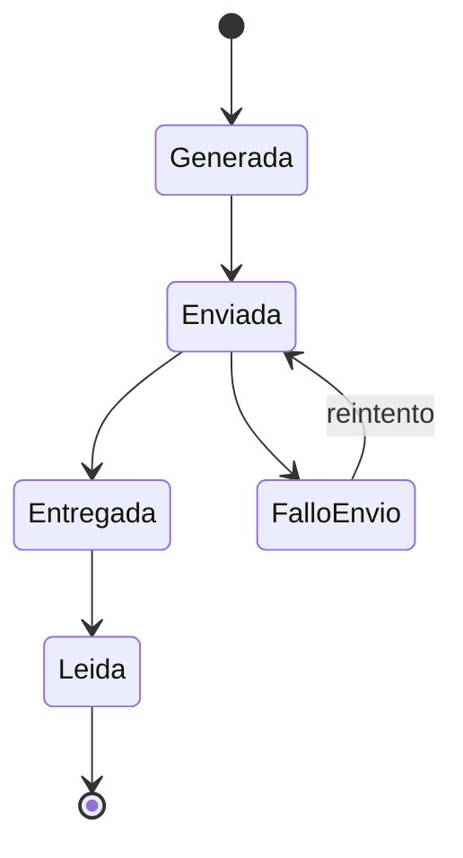
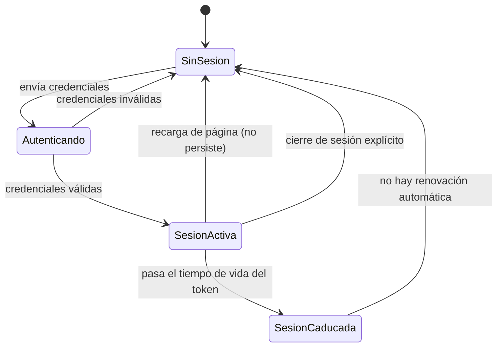

# STATE_MACHINES.md — Máquinas de estado de PERIT.IA

> Estados y transiciones de las entidades que tienen ciclo de vida propio.
> Cada máquina se marca **[Implementada]** cuando el código actual la aplica
> tal cual, o **[Conceptual]** cuando pertenece al modelo de dominio objetivo y
> aún no existe en el código — en cuyo caso se indica qué la aproxima hoy.
>
> **Fecha:** 1 de agosto de 2026 · Sprint 1 — Domain Model

---

## 1. Expediente / Encargo (`Assignment` + `Claim`)

**[Conceptual, con aproximación implementada].** El código actual solo conoce
dos valores de un campo (`estado`: `borrador`/`exportado`) más un cuarto
estado calculado en pantalla ("Pendiente revisión") que no se persiste. El
ciclo de vida completo que describe un expediente pericial de principio a fin
es más rico que eso, y es el que se documenta aquí como modelo objetivo.

### Correspondencia con el código actual

| Estado conceptual | Aproximación en el código de hoy |
|---|---|
| Asignado | Momento de `handleDone`: alta del expediente tras extraer el PDF de encargo |
| Abierto | `estado = 'borrador'`, recién creado |
| En verificación / Documentación pendiente | Semáforo naranja o rojo en cualquiera de las 6 secciones (`semaforoFromStates`) |
| En inspección | `enc.modalidadVisita === 'PRESENCIAL'`, sin estado propio |
| En análisis | Perito trabajando en Secciones 2-4, sin estado propio |
| Informe generado | Vista previa (`SecInforme`) disponible en cualquier momento, no es un estado real |
| En revisión | Panel de "Pendientes" abierto antes de exportar (`pendingOpen`), sin persistirse |
| Entregado | `estado = 'exportado'`, tras `markExported` |
| Cerrado | **No existe.** Ningún estado impide seguir editando un expediente exportado |
| Reapertura | Editar un expediente ya exportado, sin restricción ni registro de que ha ocurrido |

**Discrepancia relevante:** el estado `completado` existe en el esquema de
base de datos y en `CLAUDE.md`, pero **ningún camino del código lo asigna**.
Es un estado documentado sin implementación, o una etapa prevista y nunca
construida. Ver `docs/OPEN_QUESTIONS.md`, P-14.

---

## 2. Documento / Evidencia (`Document`, `Photo`, `Evidence`)

**[Conceptual].** No existe hoy como máquina de estados; los anexos se tratan
como presentes o ausentes, sin ciclo de vida propio.

**Nota de trazabilidad (BR-28):** la transición `Procesado → Corregido` no
debe destruir el valor `Procesado` original; ambos deben coexistir. El código
actual solo respeta esto para un número reducido de campos
(`capContOverride`, `capCont2Override`); en la mayoría de campos, corregir
sustituye el valor extraído sin dejar rastro del original.

---

## 3. Tarea de valoración (`Estimate` / `Damage`)

**[Conceptual, con aproximación implementada]**. El código no modela un
estado de la valoración en sí, pero el flujo real de trabajo del perito sí
atraviesa fases reconocibles.

---

## 4. Informe (`Report`)

**[Conceptual, con aproximación implementada]**. El informe en sí no tiene
estado propio: su estado se infiere del estado del expediente que lo
contiene y de si sus secciones están completas.

**Nota:** "ListoParaRevision" y "Exportado" no son mutuamente excluyentes en
el código actual: se puede exportar con el panel de "Pendientes" mostrando
apartados incompletos. No hay bloqueo, solo aviso — decisión de producto, no
fallo, pero merece confirmarse si es el comportamiento deseado a medida que
el informe gane peso legal.

---

## 5. Organización de trabajo — `Task`

**[Conceptual, no implementada].** No existe ninguna noción de tarea en el
código actual: el propio expediente hace las veces de única unidad de trabajo.
Se documenta el ciclo de vida que tendría una tarea si el sistema evoluciona
hacia gestión de carga de trabajo (por ejemplo, "revisar Sección 3 antes del
viernes", "solicitar factura al reparador").

---

## 6. Notificación — `Notification`

**[Conceptual, no implementada].**

---

## 7. Usuario / Sesión — aproximación implementada

**[Implementada, incompleta].** No es una máquina de estados de negocio en
sentido estricto, pero condiciona directamente la disponibilidad de todo lo
demás y merece registrarse, porque su carencia es una de las conclusiones más
repetidas del Sprint 0.

**Nota:** las dos transiciones directas a `SinSesion` desde `SesionActiva`
(caducidad y recarga) son, exactamente, el contenido de la ficha DT-03 del
Sprint 0. Se incluyen aquí porque conceptualmente son parte del ciclo de vida
que cualquier usuario del sistema atraviesa, aunque no sean estado de negocio
en sentido pericial.

---

## 8. Resumen de qué está implementado y qué es conceptual

| Máquina | Estado |
|---|---|
| Expediente / Encargo | Conceptual, aproximación parcial con 2 estados persistidos + 1 calculado |
| Documento / Evidencia | Conceptual, sin implementación |
| Valoración | Conceptual, aproximación por flujo de pantallas sin estado explícito |
| Informe | Conceptual, aproximación por completitud de secciones |
| Tarea | Conceptual, no implementada |
| Notificación | Conceptual, no implementada |
| Sesión de usuario | Implementada, con dos vacíos de estado (DT-03) |

Ninguna de las máquinas conceptuales implica que deba implementarse en el
código de inmediato — **este sprint es solo de documentación**. Su valor es
servir de referencia para cuando se aborden, en sprints futuros y con
aprobación previa, las fichas correspondientes del backlog de refactor.
