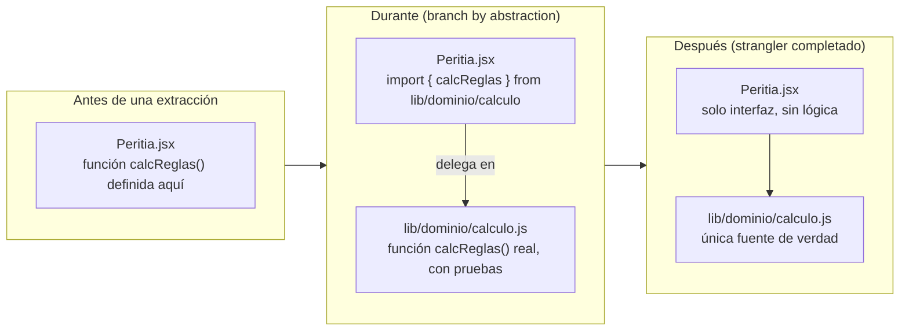
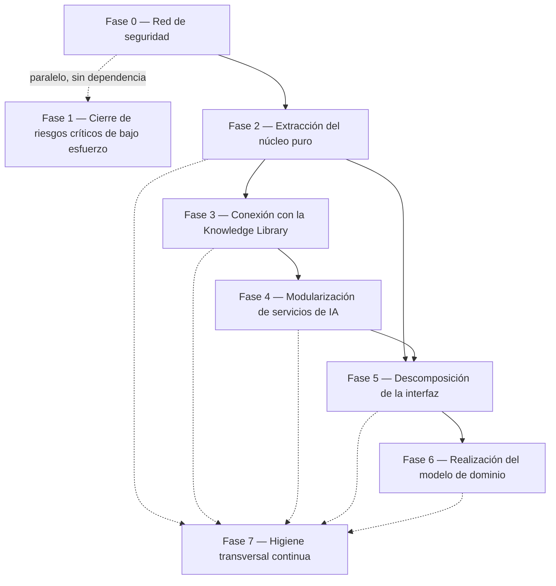

# MIGRATION_MASTER_PLAN.md — Plan Maestro de Migración de PERIT.IA

> **Sprint 4 — Foundation Refactor.** Este documento es un plan. No contiene
> código, no mueve archivos, no renombra nada. Es la hoja de ruta oficial que
> guiará, sprint a sprint, la implementación progresiva de la arquitectura
> definida en los Sprints 0–3, ahora congelada como **Architecture Freeze
> v1.0**.
>
> **Fecha:** 1 de agosto de 2026 · Sprint 4 — Foundation Refactor
> **Rol de quien ejecuta este plan:** Lead Software Engineer. La arquitectura
> ya no se diseña, se implementa — y solo se cambia mediante ADR.
> **Método:** análisis exclusivo del proyecto real. Ninguna fase de este plan
> parte de una arquitectura idealizada; parte de lo que `docs/CURRENT_IMPLEMENTATION.md`
> demuestra que existe hoy.

---

## Cómo leer este documento

Es largo porque el encargo lo pide "extremadamente detallado". Si el tiempo
apremia, el orden de lectura mínimo es: §1 (estado actual), §4 (principios),
§6 (roadmap de fases) y el resumen ejecutivo de cierre (fuera de este
archivo, en la respuesta de cierre del sprint).

---

## 1. Estado actual del proyecto

### 1.1. Resumen de la arquitectura real

Fuente: `docs/CURRENT_IMPLEMENTATION.md`, `docs/MODULES.md`,
`docs/DB_MODEL.md`, `docs/API_INVENTORY.md`, `docs/AI_INVENTORY.md` (Sprint 0).

| Dimensión | Estado real |
|---|---|
| Código de aplicación | 5.010 líneas, 88 % concentrado en un único archivo (`components/Peritia.jsx`, 4.413 líneas) |
| Capas | Ninguna barrera estructural: datos maestros, motor de cálculo, cliente de datos, cliente de IA, ~40 componentes de interfaz y 3 plantillas de exportación conviven en el mismo ámbito de archivo |
| Backend propio | 3 funciones serverless, todas proxys puros sin lógica de negocio ni autenticación |
| Acceso a datos | El navegador habla **directamente** con Supabase (Auth, REST, Storage); no hay capa de repositorio |
| Base de datos | 2 tablas, 6 columnas JSONB sin esquema declarado; sin tabla de catálogo alguna |
| Conocimiento del dominio | Incrustado como constantes de código (`BAREMO`, `TABLAS_ARQ`, `COMPANIAS`, `CAUSA_COB`) y como texto dentro de 9 prompts |
| IA | 1 cliente genérico (`callClaude`) invocado desde 9 puntos dispersos; sin registro, sin trazabilidad, sin validación de esquema |
| Pruebas | 0. Sin ejecutor de pruebas, sin `devDependencies`, sin CI |
| Sesión | Sin persistencia ni refresco de token |
| Seguridad | Proxy de IA sin autenticación; bucket de anexos público; credenciales de producción como respaldo silencioso |

### 1.2. Resumen de la arquitectura objetivo

Fuente: `docs/domain/` (Sprint 1), `knowledge/` (Sprints 2–3).

| Dimensión | Estado objetivo |
|---|---|
| Dominio | 30 entidades en 8 bounded contexts (`docs/domain/DOMAIN_MODEL.md`), con reglas de negocio, ciclos de vida y eventos documentados |
| Conocimiento | Base de conocimiento (`knowledge/`) de unidades de conocimiento (`KU`) versionadas, validadas y referenciadas por URI estable, consumibles por RAG, grafo, motor de reglas y búsqueda |
| IA | Servicios modulares por capacidad (extracción, clasificación, redacción…), cada uno con registro de ejecución, versión de prompt y trazabilidad completa |
| Prompts | Consumen la biblioteca de conocimiento; nunca la contienen (`knowledge/templates/README.md` §1) |
| Independencia de aseguradora | Cada compañía se representa por configuración y mapeo (`knowledge/mappings/COMPANIES.md`), nunca por código a medida |
| Calidad | Toda unidad de conocimiento es verificable, versionada, trazable, referenciada, auditable y reutilizable (`knowledge/quality/QUALITY_RULES.md`) |
| Pruebas | Motor de cálculo y reglas de negocio cubiertos por pruebas automatizadas, con los dos casos oráculo como base |

### 1.3. Matriz de brechas

Escala de distancia: 🔴 sin empezar · 🟠 parcial o implícito · 🟢 alineado.

| Área | Real hoy | Objetivo | Distancia | Referencia |
|---|---|---|---|---|
| Separación de capas dentro del componente | Todo en un archivo | `lib/dominio`, `lib/ia`, `components/` separados | 🔴 | DT-01, R-15 |
| Entidad `Claim` separada de `Assignment` | Fusionadas en `informes` | Entidades distintas, relacionadas 1–1 | 🔴 | `docs/domain/entities/CLAIM.md` |
| `Policy` / `PolicyVersion` | Un juego de valores por expediente, sin versión | Póliza versionada por vigencia | 🔴 | P-21 |
| `Coverage` / `SubCoverage` | Texto libre + mapa fijo | Catálogo de `KU` referenciable | 🟠 (8 fichas de ejemplo) | Sprint 3 |
| Conocimiento (baremo, módulos, catálogos) | Constantes en código | `knowledge/*` con versión y fuente | 🔴 → 🟠 (8 fichas) | DT-06 |
| Independencia de aseguradora | Prompts especializados para AXA | Mapeo por aseguradora, sin código a medida | 🔴 | DT-05, `mappings/COMPANIES.md` |
| Servicios de IA modulares | 1 cliente genérico, 9 llamadas dispersas | Servicios independientes con registro | 🔴 | `docs/AI_INVENTORY.md` §8 |
| Trazabilidad de IA | Sin registro, sin versión de prompt | Registro de ejecución por unidad de conocimiento consumida | 🔴 | DT-12 |
| Pruebas automatizadas | 0 | Motor de cálculo y reglas cubiertos | 🔴 | DT-10, R-01 |
| Sesión de usuario | Sin persistencia ni refresco | (no forma parte del dominio, pero bloquea la operación) | 🔴 | DT-03 |
| Seguridad del proxy de IA | Sin autenticación | (idem) | 🔴 | DT-04 |
| Acceso a anexos | Bucket público | (idem, pendiente de P-07) | 🔴 | DT-11 |

**Lectura de la matriz:** la arquitectura objetivo está, en su inmensa
mayoría, **sin empezar** en el código. Esto no es un fallo de los sprints
anteriores — es exactamente lo esperable de un proceso *Architecture First*:
primero se documentó el destino, ahora se traza cómo llegar sin romper el
camino.

---

## 2. Alcance y no alcance de este plan

**Este plan cubre:** la secuencia de refactorización técnica para cerrar la
matriz de brechas de §1.3, sin alterar el comportamiento observable del
producto.

**Este plan NO cubre**, y lo señala explícitamente cada vez que aparece:

- Decisiones de negocio pendientes en `docs/OPEN_QUESTIONS.md` (26 preguntas
  abiertas a fecha de este sprint). Varias de ellas **bloquean** fases
  concretas — se identifican en §6.
- Nuevas funcionalidades.
- Cambios de experiencia de usuario.
- La implementación en sí — eso ocurre en los sprints que este plan habilita,
  cada uno con su propia aprobación.

---

## 3. Metodología: Strangler Fig aplicado a un único archivo

El patrón profesional para migrar un sistema en producción sin *Big Bang* es
el **Strangler Fig** (extraer funcionalidad detrás de una nueva interfaz,
mientras el sistema antiguo sigue sirviendo tráfico, hasta que lo antiguo deja
de tener consumidores y se retira) combinado con **Branch by Abstraction**
(introducir una capa de indirección antes de mover la implementación detrás
de ella).

Aplicado a un monolito de un solo archivo, el patrón se traduce así:

**Regla operativa derivada, válida para las 7 fases de este plan:**

1. Se crea el módulo nuevo con la lógica **copiada, no reescrita**, y sus
   pruebas.
2. El código antiguo pasa a **importar y delegar** en el módulo nuevo — deja
   de tener lógica propia, pero su superficie pública (nombres, firmas) no
   cambia.
3. Se despliega y se verifica en el entorno de `test` (rama y base de datos
   ya existentes desde la sesión 22, ver `CLAUDE.md`) antes de tocar `main`.
4. Solo cuando el módulo nuevo lleva un periodo de rodaje sin incidencias se
   considera la extracción **cerrada** — nunca antes.
5. El código antiguo se elimina en un commit aparte, nunca en el mismo commit
   que la extracción.

Esta disciplina es la que hace cumplible el principio del sprint: **cada
commit debe ser desplegable, cada paso debe revertirse fácilmente.**

---

## 4. Principios rectores de la migración

Los cinco principios del encargo, con su traducción operativa:

| Principio | Traducción operativa en este plan |
|---|---|
| La prioridad absoluta es no romper nada | Ninguna fase toca código sin que exista antes una prueba o una verificación manual reproducible que la respalde (§6, Fase 0 es prerrequisito de todas) |
| Toda migración debe ser incremental | Cada fase se subdivide en pasos de una sola responsabilidad, cada uno desplegable por separado (§6) |
| Cada paso debe mantener la aplicación funcional | El entorno `test` (rama + base de datos separada) es el campo de pruebas obligatorio antes de `main` (§3, punto 3) |
| Cada commit debe ser desplegable | Se prohíbe explícitamente mezclar "mover código" y "cambiar comportamiento" en el mismo commit |
| Cada refactor debe poder revertirse fácilmente | Plan de rollback específico por fase (§9), apoyado en que el patrón strangler nunca borra lo antiguo hasta confirmar lo nuevo |

**Principio adicional, derivado del propio proyecto:** ninguna fase puede
resolver por su cuenta una pregunta de `docs/OPEN_QUESTIONS.md`. Cuando una
fase depende de una respuesta de negocio, el plan la declara como
**bloqueada**, no la sortea con una suposición.

---

## 5. Dependencias entre fases

**Lectura:**
- **Fase 0 y Fase 1 pueden ejecutarse en paralelo** — no comparten archivos ni
  lógica.
- **Fase 2 es la bisagra de todo el plan**: nada estructural debería empezar
  sin que el motor de cálculo tenga pruebas y esté extraído.
- **Fase 3 y Fase 4 están enlazadas**: no tiene sentido modularizar servicios
  de IA que sigan consumiendo catálogos incrustados en código — primero se
  conecta el conocimiento, después se modulariza quien lo consume.
- **Fase 5 (interfaz) se coloca deliberadamente después de Fases 2–4**, no
  antes: dividir componentes mientras la lógica de cálculo, los prompts y los
  catálogos siguen enredados en su interior solo trasladaría el problema a
  varios archivos en lugar de resolverlo. Es la razón por la que este plan
  **no sigue el orden "Componentes → Servicios"** que se citaba como ejemplo
  en el encargo: en este código concreto, hacerlo en ese orden multiplicaría
  el riesgo sin reducir el acoplamiento.
- **Fase 6 (dominio real, con cambios de esquema) va al final** de las fases
  estructurales: es la de mayor riesgo (toca datos de producción) y la que
  menos urge mientras el JSONB actual sigue funcionando.
- **Fase 7 es un carril paralelo, no una fase secuencial**: arranca en cuanto
  hay algo que probar (Fase 2) y sigue durante todo el proyecto.

---

## 6. Roadmap de fases

### Fase 0 — Red de seguridad

**Objetivo:** que exista una forma automática de saber si un cambio ha roto
algo, antes de tocar nada más.

**Qué se hace:**
1. Añadir infraestructura de pruebas (`devDependencies`, script `test`) —
   requiere modificar `package.json`, lo que exige la aprobación explícita
   que la regla 4 de `CLAUDE.md` reserva para dependencias nuevas.
2. Escribir pruebas del motor de cálculo (`calcPartida`, `resolvePartidas`,
   `calcReglas`, `reglaPartida`, `sumAjustado`, `calcIndemnizacion`,
   `parseCap`, `matchBaremo`), partiendo de los dos casos oráculo ya
   validados por Pol (463,59 € y 1.291,47 €, `CONTEXT.md`).
3. Introducir un flujo de integración continua mínimo (verificar `next build`
   y la nueva batería de pruebas en cada cambio) — misma exigencia de
   aprobación que el punto 1.

**Qué NO se toca:** ningún archivo de `components/` ni `pages/`. Solo se
añaden archivos nuevos de prueba y configuración.

**Corresponde a:** `docs/REFACTOR_BACKLOG.md`, R-01.

**Bloqueada por:** aprobación explícita de Pol para instalar dependencias de
desarrollo (regla 4 de `CLAUDE.md`).

---

### Fase 1 — Cierre de riesgos críticos de bajo esfuerzo

**Objetivo:** eliminar los riesgos más graves detectados en el Sprint 0 que
**no requieren** reestructurar código, solo corregir un comportamiento
puntual y acotado.

**Qué se hace**, en el orden de menor a mayor dependencia:

| Paso | Qué corrige | Toca | Dependencia |
|---|---|---|---|
| 1.1 | Documentación que contradice al código (DT-21): `CLAUDE.md` afirma que las credenciales ya no están en `Peritia.jsx`; sí están. `CONTEXT.md` tiene el recuento de líneas desactualizado | `CLAUDE.md`, `CONTEXT.md` | Ninguna |
| 1.2 | `alert()` del navegador sustituidos por avisos en pantalla, siguiendo el patrón ya establecido (DT-18) | `components/Peritia.jsx`, 4 puntos | Ninguna |
| 1.3 | Guarda de tamaño en los PDFs de entrada antes de convertir a base64 (DT-22) | `components/Peritia.jsx`, 3 puntos | Ninguna |
| 1.4 | Autenticación del proxy `/api/claude`: exigir y verificar el token de sesión antes de reenviar a Anthropic (DT-04) | `pages/api/claude.js` | Requiere poder verificar un JWT de Supabase sin SDK nuevo (viable contra `/auth/v1/user`) |
| 1.5 | Retirar el respaldo silencioso a producción cuando faltan las variables de entorno (DT-02) | `components/Peritia.jsx`, líneas 205-214 | **Bloqueada**: exige que las variables del proyecto de test estén configuradas en Vercel en el ámbito *Preview* — tarea manual de Pol, pendiente desde la sesión 22 (`CONTEXT.md`) |

**Qué NO se toca:** estructura de archivos, motor de cálculo, interfaz más
allá de sustituir 4 `alert()` por el patrón de aviso ya existente.

**Corresponde a:** `docs/REFACTOR_BACKLOG.md`, R-02, R-04, R-11, R-16, R-18.

**Nota sobre el orden interno:** 1.1–1.3 no tienen ninguna dependencia y
pueden hacerse en cualquier momento, incluso antes de la Fase 0. 1.4 y 1.5 se
posponen al final de esta fase porque tocan la superficie de seguridad y
conviene hacerlo con la red de pruebas de la Fase 0 ya operativa, aunque no
dependan técnicamente de ella.

---

### Fase 2 — Extracción del núcleo puro

**Objetivo:** sacar de `components/Peritia.jsx` el código que no depende de
React ni de la interfaz — el motor de cálculo, los datos maestros y los
prompts — a módulos independientes, sin cambiar ni una fórmula.

**Por qué esta fase primero, entre las estructurales:** es la de menor riesgo
relativo (funciones puras, con entrada y salida deterministas, ya cubiertas
por la Fase 0) y la que **desbloquea** a todas las demás: sin ella, ni la
conexión con la biblioteca de conocimiento (Fase 3) ni la modularización de
IA (Fase 4) ni la descomposición de la interfaz (Fase 5) tienen dónde
apoyarse.

**Qué se hace, aplicando el patrón de §3:**

| Paso | Extrae | Destino propuesto | Riesgo |
|---|---|---|---|
| 2.1 | Prompts de las 9 capacidades de IA (texto, sin lógica) | `prompts/` (ya existe la carpeta, vacía desde el Sprint 0) | Bajo — mover cadenas de texto. **Precaución**: el prompt de póliza es una sola línea de ~4.500 caracteres con comillas escapadas; mover sin alterar un carácter |
| 2.2 | Motor de cálculo (`calcPartida`, `getPartidas`, `calcReglas`, `sumAjustado`, `calcIndemnizacion`, `fraseIndemn`, `matchBaremo`, `parseCap`) | `lib/dominio/calculo.js` (nuevo) | Bajo — funciones puras, con pruebas de la Fase 0 como red |
| 2.3 | Datos maestros (`BAREMO`, `TABLAS_ARQ`, `PROVINCIAS`, `COMPANIAS`, `CAUSA_COB`) | `lib/datos/` (nuevo), **como paso intermedio** antes de migrar a `knowledge/` en la Fase 3 | Bajo — constantes, sin lógica |
| 2.4 | Cliente de IA (`callClaude`) y cliente de Supabase (`sbAuth`, `sbDb`) | `lib/ia/cliente.js`, `lib/supabase/cliente.js` (nuevos) | Bajo-medio — mismo comportamiento, distinto archivo |

**Corrección de bajo riesgo aprovechando la extracción (opcional dentro de
esta fase, no obligatoria):** al mover `calcReglas` a su propio módulo con
pruebas, corregir en el mismo movimiento la discrepancia ya detectada entre
el motor y la vista previa (DT-08: `SecInforme` usa `parseFloat` donde debería
usar `parseCap`). Es de bajo riesgo porque las pruebas de la Fase 0 permiten
demostrar que los dos casos oráculo siguen dando el mismo resultado. Ver
`docs/REFACTOR_BACKLOG.md`, R-06.

**Qué NO se toca:** ningún componente de interfaz, ninguna pantalla, ningún
`import` visible para el usuario final. `Peritia.jsx` sigue teniendo las
mismas funciones con los mismos nombres, ahora como reexportaciones.

**Validación de cierre de fase:** los dos casos oráculo (463,59 € / 1.291,47 €)
producen exactamente el mismo resultado antes y después; `next build` sin
cambios en el tamaño de los bundles más allá de lo esperable.

**Corresponde a:** `docs/REFACTOR_BACKLOG.md`, R-08 y la base técnica de R-06.

---

### Fase 3 — Conexión con la Knowledge Library

**Objetivo:** que los datos maestros extraídos en la Fase 2 (2.3) dejen de
ser constantes de código y pasen a resolverse contra `knowledge/`, con el
mecanismo de referencia por `id` definido en
`knowledge/architecture/KNOWLEDGE_ARCHITECTURE.md`.

**Por qué esta fase no puede ser puramente técnica:** a diferencia de las
Fases 0–2, aquí el código no es el cuello de botella — lo es el contenido.
Hoy existen **8 fichas de ejemplo** en `knowledge/`, todas en estado
`borrador`, y el catálogo real (47 partidas de baremo, ~1.170 valores de
módulos de arquitectura, 7 garantías con sus textos) no está cargado.

**Qué se hace:**

| Paso | Acción | Bloqueado por |
|---|---|---|
| 3.1 | Diseñar el mecanismo de resolución de `knowledge://` en tiempo de ejecución (lectura de archivos `.md` con frontmatter, cacheado en memoria de la función serverless) | Ninguna — es trabajo técnico puro |
| 3.2 | Migrar el catálogo de garantías (7, ya con 4 fichas de ejemplo creadas: `danos-por-agua`, `incendio`, `robo`, `rotura-de-cristales`) a `knowledge/coverages/`, en estado `aprobado` tras revisión | Revisión y aprobación de Pol de las fichas ya redactadas (ninguna lo está hoy) |
| 3.3 | Migrar el baremo completo (47 partidas) a `knowledge/repairs/`, con fuente y vigencia documentadas | **P-01** (origen y vigencia del baremo) sin responder |
| 3.4 | Migrar los módulos de arquitectura a fichas de material/objeto asegurado con su módulo €/m² | **P-02** (origen y vigencia de los módulos) sin responder |
| 3.5 | Sustituir `normCompania()` por consulta a `knowledge/mappings/COMPANIES.md` (aún sin ninguna ficha real cargada, solo el modelo) | Ninguna técnica; sí de contenido (cargar el mapeo real de AXA) |
| 3.6 | Cerrar los huecos detectados en el Sprint 3: garantía de rotura de cristales (**P-25**) y partidas de parquet, cubierta e incendio (**P-26**) | Respuesta de negocio a ambas preguntas |

**Qué NO se toca:** el motor de cálculo de la Fase 2 no cambia su fórmula;
solo cambia de dónde lee el precio o el capital de referencia.

**Riesgo distintivo de esta fase:** es la primera en la que un error de
**contenido** (una ficha de conocimiento mal cargada) tiene el mismo efecto
que un error de código — un precio equivocado en una ficha `aprobado`
produce una valoración incorrecta igual que un error en `calcPartida`. La
validación de contenido de `knowledge/quality/QUALITY_RULES.md` no es
opcional en esta fase.

**Corresponde a:** `docs/REFACTOR_BACKLOG.md`, R-14 (extraída aquí del
"diferido" porque este plan la reactiva como parte de la implementación
formal de la arquitectura ya aprobada — ver nota de gobernanza en §11).

---

### Fase 4 — Modularización de servicios de IA

**Objetivo:** que las 9 capacidades de IA dejen de ser llamadas dispersas a
un cliente genérico y pasen a ser servicios nombrados, cada uno con su propio
registro de ejecución, que consumen la biblioteca de conocimiento en lugar de
llevarla incrustada en su prompt.

**Por qué después de la Fase 3 y no antes:** modularizar un servicio que
sigue teniendo reglas de negocio escritas dentro de su propio prompt (el caso
más grave: IA-2, extracción de póliza, con reglas de selección de capital en
lenguaje natural) solo cambiaría su envoltorio, no su acoplamiento real. Con
la Fase 3 completada, cada servicio puede referenciar `knowledge://mappings/companies/...`
en lugar de contener la regla.

**Qué se hace:**

| Paso | Acción |
|---|---|
| 4.1 | Dar nombre y archivo propio a cada una de las 9 capacidades (`lib/ia/servicios/extraccionEncargo.js`, `extraccionPoliza.js`, `estimacionRiesgo.js`…), delegando en el cliente extraído en la Fase 2 |
| 4.2 | Añadir a `pages/api/claude.js` (o a un nuevo endpoint) el registro mínimo de cada ejecución: capacidad invocada, versión de prompt consumida, tokens, resultado — primer paso hacia DT-12, sin necesidad todavía de una tabla de auditoría completa (eso es Fase 6) |
| 4.3 | Sustituir, servicio a servicio, las reglas incrustadas en el prompt de IA-2 por referencias a `knowledge://mappings/companies/axa/*` (ya diseñado en `mappings/COMPANIES.md`, sin contenido real cargado — depende de 3.5) |
| 4.4 | Persistir `tokenStats` en el guardado del expediente (hoy se descarta, DT-15) — cambio pequeño y de bajo riesgo, aprovechando que ya se está tocando el punto de guardado |

**Qué NO se toca:** el comportamiento de cara al perito no cambia; las
mismas nueve capacidades siguen apareciendo en los mismos botones de la
interfaz.

**Corresponde a:** `docs/REFACTOR_BACKLOG.md`, R-10 (parcial, sin tabla de
auditoría todavía) y la base de R-14 aplicada a IA-2.

---

### Fase 5 — Descomposición de la interfaz

**Objetivo:** dividir `components/Peritia.jsx` en módulos por capa y por
sección, ahora que la lógica de cálculo (Fase 2), el conocimiento (Fase 3) y
los servicios de IA (Fase 4) ya no viven dentro del archivo — lo que queda
por dividir es, en gran medida, JSX y estado de interfaz.

**⚠ Nota de gobernanza, antes de detallar esta fase.** Dividir
`Peritia.jsx` es la ficha **R-15** del backlog de refactor del Sprint 0,
donde consta expresamente: *"Diferido explícitamente por Pol (sesión 21) —
'lo dejamos para más adelante', no abordar sin que lo pida."* Este Sprint 4
la reintroduce como fase del plan porque el propio encargo de este sprint
("preparar el proyecto para crecer") apunta en esa dirección — pero **este
plan no la activa por sí solo**. Antes de iniciar la Fase 5 debe existir una
confirmación expresa y específica, no solo la aprobación genérica de este
plan. Ver §11.

**Qué se hace, si se activa:**

| Paso | Extrae de `Peritia.jsx` | Riesgo |
|---|---|---|
| 5.1 | Componentes base (`Inp`, `Sel`, `Btn`, `Card`, etc.) a `components/ui/` | Bajo — sin estado de negocio |
| 5.2 | `LoginScreen`, `Dashboard` a `components/` propios | Bajo-medio |
| 5.3 | `UploadEncargo`, `SecEncargo` | Medio |
| 5.4 | `Sec1`, `Sec2`, `Sec3`, `Sec4`, `SecAnexos` | Medio-alto — son los componentes con más estado y más efectos entrelazados |
| 5.5 | `SecInforme`, `ExportModal` y las plantillas de exportación | Alto — es donde vive la triple duplicación (DT-07); tentador "arreglar mientras se mueve", **expresamente desaconsejado**: mover y unificar son dos refactors distintos y deben ir en commits distintos |
| 5.6 | `ReportEditor`, `App` (raíz) | Alto — es el estado global de la aplicación |

**Orden recomendado dentro de la fase:** de menor a mayor acoplamiento (5.1 →
5.6), nunca al revés. Cada paso es un commit desplegable independiente,
verificado en `test` antes de `main`.

**Qué NO se toca en esta fase:** el comportamiento visual y funcional no
cambia en absoluto. Es, por definición, un refactor de "mover sin alterar".

**Corresponde a:** `docs/REFACTOR_BACKLOG.md`, R-15 (hoy diferida).

---

### Fase 6 — Realización del modelo de dominio

**Objetivo:** que las entidades documentadas en `docs/domain/` que hoy viven
fusionadas dentro del JSONB de `informes` empiecen a tener representación
real, allí donde aporte valor y no solo por completar el modelo.

**Es, con diferencia, la fase de mayor riesgo del plan**: toca el esquema de
la base de datos de producción, con datos reales de peritajes en curso.

**Qué se hace, priorizado por valor frente a riesgo:**

| Paso | Qué realiza | Justificación | Riesgo |
|---|---|---|---|
| 6.1 | Persistir `tokenStats` (ya en Fase 4.4) — **no repetir aquí, cross-referencia** | — | — |
| 6.2 | Separar `Claim` de `Assignment` como sub-estructura propia dentro del mismo JSONB (sin tabla nueva todavía) | Permite empezar a razonar sobre el siniestro con independencia del encargo sin migrar esquema | Bajo — cambio de forma del JSON, no de tabla |
| 6.3 | Introducir `PolicyVersion` como estructura versionada dentro de `encargo`, en lugar de un único juego de valores | Resuelve P-21 a nivel técnico, una vez resuelto a nivel de negocio | Medio |
| 6.4 | Tabla nueva `public.evidencias` (o similar) para dar identidad propia a cada pieza de `anexos`, con relación a los daños que respalda (hoy solo coexistencia visual, DT-25 conceptual de Sprint 1, `EVIDENCE.md`) | Es el paso que habilita cumplir BR-25 de forma verificable | Medio-alto — migración de datos existentes en `anexos` jsonb a la tabla nueva |
| 6.5 | Tabla nueva para registro de auditoría (`AUDIT.md`, Sprint 1) | Cierra DT-12 de forma definitiva | Medio — tabla de solo escritura, aditiva, bajo riesgo de romper lo existente pero requiere disciplina para no olvidar puntos de instrumentación |
| 6.6 | `ORGANIZATION` / `ROLE` — **expresamente fuera de este plan** mientras P-20 no tenga respuesta: construir multi-usuario sin saber si el producto lo necesita es el ejemplo de sobre-ingeniería que este proyecto ha evitado hasta ahora | — | — |

**Toda migración de esquema en esta fase sigue la convención ya establecida**
en `supabase/migrations/`: SQL idempotente, aplicado primero al proyecto de
test (`PeritIA-test`), verificado, y solo después a producción.

**Corresponde a:** implementación progresiva de `docs/domain/entities/CLAIM.md`,
`POLICY_VERSION.md`, `EVIDENCE.md`, `AUDIT.md`.

---

### Fase 7 — Higiene transversal continua

**Objetivo:** no es una fase con fin, es un carril que corre en paralelo a
partir de la Fase 2 y no termina con este plan.

| Frente | Qué incluye | Arranca en |
|---|---|---|
| **Testing** | Ampliar cobertura más allá del motor de cálculo: proxys, componentes críticos (login, guardado), pruebas de regresión por cada bug corregido (regla 7 de `CLAUDE.md`) | Fase 0, continuo |
| **Performance** | `select=*` en el listado de expedientes trae las 6 columnas JSONB completas de todos los expedientes (DT visto en `docs/DB_MODEL.md` §3.1); revisar cuando el volumen de expedientes lo justifique, no antes | Tras Fase 6.2 |
| **Observabilidad** | Sustituir los `console.log` del proxy por registro estructurado una vez exista la tabla de auditoría (Fase 6.5); paneles de consumo de IA por expediente usando `tokenStats` ya persistido (Fase 4.4) | Tras Fase 6.5 |
| **Seguridad continua** | Revisión periódica de RLS y políticas de Storage tras cada cambio de esquema de la Fase 6 | Continuo desde Fase 6 |

**Corresponde a:** `docs/REFACTOR_BACKLOG.md`, R-17 (parcial), y a las
prácticas de mantenimiento ya descritas en `knowledge/architecture/KNOWLEDGE_ARCHITECTURE.md`
§9 aplicadas al propio código.

---

## 7. Riesgos

### 7.1. Riesgos por fase

| Fase | Qué puede romperse | Cómo evitarlo | Cómo validar |
|---|---|---|---|
| 0 | Nada de producción — solo puede fallar la propia infraestructura de pruebas | Ninguna prueba se ejecuta contra producción; todo en local/CI | `npm test` en verde, `next build` sin cambios |
| 1 | 1.4 (auth del proxy) puede bloquear a usuarios legítimos si la verificación de JWT falla mal | Desplegar primero en `test`, con sesión real de prueba, antes de `main` | Login + una llamada de IA real en `test` funcionan tras el cambio |
| 2 | Un error de transcripción al mover una fórmula produce un cálculo silenciosamente incorrecto | Las pruebas de la Fase 0 deben pasar **antes** de considerar cerrado cada paso de extracción | Los dos casos oráculo, exactos, antes y después de cada paso |
| 3 | Una ficha de conocimiento con un precio o capital erróneo en estado `aprobado` | Checklist de aprobación de `QUALITY_RULES.md` §3, sin excepciones; ningún dato pasa a `aprobado` sin revisión de Pol | Comparar, expediente a expediente durante el rodaje, el resultado con el que daba el código antiguo con la misma entrada |
| 4 | Un servicio de IA modularizado deja de enviar un campo que el prompt original sí enviaba, degradando la extracción | Comparar la salida del servicio nuevo contra el antiguo con los mismos documentos de prueba antes de sustituir | Extracción de un encargo y una póliza reales (anonimizados) con resultado equivalente |
| 5 | Romper un `useEffect` con dependencias mal trasladadas — causa histórica de bugs reales en este proyecto (ver `CONTEXT.md`, fix de dependencias en la auditoría de la sesión 6) | Mover componentes uno a uno, nunca en bloque; probar cada sección manualmente en el navegador tras cada extracción | Recorrido manual completo del editor (las 6 secciones) en `test` tras cada paso |
| 6 | Migración de esquema que pierda datos o rompa RLS | Migraciones idempotentes, aplicadas primero a `test`, con respaldo antes de tocar producción | Consulta de verificación de conteo de filas antes/después en `test`; revisión de políticas RLS tras cada migración |
| 7 | Ninguno directo (es mantenimiento) | — | — |

### 7.2. Riesgos transversales al plan completo

| Riesgo | Impacto | Mitigación |
|---|---|---|
| Presión por avanzar más rápido de lo que la disciplina de fases permite | Reintroduce el riesgo de *Big Bang* que este plan existe para evitar | Cada fase requiere su propia aprobación explícita antes de empezar (§11) |
| Contenido de conocimiento cargado sin validación real (Fase 3) por prisa | Valoraciones económicas incorrectas, indistinguibles de un error de código | El checklist de `QUALITY_RULES.md` no es negociable ni delegable a una IA sin revisión humana |
| El entorno de test deja de estar sincronizado con producción, y las validaciones de fase pierden fiabilidad | Fases "verificadas en test" que en realidad no representan producción | Comprobar, antes de cada fase, que `test` no está por detrás de `main` (regla 5c de `CLAUDE.md`, ya existente y aplicable aquí) |
| Reactivación de facto de R-15 (Fase 5) sin la confirmación específica que su propio diferimiento exige | Repetir el patrón ya documentado en `CONTEXT.md` (sesión 12) de dos sesiones distintas resolviendo el mismo problema en paralelo por partir de un estado desactualizado | Gate explícito de gobernanza en §11, no implícito en la aprobación general del plan |

---

## 8. Criterios de aceptación por fase

| Fase | Se considera completada cuando… |
|---|---|
| 0 | Existe `npm test` en verde con, al menos, los casos oráculo automatizados; CI ejecuta la batería en cada cambio |
| 1 | Los 5 puntos de la tabla de §Fase 1 están aplicados y desplegados en `main`; el respaldo a producción (1.5) solo se retira tras confirmar que Vercel tiene las variables de test configuradas |
| 2 | `Peritia.jsx` no contiene ya la definición de ninguna de las funciones extraídas, solo su reexportación o su uso; los dos casos oráculo siguen exactos |
| 3 | Al menos el catálogo de las 7 garantías y el baremo completo están en `knowledge/`, en estado `aprobado`, y el código los consulta en lugar de usar constantes propias |
| 4 | Las 9 capacidades de IA son servicios nombrados con archivo propio; al menos una (la de mayor riesgo, IA-2) consume el mapeo de aseguradora desde `knowledge/` en lugar de tenerlo en el prompt |
| 5 | `Peritia.jsx` ya no existe como archivo único, o —si se decide un umbral intermedio— está por debajo de un tamaño acordado explícitamente antes de empezar la fase; ninguna sección del editor ha cambiado de comportamiento observable |
| 6 | Cada paso ejecutado (6.2 a 6.5) tiene su migración aplicada a los dos proyectos Supabase, sin pérdida de datos verificada por conteo de filas |
| 7 | No tiene "completado": se revisa como parte de la retrospectiva de cada fase anterior |

---

## 9. Plan de rollback

### 9.1. Rollback general (aplica a todas las fases)

1. **Cada fase vive en su propia rama**, derivada de `main` en el momento de
   empezar la fase.
2. **Cada paso dentro de una fase es un commit o una serie corta de commits**
   desplegable de forma independiente al entorno `test` (Vercel despliega
   automáticamente cada rama, según `CLAUDE.md`).
3. Si un paso falla la validación en `test`, **no se fusiona** — se corrige en
   la misma rama o se revierte el commit concreto, sin arrastrar al resto de
   la fase.
4. Si un problema aparece **ya en `main`** tras fusionar, el rollback es un
   `git revert` del commit de fusión (nunca un `reset --hard`, conforme a la
   política de git del proyecto) y un nuevo despliegue automático de Vercel a
   la versión anterior.

### 9.2. Rollback específico por tipo de cambio

| Tipo de cambio | Cómo revertir |
|---|---|
| Extracción de función pura (Fase 2) | Revertir el commit; la función vuelve a vivir donde estaba, sin efecto en datos |
| Sustitución de constante por consulta a `knowledge/` (Fase 3) | Revertir el commit de código; **las fichas de conocimiento no se borran**, quedan disponibles para el siguiente intento |
| Servicio de IA modularizado (Fase 4) | Revertir el commit; el cliente genérico sigue existiendo hasta que la Fase 4 se dé por cerrada, así que la reversión no dejä capacidades de IA sin funcionar |
| Componente de interfaz extraído (Fase 5) | Revertir el commit; al mover sin alterar comportamiento, el componente antiguo (si aún no se ha borrado, conforme a la regla del strangler de §3) puede restaurarse literalmente |
| Migración de esquema (Fase 6) | Cada migración SQL debe documentar su reversión (columna o tabla a eliminar) antes de aplicarse; se aplica primero y se verifica en `test`, con margen de varios días de rodaje antes de aplicar a producción |

### 9.3. Qué NUNCA se revierte de golpe

Las fichas de conocimiento aprobadas en la Fase 3 no deben revertirse como
parte de un rollback de código: si el contenido es correcto, un fallo de
código no lo invalida. Revertir contenido y código a la vez mezcla dos
causas de fallo distintas y dificulta diagnosticar cuál fue la real.

---

## 10. Dependencias y paralelización

### 10.1. Qué bloquea a qué (resumen de §5, en forma de lista)

- Fase 2 bloquea a Fase 3, Fase 4 y Fase 5.
- Fase 3 bloquea a Fase 4.
- Fase 4 bloquea a Fase 5 (recomendado, no estrictamente técnico — ver
  justificación en §5).
- Fase 5 bloquea a Fase 6 (recomendado: es más seguro tocar el esquema
  cuando la interfaz que lo consume ya está modularizada y bien probada).
- Fase 7 no bloquea ni es bloqueada — corre en paralelo desde que hay algo
  que observar.

### 10.2. Qué puede ejecutarse en paralelo

| Puede paralelizarse | Con qué |
|---|---|
| Fase 0 (pruebas) | Fase 1 (riesgos de bajo esfuerzo) — no comparten archivos |
| Pasos 1.1–1.3 | Cualquier otra fase, en cualquier momento — son independientes por diseño |
| Fase 3 (contenido, tareas de curación) | Fase 4 (código, preparación de la estructura de servicios) — el contenido puede prepararse mientras el código que lo consumirá aún no está listo, siempre que no se fusione a `main` antes de que ambas partes coincidan |
| Fase 7 | Cualquier fase a partir de la 2 |

### 10.3. Qué NO debe paralelizarse

- Fase 2 y Fase 5 **no deben solaparse en el tiempo**: mover lógica de
  cálculo y mover componentes de interfaz a la vez multiplica el área de
  conflicto de cualquier `merge` y hace casi imposible aislar la causa de un
  fallo.
- Dos pasos de la Fase 6 sobre el mismo objeto de esquema (por ejemplo, 6.2 y
  6.3 si ambas tocaran la misma sub-estructura) no deben ejecutarse en ramas
  paralelas sin coordinación explícita.

---

## 11. Gates de gobernanza

Puntos en los que este plan **no avanza solo por estar aprobado en general**:
requieren una decisión o confirmación específica antes de empezar la fase
correspondiente.

| Gate | Bloquea | Qué se necesita |
|---|---|---|
| G-1 | Fase 0 | Aprobación explícita para instalar `devDependencies` (regla 4 de `CLAUDE.md`) |
| G-2 | Fase 1, paso 1.5 | Variables de entorno del proyecto de test configuradas en Vercel (ámbito *Preview*) — pendiente desde la sesión 22 |
| G-3 | Fase 3, pasos 3.3–3.4 | Respuestas a P-01 y P-02 (`docs/OPEN_QUESTIONS.md`) |
| G-4 | Fase 3, paso 3.6 | Respuestas a P-25 y P-26 |
| G-5 | **Fase 5 completa** | Confirmación específica y expresa de reactivar R-15, distinta de la aprobación genérica de este plan — por ser un diferimiento explícito previo |
| G-6 | Fase 6, paso 6.6 | Respuesta a P-20 (no se ejecuta mientras no haya respuesta; **no es un bloqueo temporal, es una exclusión de alcance mientras la pregunta siga abierta**) |

Ningún gate se sortea generando la respuesta por cuenta propia. Es la
aplicación, a este plan de migración, de la misma regla que ha regido los
Sprints 0–3.

---

## 12. Estimación

**Nota metodológica.** Este proyecto no tiene velocidad de equipo medida en
horas ni en puntos de historia: su unidad de progreso real, documentada en
`CONTEXT.md` desde el origen, es la **sesión de trabajo**. Fabricar una
estimación en días u horas sin datos que la respalden sería inventar una
precisión que no existe. Se estima en tamaño relativo (T-shirt sizing) y en
sesiones orientativas, no en fechas.

| Fase | Complejidad | Impacto | Riesgo | Esfuerzo relativo |
|---|---|---|---|---|
| 0 — Red de seguridad | Media (primera vez que el proyecto tiene pruebas) | Alto (habilita todo lo demás) | Bajo | M (2–3 sesiones) |
| 1 — Riesgos críticos de bajo esfuerzo | Baja | Alto (cierra 4 riesgos críticos del Sprint 0) | Bajo–Medio (1.4, 1.5) | S (1–2 sesiones) |
| 2 — Extracción del núcleo puro | Media | Alto (bisagra del plan) | Bajo, si Fase 0 está cerrada antes | M–L (3–4 sesiones) |
| 3 — Conexión con Knowledge Library | Alta (mezcla código y curación de contenido) | Muy alto (es el activo estratégico declarado) | Medio (calidad de contenido) | L–XL (depende de G-3/G-4, no solo de código) |
| 4 — Modularización de IA | Media–Alta | Alto (trazabilidad, independencia de aseguradora) | Medio | M–L (3–4 sesiones) |
| 5 — Descomposición de la interfaz | Alta | Medio (no cambia lo que ve el usuario, pero reduce deuda) | Alto | XL (la de mayor esfuerzo bruto, por volumen de líneas) |
| 6 — Realización del dominio | Alta | Medio–Alto (según qué pasos se ejecuten) | Alto (toca esquema de producción) | L (variable según cuántos pasos se aprueben) |
| 7 — Higiene transversal | Baja por incremento, continua en el tiempo | Medio, acumulativo | Bajo | Continuo, sin cierre |

**Lectura de la tabla:** las fases de mayor **impacto por esfuerzo** son la 0,
la 1 y la 2 — coincide, no por casualidad, con el orden recomendado de
ejecución. Las fases 3, 5 y 6 son las de mayor esfuerzo bruto y conviene
planificarlas como sprints propios, no como continuación directa de las
anteriores.

---

## 13. Qué queda fuera de este plan, deliberadamente

- **R-09** (validación de esquema de las respuestas de IA): sigue diferida
  por Pol (sesión 21), igual que R-15 lo estaba. Este plan no la reactiva —
  a diferencia de R-15, no hay señal en el encargo de este sprint de que deba
  reconsiderarse, así que se mantiene fuera sin necesidad de gate explícito.
- **R-13** (plantilla única de informe, cerrando la triple duplicación
  DT-07): mencionada como tentación en el paso 5.5, expresamente pospuesta a
  un sprint propio posterior a la Fase 5, para no mezclar "mover" con
  "unificar".
- **Cualquier ampliación de `TAXONOMY.md` o `ONTOLOGY.md`** más allá de lo ya
  diseñado en los Sprints 2–3: este plan consume la arquitectura, no la
  amplía — cualquier ampliación necesaria se tramitaría como ADR, no como
  parte de la migración.
