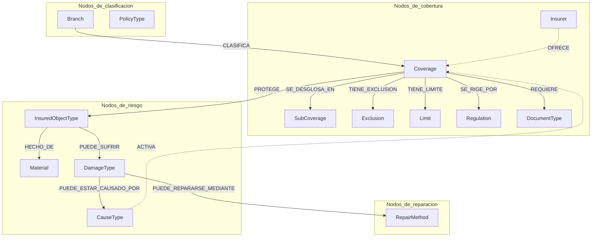
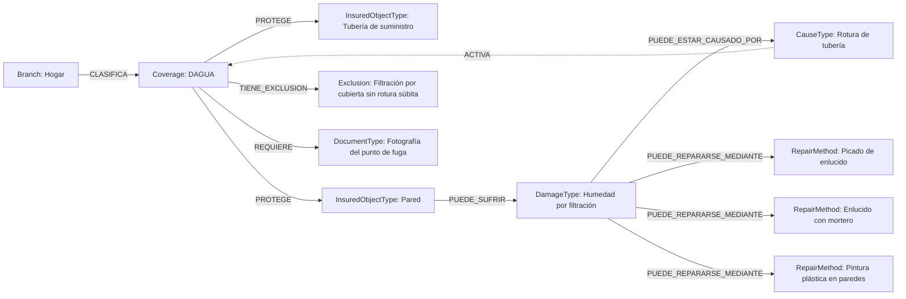

# KNOWLEDGE_GRAPH.md — Modelo conceptual del Grafo de Conocimiento de PERIT.IA

> Diseño del modelo de nodos y relaciones para representar el conocimiento
> pericial como grafo consultable. **Solo modelo conceptual: sin tecnología.**
> No se decide aquí si el grafo se implementa en Neo4j, en una base de datos
> relacional con tablas de adyacencia, o de cualquier otra forma — esa
> decisión de implementación pertenece al Sprint 3 (AI Architecture) o a un
> sprint de implementación posterior, no a este.
>
> **Fecha:** 1 de agosto de 2026 · Sprint 2 — Knowledge Architecture
> **Depende de:** `knowledge/ontology/ONTOLOGY.md`, del que este documento es
> la traducción a un modelo de nodos y aristas consultable.

---

## 1. Por qué un grafo, además de RAG

RAG (`knowledge/rag/RAG_ARCHITECTURE.md`) resuelve bien las preguntas
abiertas en lenguaje natural ("¿qué se considera daño por agua no cubierto?").
No resuelve bien las preguntas **estructurales y de varios saltos**: "dado
este daño, ¿qué métodos de reparación aplican, y de esos métodos, cuáles
pertenecen a un oficio con partida de costes indirectos?" es una pregunta de
navegación por relaciones, no de similitud semántica. El grafo de conocimiento
es el mecanismo diseñado para ese segundo tipo de pregunta.

---

## 2. Nodos

Cada tipo de `KU` definido en `KNOWLEDGE_ARCHITECTURE.md`, sección 2, es,
potencialmente, un tipo de nodo del grafo. No todos los tipos de `KU` tienen
el mismo valor como nodo de grafo: los de contenido narrativo largo
(`procedure`, `legal`, `example`) aportan poco a la navegación estructural y
son mejor servidos por RAG; los de contenido corto y muy relacional
(`coverage`, `insured_object`, `damage`, `cause`, `repair`, `material`) son
los que justifican el grafo.

### 2.1. Tipos de nodo propuestos

| Tipo de nodo | Corresponde a `KU` tipo | Propiedades mínimas |
|---|---|---|
| `Branch` | `branch` | id, nombre |
| `PolicyType` | (nuevo, ver `TAXONOMY.md` §3) | id, nombre, ramo |
| `Coverage` | `coverage` | id, código, nombre, ramo |
| `SubCoverage` | `subcoverage` | id, nombre, garantía padre |
| `InsuredObjectType` | `insured_object` | id, nombre, bloque (continente/contenido) |
| `Material` | `material` | id, nombre, calidad |
| `DamageType` | `damage` | id, nombre |
| `CauseType` | `cause` | id, nombre, categoría |
| `RepairMethod` | `repair` | id, nombre, oficio, unidad, precio de referencia |
| `Exclusion` | (parte de `coverage`, ver `TAXONOMY.md` §13) | id, texto, garantía padre |
| `Limit` | (parte de `coverage`) | id, tipo, valor, garantía padre |
| `DocumentType` | `document` | id, nombre |
| `Insurer` | (referencia a `docs/domain/entities/INSURER.md`) | id, nombre comercial |
| `Regulation` | `regulation` / `legal` | id, referencia, resumen |

**Nota de diseño:** los nodos del grafo de conocimiento son **tipos**, no
instancias de expediente. `Insurer` aquí es "AXA Seguros" como concepto de
catálogo (una vez, en el grafo), no una copia por cada expediente de AXA — a
diferencia de cómo vive hoy `enc.compania`, repetido como texto en cada fila
de `informes`.

---

## 3. Relaciones (aristas)

Traducción directa de `ONTOLOGY.md`, con su cardinalidad, a forma de arista de
grafo:

| Arista | Origen → Destino | Cardinalidad | Propiedades de la arista |
|---|---|---|---|
| `PROTEGE` | Coverage → InsuredObjectType | N–N | — |
| `PUEDE_SUFRIR` | InsuredObjectType → DamageType | N–N | frecuencia (opcional, estadística futura) |
| `PUEDE_ESTAR_CAUSADO_POR` | DamageType → CauseType | N–N | — |
| `PUEDE_REPARARSE_MEDIANTE` | DamageType → RepairMethod | N–N | idoneidad (alta/media/baja, opcional) |
| `GENERA` | RepairMethod → (valor de coste, no nodo) | 1–1 | calculado, no almacenado como arista |
| `TIENE_EXCLUSION` | Coverage → Exclusion | 1–N | — |
| `TIENE_LIMITE` | Coverage → Limit | 1–N | — |
| `REQUIERE` | Coverage → DocumentType | N–N | obligatoriedad (obligatorio/recomendado) |
| `CLASIFICA` | Branch → Coverage | 1–N | — |
| `HECHO_DE` | InsuredObjectType → Material | N–N | — |
| `ACTIVA` | CauseType → Coverage | N–N | — |
| `PERTENECE_A` | RepairMethod → Oficio (atributo, no nodo propio salvo que se decida lo contrario) | N–1 | — |
| `SE_RIGE_POR` | Coverage → Regulation | N–N | — |
| `OFRECE` | Insurer → Coverage (vía `mapping`) | N–N | nombreEnPoliza (ver `mappings/COMPANIES.md`) |

**Nota:** `GENERA` (Método → Coste) se marca como no almacenada porque el
coste no es un hecho fijo del conocimiento, es un cálculo que depende de
cantidad y contexto —vive en `docs/domain/entities/REPAIR.md` como fórmula,
no como dato estático del grafo.

---

## 4. Diagrama del modelo de grafo

---

## 5. Ejemplo poblado (ilustrativo, no catálogo real)

---

## 6. Casos de uso del grafo

1. **"¿Qué métodos de reparación aplican a este daño?"** — recorrido de un
   salto: `DamageType --PUEDE_REPARARSE_MEDIANTE--> RepairMethod`. Es lo que
   hoy resuelve `matchBaremo()` de forma heurística sobre texto; el grafo lo
   convierte en una consulta estructurada y determinista.

2. **"¿Qué documentación falta para este expediente, según su garantía?"** —
   recorrido: `Coverage --REQUIERE--> DocumentType`, contrastado contra los
   anexos ya presentes en el expediente. Sustituiría la lista de comprobación
   genérica actual (`anexosBlockStates`) por una específica de cada garantía.

3. **"¿Por qué este daño no tiene cobertura?"** (explicabilidad) — recorrido:
   `DamageType --PUEDE_ESTAR_CAUSADO_POR--> CauseType --ACTIVA--> Coverage
   --TIENE_EXCLUSION--> Exclusion`, devolviendo la cadena completa como
   justificación trazable.

4. **"¿Cómo llama esta aseguradora a la garantía que nosotros llamamos
   DAGUA?"** — recorrido: `Insurer --OFRECE--> Coverage`, resuelto contra
   `knowledge/mappings/COMPANIES.md`.

5. **"¿Qué garantías cubre este ramo?"** — recorrido de un salto:
   `Branch --CLASIFICA--> Coverage`.

6. **Validación cruzada en tiempo de redacción** — antes de aceptar una
   partida generada por IA para un daño, comprobar que existe la arista
   `PUEDE_REPARARSE_MEDIANTE` entre ese daño y ese método; si no existe,
   marcar la partida para revisión en lugar de aceptarla en silencio.

---

## 7. Relación con el modelo relacional existente (`docs/DB_MODEL.md`)

El grafo de conocimiento es **conceptualmente independiente** de las tablas
`informes` y `perfiles` del Sprint 0: aquellas contienen instancias de
expediente (datos concretos de un siniestro concreto); el grafo contiene
conocimiento de referencia (verdades generales del oficio, reutilizables entre
expedientes). Un expediente **consulta** el grafo, nunca lo modifica
directamente — la única vía de modificación del grafo es el ciclo de
validación de `knowledge/quality/QUALITY_RULES.md`.

---

## 8. Qué no resuelve este documento

- Qué tecnología de almacenamiento de grafo se usará (Sprint 3 o posterior).
- Cómo se sincroniza el grafo con los archivos Markdown de `KU` que este
  sprint usa como formato de partida (decisión de implementación futura).
- El rendimiento o el volumen esperado de nodos y aristas — prematuro sin
  conocimiento real cargado.

Este documento fija el **modelo conceptual**: qué tipos de nodo existen, qué
relaciones los conectan, con qué cardinalidad, y para qué preguntas de negocio
sirve consultarlos. Es suficiente para razonar sobre el diseño y para que
cualquier tecnología de implementación futura tenga un contrato claro que
cumplir.
