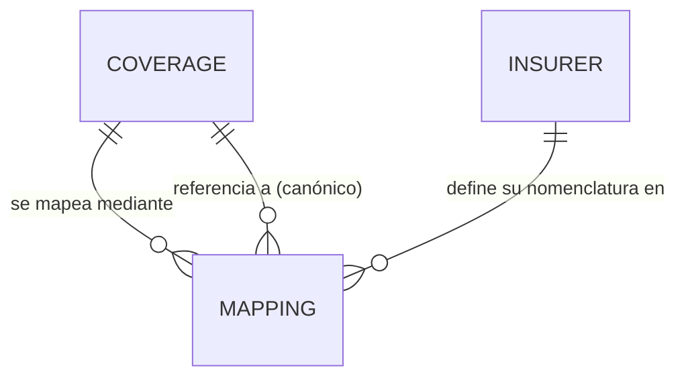
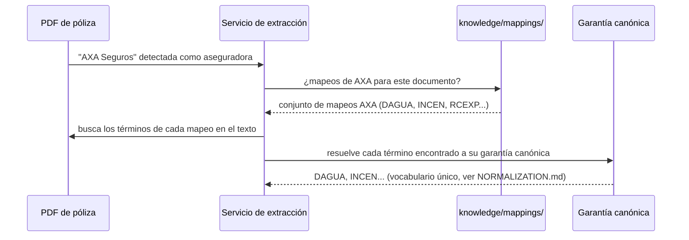

# COMPANIES.md — Modelo de mapeo entre garantías canónicas y nomenclatura por aseguradora

> Diseño del mecanismo que permitirá que una garantía estándar de PERIT.IA se
> corresponda con la nomenclatura propia de cada aseguradora, **sin
> introducir lógica específica de ninguna compañía en el código**. No se
> desarrolla todavía el mapeo de ninguna aseguradora concreta más allá de los
> ejemplos imprescindibles para ilustrar el modelo.
>
> **Fecha:** 1 de agosto de 2026 · Sprint 2 — Knowledge Architecture
> **Resuelve directamente:** `docs/TECHNICAL_DEBT.md`, DT-05 (lógica
> específica de AXA incrustada en código y prompts) y BR-38
> (`docs/domain/BUSINESS_RULES.md`): la plataforma debe funcionar de forma
> equivalente para cualquier aseguradora.

---

## 1. El problema exacto que este modelo resuelve

Hoy, el prompt de extracción de póliza (`docs/AI_INVENTORY.md`, IA-2) está
escrito explícitamente "para pólizas AXA y similares", con reglas de
selección de capital redactadas en lenguaje natural dentro del propio prompt
(*"Para DAGUA, RGEXT, INCEN: usa EDIFICIO PRIMER RIESGO si existe con
valor>0..."*). Incorporar una segunda aseguradora exigiría, tal y como está
construido hoy, escribir un prompt nuevo o ramificar el existente con
condicionales — es decir, código específico de aseguradora, exactamente lo
que el principio de independencia de aseguradora prohíbe.

Este documento diseña la alternativa: **la aseguradora se representa como
dato de configuración (un mapeo), nunca como lógica de código.**

---

## 2. El mapeo como unidad de conocimiento

Cada correspondencia entre una garantía canónica y cómo la nombra una
aseguradora concreta es una `KU` de tipo `mapping`:

```yaml
id: knowledge://mappings/companies/axa/DAGUA
tipo: mapping
canonico: knowledge://coverages/DAGUA
aseguradora: AXA Seguros
terminoEnPoliza:
  - texto: "Daños por Agua"
  - texto: "DAGUA"
    contexto: "tabla de capitales, columna de código"
reglasDeSeleccion:
  - condicion: "capital continente con varios valores (Edificio, Edificio primer riesgo, Obras de reforma)"
    accion: "usar Edificio primer riesgo si existe con valor > 0; si no, usar Obras de reforma"
  - condicion: "capital contenido"
    accion: "usar el capital principal de Mobiliario y maquinaria, no sublímites"
vigenciaDesde: 2026-01-01
fuente: {tipo: elaboracion_propia, referencia: "prompts de extracción anteriores a Sprint 2"}
confianza: alta
```

**Observación clave de diseño:** las reglas de selección de capital que hoy
viven como texto fijo dentro del prompt de IA-2 (`docs/AI_INVENTORY.md`) se
trasladan aquí, al campo `reglasDeSeleccion` del mapeo — pasan de ser
instrucciones de un prompt a ser **datos consultables**, con su propia
trazabilidad, versión y ámbito. El servicio de IA de extracción, en su forma
madura, no debería llevar esas reglas escritas en su propio prompt: debería
consultar el mapeo correspondiente a la aseguradora detectada en el
documento.

---

## 3. Cardinalidad del mapeo



Una garantía canónica puede tener **varios** mapeos (uno por aseguradora que
la ofrezca, y potencialmente más de uno por aseguradora si su nomenclatura ha
cambiado con el tiempo — ver sección 6). Un mapeo pertenece siempre a una
única combinación garantía canónica + aseguradora.

---

## 4. Flujo de resolución en tiempo de extracción



Si la aseguradora detectada **no tiene mapeos cargados todavía** (una
compañía nueva, nunca vista), el sistema debería degradar de forma explícita
—usar el nombre canónico y las reglas genéricas del oficio, marcando el
resultado con confianza reducida y generando un candidato de mapeo en estado
`borrador` para revisión— en lugar de fallar en silencio o de aplicar por
defecto las reglas de una aseguradora distinta.

---

## 5. Qué NO debe vivir en el mapeo

Para que esta pieza no se convierta, con el tiempo, en el mismo problema que
resuelve pero trasladado de sitio, se fija un límite explícito:

- **El mapeo no redefine la garantía canónica.** Si AXA cubre algo distinto
  de lo que la garantía canónica "Daños por agua" representa, eso no se
  resuelve forzando el mapeo: indica que la taxonomía necesita una
  subgarantía nueva (`knowledge/subcoverages/`) o que la garantía canónica
  está mal definida — una decisión de modelado, no de mapeo.
- **El mapeo no contiene lógica de cálculo.** Las reglas de selección de
  capital (sección 2) son condiciones declarativas de "qué dato leer", no
  fórmulas de cálculo — el cálculo sigue viviendo en el motor único
  (`docs/domain/entities/REPAIR.md`), ajeno a cualquier aseguradora.

---

## 6. Versionado del mapeo frente al versionado de la póliza

Un mapeo puede necesitar nueva versión sin que cambie nada de la garantía
canónica: si una aseguradora **renombra** su producto o reestructura su
tabla de capitales de un año a otro, el mapeo debe versionarse para reflejar
el cambio, conservando la versión anterior operativa para pólizas antiguas
—coherente con la necesidad de `POLICY_VERSION` señalada en
`docs/domain/entities/POLICY_VERSION.md` y con `docs/OPEN_QUESTIONS.md`,
P-21—. La `vigenciaDesde`/`vigenciaHasta` del mapeo debe poder alinearse con
la fecha de efecto de la póliza que se está interpretando, no solo con la
fecha de la extracción.

---

## 7. Onboarding de una aseguradora nueva

Flujo propuesto para cuando el negocio decida trabajar con una aseguradora
sin mapeos previos:

1. Se registra la `Insurer` (ver `docs/domain/entities/INSURER.md`).
2. Se procesan sus primeros documentos con las reglas genéricas del oficio
   (sin mapeo específico), marcando el resultado con confianza reducida.
3. El perito o el responsable de conocimiento revisa los resultados y
   confirma o corrige la correspondencia detectada.
4. Cada correspondencia confirmada se registra como `mapping` en estado
   `aprobado`.
5. A partir de ese momento, la extracción de documentos de esa aseguradora
   usa sus mapeos específicos con confianza alta.

Este flujo convierte cada aseguradora nueva en una **tarea de curación de
conocimiento**, no en una tarea de programación — es la prueba de que el
diseño cumple el principio de independencia de aseguradora.

---

## 8. Estado del mapeo de AXA hoy

**No se ha creado ningún mapeo real en este sprint.** El ejemplo de la
sección 2 es ilustrativo del formato, tomado de lo ya verificado en el prompt
actual (Sprint 0, `docs/AI_INVENTORY.md`, IA-2), pero **no sustituye al
prompt existente ni se ha cargado como `KU` real**: eso es trabajo de un
sprint de carga de conocimiento o de implementación, fuera del alcance de
este sprint de diseño.

---

## 9. Relación con el resto de la arquitectura

| Este documento define… | Se relaciona con… |
|---|---|
| El modelo de mapeo garantía↔aseguradora | `knowledge/ontology/ONTOLOGY.md`, arista `OFRECE` |
| La distinción mapeo/normalización | `knowledge/normalization/NORMALIZATION.md`, sección 6 |
| El grafo de `Insurer` | `knowledge/graph/KNOWLEDGE_GRAPH.md`, sección 2 |
| La deuda técnica que resuelve | `docs/TECHNICAL_DEBT.md`, DT-05 |
