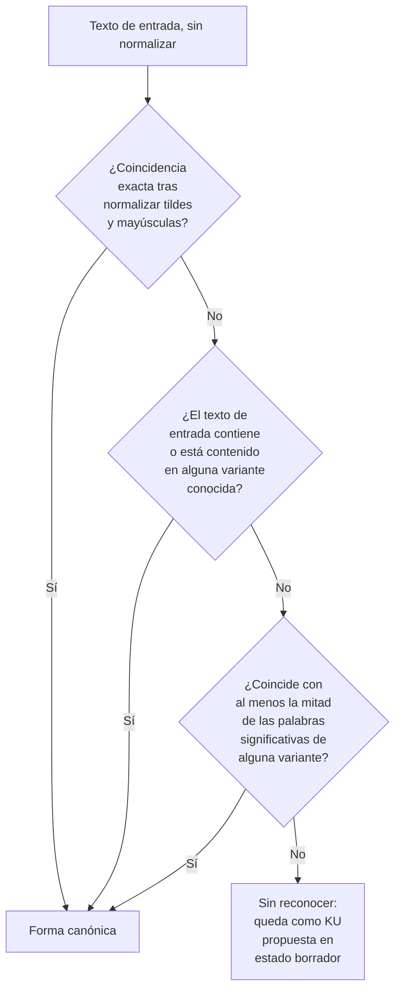
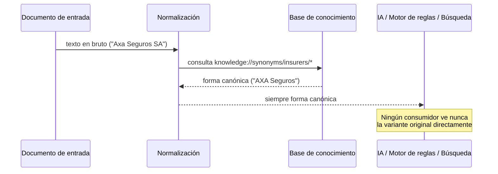

# NORMALIZATION.md — Normalización de vocabulario en PERIT.IA

> Define cómo se unifican sinónimos, abreviaturas y variantes de escritura,
> para que cualquier IA —y cualquier persona— trabaje siempre sobre un
> vocabulario único, con independencia de cómo llegue el término en el
> documento de origen.
>
> **Fecha:** 1 de agosto de 2026 · Sprint 2 — Knowledge Architecture
> **Punto de partida real:** el sistema actual ya resuelve normalización de
> dos formas puntuales y no generalizadas, documentadas en Sprint 0
> (`docs/CURRENT_IMPLEMENTATION.md`): `normCompania()` (fuerza cualquier
> variante de "AXA" a "AXA Seguros") y `matchBaremo()` (empareja el texto
> devuelto por la IA con las partidas del baremo por coincidencia, contención
> o mayoría de palabras). Este documento generaliza ese patrón a un mecanismo
> sistemático, aplicable a cualquier vocabulario del dominio, no solo a esos
> dos casos.

---

## 1. El problema que resuelve

Un mismo concepto llega al sistema escrito de formas distintas según su
origen: el mismo dato ("AXA") aparece en un documento como "AXA", en otro
como "AXA Seguros Generales SA", y en un tercero simplemente como "Axa" en
minúsculas. Sin normalización, cada IA, cada búsqueda y cada motor de reglas
tendría que reconocer todas las variantes por su cuenta — exactamente el
riesgo de fragmentación que un prompt como el de IA-2, escrito a mano para
reconocer solo las variantes de AXA que su autor conocía, ilustra.

**Principio central: normalizar una vez, en un sitio, y que todo lo demás
consuma la forma canónica.** No cada consumidor (prompt, motor de reglas,
búsqueda) debe reimplementar su propia heurística de reconocimiento.

---

## 2. El conjunto de sinónimos como unidad de conocimiento

Cada concepto normalizable se representa como una `KU` de tipo
`synonym_set` (ver `KNOWLEDGE_ARCHITECTURE.md`, sección 2):

```yaml
id: knowledge://synonyms/insurers/axa
tipo: synonym_set
canonico: "AXA Seguros"
variantes:
  - texto: "AXA"
    tipo: abreviatura
  - texto: "AXA Seguros Generales SA"
    tipo: razon_social_completa
  - texto: "Axa"
    tipo: variante_capitalizacion
  - texto: "AXA SEGUROS"
    tipo: variante_capitalizacion
ambito: {categoria: insurer}
confianza: alta
```

El campo `canonico` es el único valor que cualquier consumidor debe mostrar,
almacenar o razonar; `variantes` es exclusivamente para el paso de
reconocimiento, nunca para presentación.

---

## 3. Categorías de vocabulario a normalizar

| Categoría | Ejemplo de variantes → forma canónica | Estado hoy |
|---|---|---|
| Compañías aseguradoras | "AXA" / "Axa Seguros SA" → "AXA Seguros" | `[Parcial]` — solo AXA, vía `normCompania()` |
| Garantías | "Daños de agua" / "Agua" / "DAGUA" → "Daños por agua" | `[No implementado]` — texto libre |
| Materiales | "Gres" / "Gres porcelánico" / "Porcelánico" → forma única | `[No implementado]` |
| Daños | "Humedad" / "Mancha de humedad" / "Filtración" (cuando son el mismo concepto) → forma única | `[No implementado]` |
| Documentos | "Presupuesto" / "Pptu." / "Oferta económica" → "Presupuesto" | `[No implementado]` |
| Unidades de medida | "m2" / "m²" / "metros cuadrados" → "m²" | `[Parcial]` — implícito en `BAREMO`, sin normalización de entrada |
| Nombres de partidas del baremo | Coincidencia heurística ya existente | `[Verificado]` — `matchBaremo()`, el caso más maduro del sistema |

---

## 4. El mecanismo de reconocimiento, generalizado desde `matchBaremo()`

`matchBaremo()` ya resuelve, para un solo caso (nombres de partidas), un
patrón de reconocimiento en tres niveles decrecientes de exigencia. Se
propone como **el patrón general de normalización** de PERIT.IA, aplicable a
cualquier categoría de la sección 3:



**Diferencia respecto al código actual:** hoy, si `matchBaremo()` no
reconoce una partida, entra al expediente a precio 0 € con un aviso al
perito — una degradación razonable para ese caso concreto. El modelo general
propuesto aquí añade un cuarto paso: lo no reconocido no solo se avisa al
perito, sino que **se registra como candidato a nueva variante**, en estado
`borrador`, para que una revisión posterior decida si se incorpora al
conjunto de sinónimos — así el propio uso del sistema alimenta y mejora el
conocimiento de normalización con el tiempo, en lugar de repetir el mismo
fallo de reconocimiento indefinidamente.

---

## 5. Dónde se aplica la normalización en el flujo de una unidad de conocimiento



La normalización se aplica **una sola vez, en el punto de entrada**, no en
cada consumidor por separado. Esto es lo contrario del patrón actual, donde
`normCompania()` se invoca puntualmente en los sitios de la interfaz que
necesitan mostrar el nombre correcto, y otros puntos del código pueden seguir
viendo la variante sin normalizar.

---

## 6. Normalización léxica frente a normalización semántica

Es importante distinguir dos operaciones que a veces se confunden:

- **Normalización léxica** (esta arquitectura): unificar formas de escribir
  el *mismo* concepto ("AXA" y "AXA Seguros" son el mismo concepto, escrito
  distinto).
- **Mapeo entre vocabularios distintos pero relacionados**: cuando dos
  conceptos *son* distintos pero se corresponden entre sí (la garantía
  canónica "Daños por agua" de PERIT.IA corresponde a la garantía "DAGUA" tal
  y como la nombra AXA en sus pólizas). Esto **no** es normalización, es
  mapeo — desarrollado en `knowledge/mappings/COMPANIES.md`.

La confusión entre ambas es un riesgo real: tratar un mapeo como si fuera
normalización perdería la distinción de que dos aseguradoras pueden llamar de
forma distinta a la misma garantía sin que ninguna de las dos formas sea
"incorrecta" — son, simplemente, su vocabulario propio, no una errata a
corregir.

---

## 7. Validación de un conjunto de sinónimos

Un `synonym_set` sigue el mismo ciclo de calidad que cualquier `KU` (ver
`knowledge/quality/QUALITY_RULES.md`), con un criterio adicional propio de
este tipo: **ninguna variante puede pertenecer a dos conjuntos de sinónimos
distintos a la vez** (una misma cadena de texto no puede normalizar,
simultáneamente, a dos formas canónicas distintas) — la validación
estructural debe comprobarlo antes de aprobar un `synonym_set` nuevo.

---

## 8. Relación con el resto de la arquitectura de conocimiento

| Este documento define… | Se usa en… |
|---|---|
| El mecanismo de reconocimiento de variantes | Extracción de documentos (sustituyendo la lógica hoy incrustada en prompts) |
| La forma canónica de cada concepto | Toda `KU` de `knowledge/`, que debe usar siempre la forma canónica en su cuerpo |
| El registro de candidatos no reconocidos | Alimenta el mantenimiento de la base de conocimiento (`KNOWLEDGE_ARCHITECTURE.md`, sección 9) |
| La distinción normalización/mapeo | `knowledge/mappings/COMPANIES.md` |
