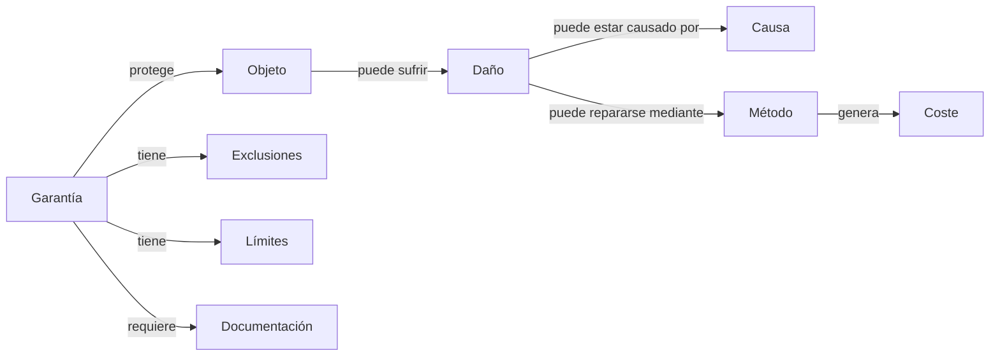
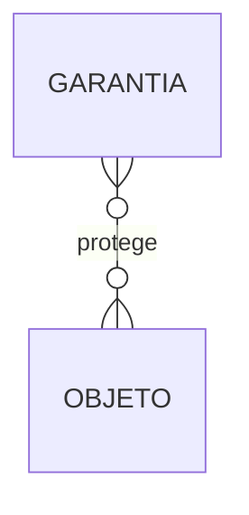
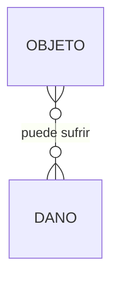
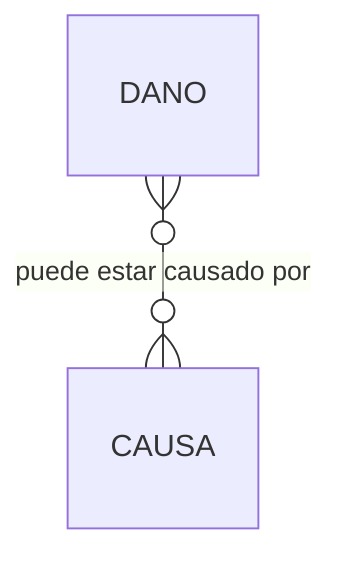
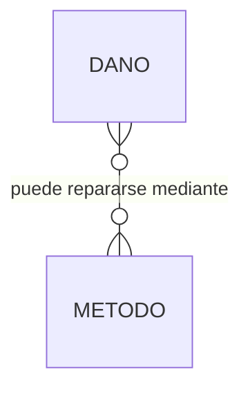
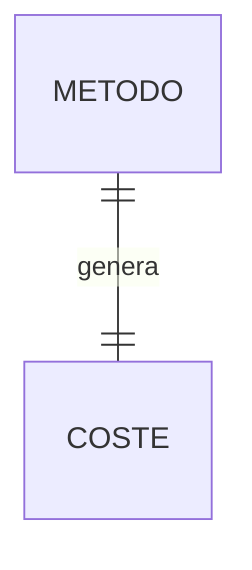
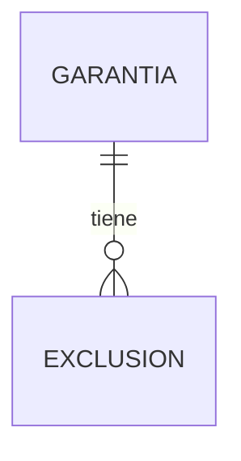
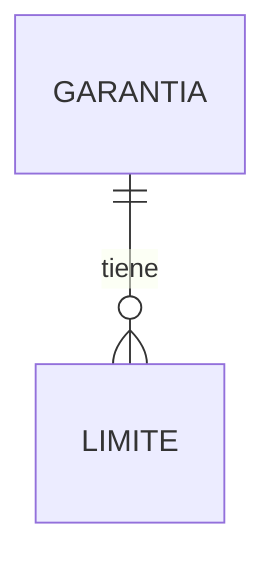
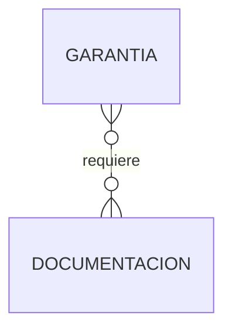
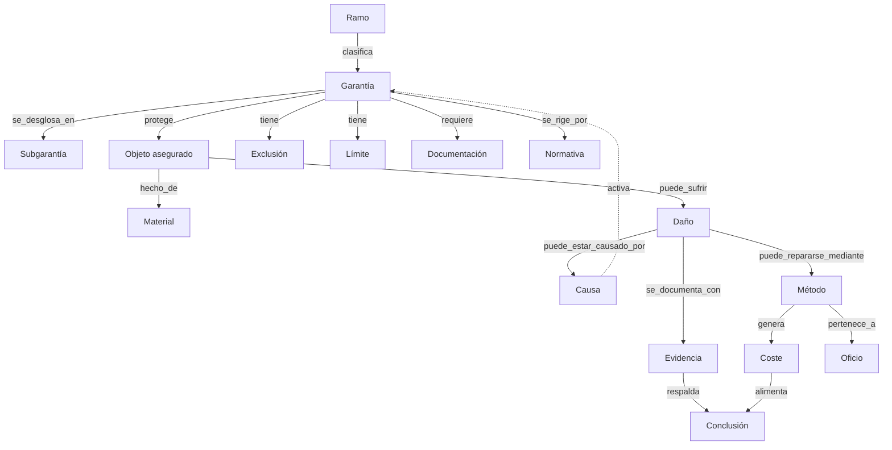

# ONTOLOGY.md — Ontología de PERIT.IA

> Modelo de relaciones con sentido de negocio entre los conceptos del dominio
> pericial. Mientras `knowledge/taxonomy/TAXONOMY.md` clasifica los conceptos
> en jerarquías, este documento define **cómo se conectan entre sí**,
> con independencia de su posición jerárquica.
>
> **Fecha:** 1 de agosto de 2026 · Sprint 2 — Knowledge Architecture
> **Relación con Sprint 1:** esta ontología es una extensión, orientada a
> consumo por IA y por grafo, de `docs/domain/RELATIONSHIPS.md`. Aquella habla
> de entidades del *expediente* (Assignment, Claim, Report…); esta habla de
> *conceptos del conocimiento* reutilizables entre expedientes (Garantía,
> Objeto, Daño, Causa, Método). Son complementarias, no duplicadas: una
> instancia de `Damage` en un expediente concreto *es-un* ejemplo del concepto
> `damage` de esta ontología.

---

## 1. Las relaciones nucleares, tal como las pide este sprint

Cada una de estas siete relaciones se desarrolla a continuación con su
cardinalidad, su justificación de negocio y su estado frente al código actual.

---

## 2. Garantía → protege → Objeto

**Cardinalidad:** N–N. Una garantía protege varios tipos de objeto (Daños por
agua protege tanto elementos estructurales como mobiliario); un tipo de
objeto puede estar protegido por varias garantías a la vez (una tubería
puede sufrir daño por agua o por daño eléctrico si es de calefacción).

**Justificación:** es la relación que determina, en última instancia, si un
daño concreto sobre un objeto concreto tiene cobertura.

**Estado:** `[Parcial]`. El código actual no relaciona garantía con tipo de
objeto de forma explícita; la cobertura se determina indirectamente, a través
de si la partida se imputa a "continente" o "contenido" y de si la garantía
correspondiente está contratada.

---

## 3. Objeto → puede sufrir → Daño

**Cardinalidad:** N–N. Un tipo de objeto puede sufrir varios tipos de daño
distinto (una pared puede sufrir humedad o fisura); un tipo de daño puede
afectar a varios tipos de objeto (la humedad puede afectar a una pared o a un
suelo).

**Justificación:** delimita qué combinaciones objeto-daño son plausibles, útil
tanto para validación (avisar si se declara un daño incoherente con el objeto)
como para sugerencia asistida por IA.

**Estado:** `[No implementado]`. Corresponde a BR-07 de
`docs/domain/BUSINESS_RULES.md`, documentada pero sin representación en el
código: no existe `InsuredObject` como entidad (Sprint 1).

---

## 4. Daño → puede estar causado por → Causa

**Cardinalidad:** N–N. Un tipo de daño puede tener varias causas posibles (la
humedad puede deberse a filtración, a rotura de tubería o a capilaridad); una
causa puede producir varios tipos de daño (un temporal de viento puede causar
rotura de tejas y, además, humedad por filtración de la cubierta dañada).

**Justificación:** de esta relación depende directamente qué garantía es
aplicable (BR-09), y es la base de la inferencia que hoy hace, con
expresiones regulares, la función `causasMeteo()`.

**Estado:** `[Parcial]`. Verificado como correspondencia fija causa→garantía
(`CAUSA_COB`), no como relación N–N consultable causa↔daño.

---

## 5. Daño → puede repararse mediante → Método

**Cardinalidad:** N–N. Un tipo de daño puede repararse por varios métodos
alternativos o complementarios (una pared con humedad requiere picado,
saneado, enlucido y pintura — varios métodos para un mismo daño); un método
puede aplicarse a varios tipos de daño (la "pintura plástica en paredes" sirve
tanto para humedad como para daños tras una reparación de tubería).

**Justificación:** es la relación que sostiene, conceptualmente, la
generación automática de la tabla de valoración desde el baremo (IA-8 en
`docs/AI_INVENTORY.md`): hoy la IA infiere esta relación implícitamente a
partir de los campos `dano` y `cond` de cada partida del baremo, en lugar de
consultarla como una relación explícita del conocimiento.

**Estado:** `[Verificado, implícito]`. Cada partida de `BAREMO` ya lleva un
campo `dano` (tipo de daño que resuelve) y `cond` (condición de activación) —
es, de hecho, la relación mejor cubierta de toda la ontología, aunque
incrustada como texto libre en lugar de como relación estructurada entre `KU`.

---

## 6. Método → genera → Coste

**Cardinalidad:** 1–1 (por combinación método + unidad + cantidad). Un método
aplicado con una cantidad concreta genera un coste determinado; no es una
relación N–N sino un cálculo derivado.

**Justificación:** es el puente entre el conocimiento de referencia (el
método, su precio unitario) y el cálculo económico concreto de un expediente
(`docs/domain/entities/REPAIR.md`).

**Estado:** `[Verificado]`. Es la fórmula `calcPartida` de
`docs/CURRENT_IMPLEMENTATION.md`, ya validada contra los dos casos oráculo.

---

## 7. Garantía → tiene → Exclusiones

**Cardinalidad:** 1–N. Una garantía puede tener varias exclusiones (Daños por
agua puede excluir filtraciones por cubierta, o daños en sótanos); una
exclusión pertenece a una única garantía (aunque redacciones equivalentes
puedan repetirse entre garantías distintas, cada instancia de exclusión es
propia de la suya).

**Justificación:** sin exclusiones explícitas y consultables, la
determinación de cobertura depende enteramente de que la IA interprete
correctamente el texto libre de la póliza en cada expediente, sin
posibilidad de contraste contra un catálogo de exclusiones típicas del
sector.

**Estado:** `[Parcial]`. El texto de exclusión existe (`descripciones{}`),
pero como texto libre por expediente, no como catálogo reutilizable de
exclusiones típicas con las que contrastar.

---

## 8. Garantía → tiene → Límites

**Cardinalidad:** 1–N. Una garantía puede tener varios límites de naturaleza
distinta (de capital, temporales, geográficos — ver
`knowledge/taxonomy/TAXONOMY.md`, sección 13).

**Justificación:** el capital asegurado y la franquicia son, en rigor, tipos
de límite; formalizarlos como tal permite razonar de forma uniforme sobre
todos los límites de una garantía, no solo sobre los dos que el sistema
actual conoce explícitamente.

**Estado:** `[Parcial]`. Capital y franquicia están bien modelados; los demás
tipos de límite (temporal, geográfico) no tienen representación.

---

## 9. Garantía → requiere → Documentación

**Cardinalidad:** N–N. Una garantía puede requerir varios tipos de documento
(RC Explotación puede requerir informe de un tercero perjudicado); un tipo de
documento puede ser requerido por varias garantías (una factura puede
justificar tanto Daños por agua como Daños eléctricos).

**Justificación:** es la relación que sostendría, en su forma madura, una
lista de comprobación automática de "qué falta en este expediente según su
garantía" — hoy resuelta de forma genérica e igual para todas las garantías
(`anexosBlockStates`), sin diferenciar qué exige específicamente cada una.

**Estado:** `[No implementado]`. El sistema actual pide el mismo conjunto de
anexos (fotos, catastro, meteosim, facturas) con independencia de la
garantía; no hay relación garantía→documento requerido.

---

## 10. Grafo conceptual consolidado

Vista completa de todas las relaciones descritas, incluyendo el eje de
evidencia (transversal, no discutido como relación nuclear en el enunciado de
este sprint, pero indispensable por el principio de trazabilidad, BR-25):

---

## 11. Relaciones adicionales identificadas más allá del enunciado mínimo

El enunciado de este sprint pide como mínimo las siete relaciones de la
sección 1. Durante el diseño se han identificado estas relaciones adicionales,
igualmente necesarias para que el grafo sea completo:

| Relación | Cardinalidad | Justificación |
|---|---|---|
| Ramo → clasifica → Garantía | 1–N | Sin esta relación, la taxonomía de garantías no puede filtrarse por ramo |
| Objeto → hecho de → Material | N–N | Necesaria para inferir depreciación por tipo de material |
| Causa → activa → Garantía | N–N | Inversa de "Garantía protege Objeto que puede sufrir Daño causado por Causa" — es la relación que hoy vive en `CAUSA_COB` |
| Método → pertenece a → Oficio | N–1 | Ya implementada (`oficio` en cada partida del baremo) |
| Evidencia → respalda → Conclusión | N–N | Formaliza BR-25: ninguna conclusión sin evidencia |
| Garantía → se rige por → Normativa | N–N | Conecta la garantía con su marco legal y técnico (`knowledge/legal/`, `knowledge/regulations/`) |

---

## 12. Casos de uso de la ontología

1. **Validación en tiempo de redacción:** si el perito declara un daño de
   tipo "cortocircuito" sobre un objeto de tipo "tubería", el grafo puede
   señalar la incoherencia antes de que llegue al informe final.
2. **Sugerencia de métodos de reparación:** dado un daño, recorrer la relación
   *puede repararse mediante* para proponer los métodos plausibles — la
   ontología formaliza lo que hoy hace `matchBaremo()` de forma heurística
   sobre texto libre.
3. **Comprobación de documentación pendiente:** dada la garantía de un
   expediente, recorrer *requiere → Documentación* para generar una lista de
   comprobación específica, en lugar de la lista genérica actual.
4. **Explicabilidad del dictamen:** recorrer *Daño → Causa → Garantía → tiene
   → Exclusiones* para poder explicar, de forma trazable, por qué un daño
   concreto no tiene cobertura.
5. **Detección de exclusiones aplicables antes de valorar:** cruzar el texto
   extraído de la póliza contra el catálogo de exclusiones típicas del sector
   para alertar de posibles exclusiones no detectadas por la IA de
   extracción.

---

## 13. Relación con `knowledge/graph/KNOWLEDGE_GRAPH.md`

Este documento define **qué relaciones existen y por qué** (el modelo
conceptual, orientado a negocio). `KNOWLEDGE_GRAPH.md` define **cómo se
representan como nodos y aristas** de un grafo de conocimiento consultable
(el modelo de datos, orientado a consulta). La ontología es más estable en el
tiempo; el modelo de grafo puede evolucionar en su representación técnica sin
alterar la ontología que expresa.
