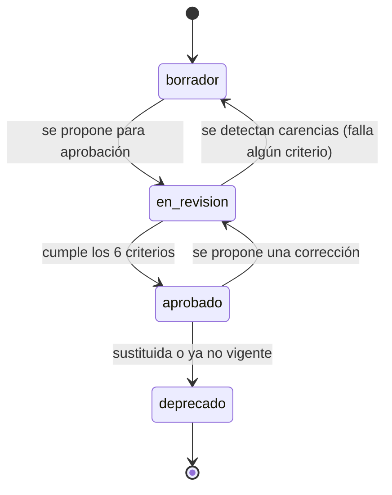

# QUALITY_RULES.md — Criterios de calidad de la Base de Conocimiento

> Define qué debe cumplir cualquier unidad de conocimiento (`KU`) para
> considerarse apta para su uso: verificable, versionada, trazable,
> referenciada, auditable y reutilizable — los seis criterios exigidos
> explícitamente por el enunciado de este sprint.
>
> **Fecha:** 1 de agosto de 2026 · Sprint 2 — Knowledge Architecture
> **Depende de:** el sobre de metadatos definido en
> `knowledge/architecture/KNOWLEDGE_ARCHITECTURE.md`, sección 1.1, que es
> donde estos criterios se materializan como campos concretos.

---

## 1. Los seis criterios

### 1.1. Verificable

Una `KU` es verificable cuando su afirmación puede contrastarse contra algo
externo a ella misma: una fuente normativa, un documento real, o la
confirmación explícita de una persona con criterio experto.

**Cómo se comprueba:** el campo `fuente` del sobre de metadatos no puede
quedar vacío ni con el valor por defecto. Una `KU` con
`fuente.tipo: elaboracion_propia` es verificable solo si tiene, además, un
`autor` identificado que asuma la responsabilidad de la afirmación —no es
aceptable una `KU` sin autor y sin fuente externa.

**Ejemplo de incumplimiento:** una ficha de garantía que afirme una
franquicia sin indicar de qué póliza, normativa o confirmación procede ese
importe.

### 1.2. Versionada

Una `KU` es versionada cuando cualquier cambio de contenido genera una nueva
versión numerada, sin sobrescribir la anterior (ver
`KNOWLEDGE_ARCHITECTURE.md`, sección 4).

**Cómo se comprueba:** el campo `version` es obligatorio y debe incrementarse
en cada cambio de contenido; el sistema debe rechazar cualquier intento de
modificar el cuerpo de una `KU` sin incrementar su versión.

**Ejemplo de incumplimiento:** corregir directamente el precio de una
partida del baremo sin dejar constancia del valor anterior ni de cuándo
cambió — el error exacto que hoy comete el sistema con la mayoría de campos
de `encargo` (Sprint 1, `BUSINESS_RULES.md`, BR-28).

### 1.3. Trazable

Una `KU` es trazable cuando se puede reconstruir, en cualquier momento, quién
la creó o modificó, cuándo, y por qué (BR-26 del Sprint 1, aplicada aquí al
conocimiento de referencia, no solo al expediente).

**Cómo se comprueba:** los campos `autor`, `revisadoPor` y el propio
histórico de versiones deben estar completos. Toda transición de estado
(sección 2) debe quedar registrada con quién la ejecutó y cuándo — lo que
enlaza directamente con `docs/domain/entities/AUDIT.md`, propuesta en Sprint
1 y hoy no implementada.

**Ejemplo de incumplimiento:** una `KU` que pasó de `borrador` a `aprobado`
sin que conste quién autorizó ese paso.

### 1.4. Referenciada

Una `KU` es referenciada cuando tiene un identificador único y estable
(`knowledge://tipo/slug`, ver `KNOWLEDGE_ARCHITECTURE.md`, sección 7) al que
cualquier otra pieza puede apuntar sin duplicar su contenido, y cuando, a su
vez, declara de qué otras `KU` depende.

**Cómo se comprueba:** el `id` debe ser único en todo el sistema (validación
estructural automatizable); las relaciones declaradas en el campo
`relaciones` deben apuntar a `id` que existan.

**Ejemplo de incumplimiento:** copiar el texto de una exclusión dentro de la
ficha de una garantía en lugar de referenciarla como `KU` propia — reproduce
exactamente el problema de duplicación ya señalado en
`docs/TECHNICAL_DEBT.md`, DT-07, pero aplicado al conocimiento en vez de al
informe.

### 1.5. Auditable

Una `KU` es auditable cuando su historial completo de estados y versiones
permanece consultable, incluso las versiones deprecadas o el conocimiento que
resultó ser incorrecto.

**Cómo se comprueba:** ninguna versión ni estado se borra físicamente; una
`KU` deprecada sigue siendo consultable con su motivo de deprecación y, si
aplica, la referencia a la `KU` que la sustituye.

**Ejemplo de incumplimiento:** eliminar por completo una `KU` que resultó
tener un dato incorrecto, en lugar de deprecarla dejando constancia del
error — perdería la posibilidad de explicar, más adelante, por qué un
informe antiguo llegó a una conclusión basada en esa información.

### 1.6. Reutilizable

Una `KU` es reutilizable cuando su ámbito de aplicabilidad está definido con
precisión (ramo, aseguradora, provincia, vigencia — campo `ambito`), de modo
que pueda consumirse en cualquier contexto compatible sin necesidad de
reescribirla para cada caso.

**Cómo se comprueba:** el campo `ambito` no debe quedar más restringido de lo
necesario (una `KU` que en realidad aplica a cualquier ramo no debe marcarse
como exclusiva de uno) ni más amplio de lo correcto (una regla específica de
una aseguradora no debe declararse de ámbito general).

**Ejemplo de incumplimiento:** una regla de selección de capital que en
realidad es específica de AXA, cargada como si fuera una regla general del
oficio pericial — es, precisamente, la confusión que el modelo de mapeo de
`knowledge/mappings/COMPANIES.md` existe para evitar.

---

## 2. Ciclo de estados y su relación con los criterios

| Estado | Consumible por IA en producción | Cumple los 6 criterios |
|---|---|---|
| `borrador` | No | Aún no evaluado en su totalidad |
| `en_revision` | No | En proceso de verificación |
| `aprobado` | Sí | Debe cumplir los seis, sin excepción |
| `deprecado` | Solo para consultas históricas explícitas (reproducción de informes antiguos) | Cumplidos en su momento; conservado por auditabilidad |

**Regla de cierre, sin excepciones:** ninguna `KU` en estado `borrador` o
`en_revision` debe ser indexada para RAG en producción ni consultada por el
grafo de conocimiento en un flujo real de expediente. Es la misma disciplina
ya aplicada, con acierto, en `docs/domain/BUSINESS_RULES.md` de este proyecto:
distinguir con claridad lo verificado de lo propuesto, y no dejar que lo
propuesto se use como si fuera verificado.

---

## 3. Checklist de aprobación

Antes de que una `KU` pase de `en_revision` a `aprobado`, debe verificarse
explícitamente:

- [ ] El sobre de metadatos está completo (todos los campos obligatorios de
  `KNOWLEDGE_ARCHITECTURE.md`, sección 1.1).
- [ ] El `id` es único y sigue el esquema `knowledge://tipo/slug`.
- [ ] El campo `fuente` identifica de dónde procede la afirmación
  (**Verificable**).
- [ ] Si sustituye a una versión anterior, la anterior queda marcada con
  `vigenciaHasta` sin borrarse (**Versionada**).
- [ ] `autor` está identificado; si hubo revisión, `revisadoPor` también
  (**Trazable**).
- [ ] Todas las relaciones declaradas apuntan a `KU` existentes
  (**Referenciada**).
- [ ] No se ha borrado ninguna versión ni estado anterior
  (**Auditable**).
- [ ] El campo `ambito` refleja con precisión dónde aplica, ni más ni menos
  (**Reutilizable**).
- [ ] Si el contenido procede de una propuesta generada por IA, ha sido
  revisado y confirmado por una persona (nunca se aprueba directamente desde
  una generación automática).

---

## 4. Quién aplica estos criterios

Depende de la respuesta a `docs/OPEN_QUESTIONS.md`, P-23 (nueva de este
sprint): quién es el responsable de mantener la base de conocimiento. Hasta
que esa pregunta se resuelva, el criterio operativo por defecto es que
**ninguna `KU` pasa a `aprobado` sin revisión de Pol** — coherente con que hoy
es el único perito y la única autoridad de negocio del proyecto.

---

## 5. Relación con la calidad del dato ya existente en el sistema

Estos criterios, aplicados retrospectivamente al conocimiento que hoy vive
incrustado en el código (Sprint 0, `docs/TECHNICAL_DEBT.md`, DT-06), explican
con precisión por qué ese conocimiento es frágil sin necesidad de repetir el
diagnóstico completo:

| Criterio | Cómo lo incumple el conocimiento incrustado hoy |
|---|---|
| Verificable | El baremo y los módulos de arquitectura no citan fuente ni fecha (`docs/OPEN_QUESTIONS.md`, P-01, P-02) |
| Versionada | Cambiar un precio sobrescribe el anterior sin dejar rastro |
| Trazable | No hay autor ni fecha de última revisión de ninguna constante |
| Referenciada | Los mismos valores se repiten en varios puntos del código en lugar de referenciarse una vez (`docs/TECHNICAL_DEBT.md`, DT-17) |
| Auditable | No existe historial de qué valores tenía el sistema en el pasado |
| Reutilizable | El ámbito está implícito en el código (una sola tabla para toda España salvo 5 provincias), no declarado de forma explícita |

Esta comparación no es una crítica retrospectiva: es la justificación
funcional de por qué merece la pena construir la arquitectura de este sprint
antes de cargar conocimiento real.
