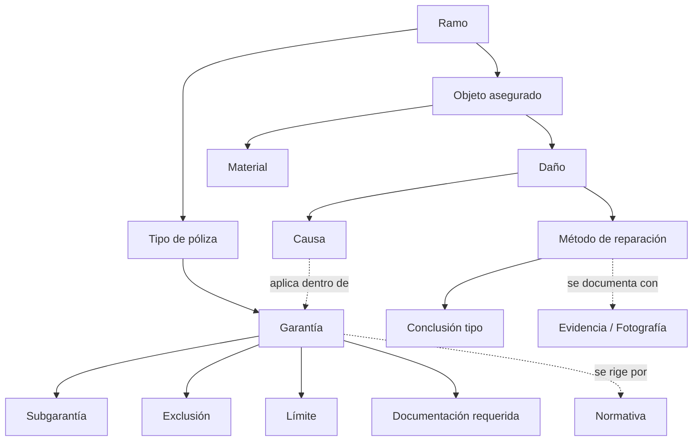

# TAXONOMY.md — Taxonomía de PERIT.IA

> Diseño de la clasificación jerárquica completa del conocimiento pericial.
> **No se rellenan todavía todas las garantías, materiales o causas** — se
> diseña la estructura que las contendrá. Los ejemplos que aparecen son
> ilustrativos del nivel de detalle esperado, tomados de lo ya verificado en
> Sprint 0 (`docs/CURRENT_IMPLEMENTATION.md`), no un catálogo cerrado.
>
> **Fecha:** 1 de agosto de 2026 · Sprint 2 — Knowledge Architecture
> **Convención:** cada nodo de la taxonomía es, en potencia, una `KU` de tipo
> `branch`/`coverage`/`subcoverage`/etc. (ver
> `knowledge/architecture/KNOWLEDGE_ARCHITECTURE.md`, sección 2). Un nodo
> `[Verificado]` tiene evidencia directa en el código actual; un nodo
> `[Propuesto]` es una extensión razonable del modelo, pendiente de
> confirmación de negocio.

---

## 1. Estructura general de la taxonomía



Cada rama de este árbol se desarrolla en las secciones siguientes. La
taxonomía completa es multi-eje: un mismo objeto asegurado puede participar en
varios ramos; una misma causa puede activar varias garantías (BR-09); un
mismo material puede aparecer en varios tipos de daño. Por eso el diagrama
usa flechas de composición (línea continua) y de relación transversal (línea
punteada) — las segundas se desarrollan con detalle en
`knowledge/ontology/ONTOLOGY.md`.

---

## 2. Ramos

**Nivel 1** de la jerarquía. `[Verificado]` los que tienen evidencia directa
en `docs/CURRENT_IMPLEMENTATION.md`; el resto, `[Propuesto]`.

| Ramo | Estado | Evidencia |
|---|---|---|
| Hogar | `[Verificado]` | `TIPOS_USO` incluye "Piso / Apartamento", "Vivienda unifamiliar" |
| Comunidades de propietarios | `[Verificado]` | `TIPOS_USO`: "Comunidad de propietarios" |
| Comercio / Local comercial | `[Verificado]` | `TIPOS_USO`: "Local comercial" |
| Hostelería (hotel, hostal, restaurante) | `[Verificado]` | `TIPOS_USO`: "Hotel / Apart-hotel", "Hostal / Pensión", "Restaurante / Bar" |
| Oficinas | `[Verificado]` | `TIPOS_USO`: "Oficinas" |
| Industria / Nave | `[Verificado]` | `TIPOS_USO`: "Industria / Nave" |
| Automóvil | `[Propuesto]` | Carpeta `knowledge/automovil/` creada en Sprint 0, sin evidencia de uso en el flujo actual — ver `docs/OPEN_QUESTIONS.md`, P-11 |
| Responsabilidad Civil general | `[Propuesto]` | Las garantías RC existen (`RCEXP`, `RCLOC`), pero no como ramo independiente |

**Nota de diseño:** el sistema actual no tiene, en rigor, un selector de
"ramo" independiente del tipo de uso del inmueble (`TIPOS_USO`). La taxonomía
propone separarlos porque, conceptualmente, el ramo es una clasificación
contractual de la póliza y el uso es una característica física del riesgo —
hoy están fusionados en un único campo.

---

## 3. Tipos de póliza

**Nivel 2**, dentro de cada ramo.

| Tipo | Estado | Evidencia |
|---|---|---|
| Multirriesgo Hogar | `[Verificado]` | `enc.productoContratado`, ejemplo real citado en el prompt de extracción |
| Multirriesgo Comercio | `[Propuesto]` | Coherente con el ramo Comercio, sin ejemplo verificado |
| Multirriesgo Comunidades | `[Propuesto]` | Coherente con el ramo Comunidades |
| Instant Payment | `[Verificado]` | `enc.tipoEncargo === 'INSTANT_PAYMENT'`, modalidad de gestión, no de póliza en sentido estricto — ver nota |

**Nota de diseño:** "Instant Payment" aparece en el código como un
`tipoEncargo`, no como un tipo de póliza propiamente dicho (es una modalidad
de gestión del encargo, ver `docs/domain/OPEN_QUESTIONS.md`... la pregunta
original es P-13 en `docs/OPEN_QUESTIONS.md`). Se incluye aquí para que la
taxonomía no lo pierda, con la salvedad expresa de que su ubicación
jerárquica correcta depende de esa pregunta abierta.

---

## 4. Garantías

**Nivel 3**, dentro de cada tipo de póliza. Las siete garantías con evidencia
directa en el código (`docs/AI_INVENTORY.md`, IA-2):

| Código | Nombre comercial | Estado |
|---|---|---|
| `INCEN` | Incendio | `[Verificado]` |
| `DAGUA` | Daños por agua | `[Verificado]` |
| `RGEXT` | Riesgos extensivos / Atmosféricos | `[Verificado]` |
| `ROBO` | Robo | `[Verificado]` |
| `DELEC` | Daños eléctricos | `[Verificado]` |
| `RCEXP` | RC Explotación | `[Verificado]` |
| `RCLOC` | RC Locatario | `[Verificado]` |

Cada garantía se desglosa, además, en dos bloques transversales —no
jerárquicos sino de aplicación—: **Continente** y **Contenido**, con textos de
cobertura y capitales independientes (BR-05). Este desglose no es un nivel
más de la taxonomía, es un eje ortogonal que atraviesa cada garantía.

---

## 5. Subgarantías

**Nivel 4**, dentro de cada garantía. `[Propuesto]` en su totalidad — el
código actual no baja a este nivel de detalle (ver
`docs/domain/entities/SUBCOVERAGE.md`). Ejemplos de qué contendría este nivel,
si se confirma su necesidad (`docs/OPEN_QUESTIONS.md`, P-08):

```
DAGUA (Daños por agua)
├── Rotura de tubería propia
├── Filtración desde vivienda vecina
├── Atasco de desagües
├── Filtración por cubierta
└── Daños por lluvia (solapa con RGEXT según redacción de póliza)
```

---

## 6. Objetos asegurados

**Eje independiente**, no hijo directo de garantía sino del ramo, clasificado
por bloque (continente/contenido). `[Propuesto]` en su totalidad — ver
`docs/domain/entities/INSURED_OBJECT.md`.

```
Continente
├── Elementos estructurales (paredes, forjados, cimentación)
├── Instalaciones fijas (fontanería, electricidad, climatización)
├── Acabados (pavimentos, revestimientos, pintura)
└── Elementos exteriores (cubierta, fachada, cerramientos)

Contenido
├── Mobiliario
├── Electrodomésticos y equipos
├── Mercancía / existencias (ramo Comercio/Industria)
└── Efectos personales
```

---

## 7. Materiales

**Nivel** dentro de cada objeto asegurado, con su calidad asociada. Parcial
`[Verificado]` a través de las tres calidades del sistema de módulos de
arquitectura (`docs/CURRENT_IMPLEMENTATION.md`, `TABLAS_ARQ`: Básica, Media,
Alta), sin catálogo propio de materiales concretos.

```
Pavimentos
├── Baldosa cerámica          [Propuesto]
├── Parqué / tarima           [Propuesto]
├── Terrazo                   [Propuesto]
└── Gres porcelánico          [Propuesto]

Revestimientos verticales
├── Alicatado / azulejo       [Propuesto]
├── Enlucido de yeso          [Verificado — partida BAREMO "Picado de enlucido"]
└── Pintura plástica          [Verificado — partida BAREMO "Pintura plástica en paredes"]
```

---

## 8. Daños

**Eje independiente**, relacionado con objeto asegurado, causa y garantía
(ver `knowledge/ontology/ONTOLOGY.md`). `[Propuesto]` como catálogo cerrado;
hoy solo existe como texto libre en la descripción de cada partida.

```
Humedad
├── Por filtración
├── Por rotura de tubería
└── Por capilaridad

Rotura / fractura
├── De pavimento
├── De carpintería
└── De instalación

Daño eléctrico
├── Cortocircuito
└── Sobretensión

Sustracción (robo)
```

---

## 9. Causas

**Eje independiente**, relacionado con garantía (BR-09) y con daño.
`[Verificado]` parcialmente a través de `CAUSA_COB` y `causasMeteo()`
(`docs/CURRENT_IMPLEMENTATION.md`).

```
Atmosférica
├── Viento
├── Pedrisco
├── Lluvia / inundación
└── Nieve

Hídrica (no atmosférica)
├── Rotura de tubería
└── Filtración

Térmica
└── Incendio

Eléctrica
└── Rayo / sobretensión

Antrópica
├── Robo / hurto
└── Actos vandálicos
```

---

## 10. Métodos de reparación

**Nivel** dentro de cada daño, agrupado por oficio. `[Verificado]` — es el
único eje de la taxonomía con catálogo cerrado y verificado en el código
(`BAREMO`, 47 partidas):

```
Albañilería (13 partidas verificadas)
Pintura (6 partidas verificadas)
Lampistería (6 partidas verificadas)
Electricidad (5 partidas verificadas)
Carpintería (7 partidas verificadas)
Cerrajería (4 partidas verificadas)
Limpieza (3 partidas verificadas)
Auxiliares (3 partidas verificadas, incluye "Costos indirectos")
```

Detalle completo de cada partida: `docs/CURRENT_IMPLEMENTATION.md`, sección 5
(ubicación exacta en el código).

---

## 11. Conclusiones

**Nivel** dentro de cada combinación garantía + modo de valoración +
perceptor. `[Verificado]` — el sistema actual ya tiene una taxonomía cerrada
de patrones de conclusión (`fraseIndemn`, `docs/CURRENT_IMPLEMENTATION.md`):

```
Por modo de valoración
├── Baremo (sin propuesta económica formal)
├── Presupuesto (condicionada a factura posterior)
└── Factura
    ├── Perceptor: Asegurado (con IVA incl.)
    ├── Perceptor: Perjudicado
    └── Perceptor: Reparador (sin depreciación)
```

---

## 12. Normativa

**Eje transversal**, relacionado con garantía y con ramo. `[Propuesto]` en su
totalidad — sin ningún catálogo hoy. Ejemplos de qué contendría:

```
Legal
├── Ley 50/1980, de Contrato de Seguro
└── Normativa de protección de datos aplicable

Técnica
├── Código Técnico de la Edificación
└── Normas UNE de valoración de daños
```

---

## 13. Exclusiones y Límites

**Nivel** dentro de cada garantía, hoy fusionado con el texto literal de
cobertura (`descripciones{}.continente`/`.contenido`), no clasificado como
entidad propia. `[Propuesto]` como catálogo estructurado:

```
Exclusión
├── tipo: exclusión total (la garantía no cubre este supuesto en absoluto)
├── tipo: exclusión parcial (cubre con condición)
└── tipo: exclusión por franquicia especial

Límite
├── tipo: límite de capital (por garantía, por objeto)
├── tipo: límite temporal (plazo para reclamar, plazo de paralización)
└── tipo: límite geográfico (ámbito de cobertura, ver /api/meteocat y /api/catastro)
```

---

## 14. Documentación

**Eje transversal**, relacionado con garantía (BR-25, BR-26) y con
procedimiento. `[Verificado]` parcialmente — las cinco pestañas de Anexos
(`docs/DB_MODEL.md`) son, en la práctica, una taxonomía plana de tipos de
documento:

```
Documento de encargo
Póliza
Factura
Presupuesto
Informe catastral
Captura meteorológica
Fotografía
```

---

## 15. Fotografías

**Subtipo** de Documentación, con clasificación propia por lo que
documentan. `[Propuesto]`:

```
Fotografía de riesgo (estado general, previo al análisis)
Fotografía de daño (detalle de la consecuencia material)
Fotografía de evidencia externa (mapa, cartografía)
```

---

## 16. Evidencias

**Eje transversal** que atraviesa toda la taxonomía: cualquier nodo puede
requerir o generar evidencia (ver `docs/domain/entities/EVIDENCE.md`). No es
un nivel jerárquico propio, es una relación que se aplica desde cualquier
otro nodo — desarrollada en `knowledge/ontology/ONTOLOGY.md`.

---

## 17. Relaciones entre ejes de la taxonomía

La taxonomía no es un único árbol: es un conjunto de jerarquías paralelas
(ramo→garantía→subgarantía; objeto→material; daño→causa; daño→método) que se
cruzan mediante relaciones transversales. La tabla siguiente resume qué eje se
relaciona con cuál, remitiendo al detalle ontológico:

| Eje origen | Se relaciona con | Detalle en |
|---|---|---|
| Garantía | Objeto asegurado | `ONTOLOGY.md`, relación *protege* |
| Objeto asegurado | Daño | `ONTOLOGY.md`, relación *puede sufrir* |
| Daño | Causa | `ONTOLOGY.md`, relación *puede estar causado por* |
| Daño | Método de reparación | `ONTOLOGY.md`, relación *puede repararse mediante* |
| Método de reparación | Coste | `ONTOLOGY.md`, relación *genera* |
| Garantía | Exclusión / Límite / Documentación | `ONTOLOGY.md`, relaciones *tiene* / *requiere* |

---

## 18. Qué queda fuera de este sprint

Deliberadamente no se rellena en este documento:

- El catálogo completo de subgarantías por garantía (depende de P-08).
- El catálogo completo de materiales con sus propiedades de depreciación
  (depende del diseño de `knowledge/catalogs/CATALOGS.md`, sección
  correspondiente).
- Cualquier dato específico de una aseguradora concreta (eso vive en
  `knowledge/mappings/COMPANIES.md`, como mapeo, no como parte de la
  taxonomía canónica).

La taxonomía aquí descrita es el **esqueleto**; poblarla de contenido real es
trabajo de un sprint de carga de conocimiento, no de este sprint de diseño.
